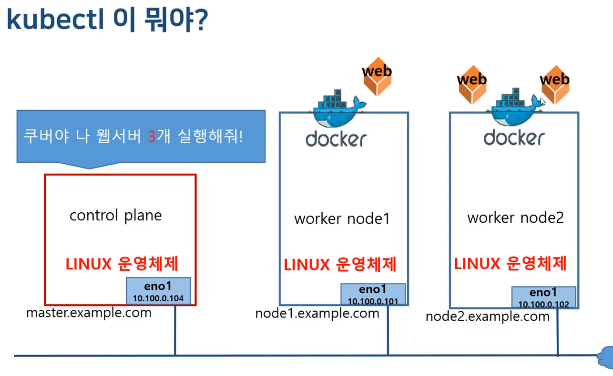
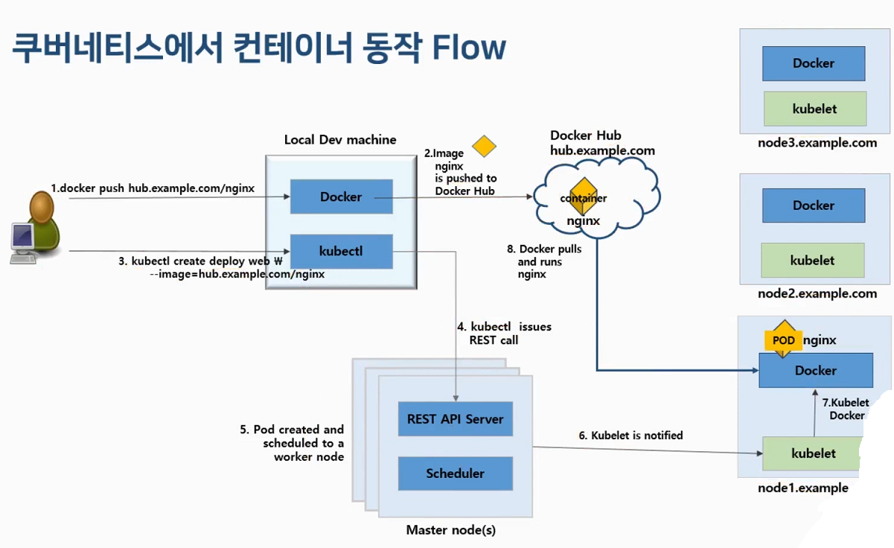
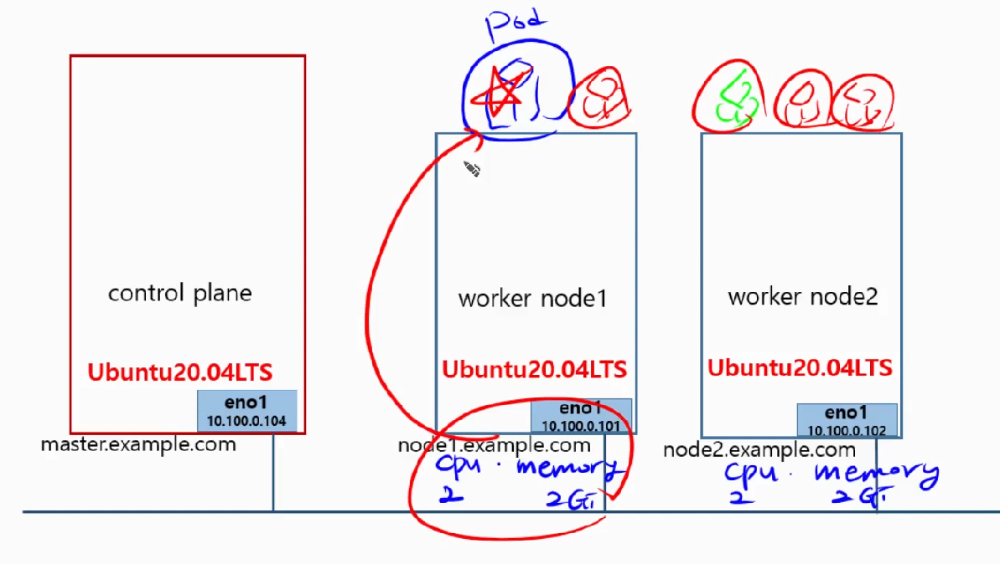
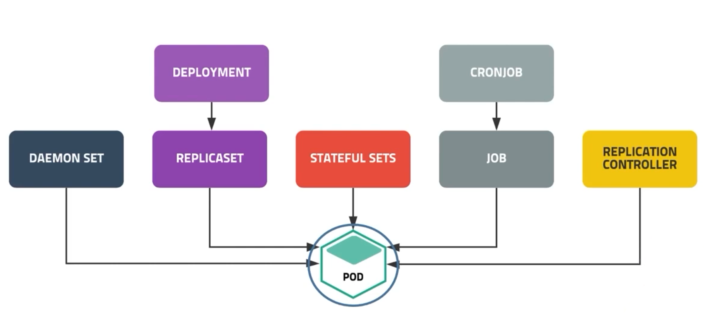

# kubernetes
- 유튜브 이성미 강사님의 [따라하면서 배우는 쿠버네티스](https://www.youtube.com/watch?v=6n5obRKsCRQ&list=PLApuRlvrZKohaBHvXAOhUD-RxD0uQ3z0c)를 주로 정리
- [이성미 강사님의 GitHub 페이지](https://github.com/237summit)
- ``쿠버네티스 입문(90가지 예제로 배우는 컨테이너 관리 자동화 표준)``을 정리

## 설치없이 쿠버네티스 사용하기
- 카타코다 쿠버네티스 플레이그라운드
  - https://www.katacoda.com/courses/kubernetes/playground
  - Master, node1이 구성되어 있어 바로 사용가능
- Play with Kubernetes
  - docker에서 제공. docker hub 계정으로 로그인
  - https://labs.play-with-k8s.com/
  - 4시간 사용 가능.
  - Master, Worker Noder를 직접 구성한 후 사용가능

## 쿠버네티스 설치해서 사용하기
### 윈도우에 WSL2을 여러 개 설치하는 방법 (실패)
- WSL이란?
  - Windows Subsystem for Linux
  - Hypervisor 위에 윈도우 NT 커널과 리눅스 커널을 각각 올리는 방식
    
- 상세 절차는 [MS Document를 참조](https://docs.microsoft.com/en-us/windows/wsl/install-manual)
#### Step 1: Enable the Windows Subsystem for Linux
- 윈도우에 Linux를 깔기 전에 "Windows Subsystem for Linux" optional feature를 Enable함
- Windows PowerShell에서 아래의 명령 입력
```powerShell
dism.exe /online /enable-feature /featurename:Microsoft-Windows-Subsystem-Linux /all /norestart
```
#### Step 2: Check requirements for running WSL2
- Windows 10에서 운영 중이어야 함
- For x64 systems: Version 1903 or higher, with Build 18362 or higher.
- For ARM64 systems: Version 2004 or higher, with Build 19041 or higher.
- Builds lower than 18362 do not support WSL 2. Use the Windows Update Assistant to update your version of Windows.

#### Step 3: Enable Virtual Machine feature
- ``Virtual Machine Platform" optional feature를 enable함
```powerShell
dism.exe /online /enable-feature /featurename:VirtualMachinePlatform /all /norestart
```
#### Step 4: Download the Linux kernel update package
- 최신 패키지를 다운로드
  - [WSL2 Linux kernel update package for x64 machines](https://wslstorestorage.blob.core.windows.net/wslblob/wsl_update_x64.msi)
- 해당 패키지를  설치
#### Step 5: Set WSL 2 as your default version
- 새로운 리눅스를 깔 때, 기본 버전으로서 WSL2를 지정함
```powerShell
wsl --set-default-version 2
```
#### Step 6: Install a lot of WSL on Windows 10
- Ubuntu-20.04[https://aka.ms/wslubuntu2004]를 다운로드
- 7zip를 이용하여 압축을 푼다
  - 만약, appx 확장자를 가진 다운로드 파일을 클릭하면 설치가 됨.
  - 설치를 하게 되면 하나의 Linux가 설치됨
###### Step 6-1: WSL 명령어를 이용하여 설치하기
```powerShell
wsl --import Ubuntu-20.04-Master D:\WSL\Data\Ubuntu-20.04-Master D:\Tools\Ubuntu\Ubuntu_2004.2020.424.0_x64\install.tar.gz
wsl --list
wsl --distribution Ubuntu-20.04-Master
```
- 출처: https://godsman.tistory.com/entry/윈도우즈에-WSL-여러-개-설치하기 [선수로 산다, 때론 좋은 코치로]     
###### Step 6-2: 사용자 추가
```powerShell
useradd gusami
passwd gusami
usermod -aG sudo gusami
```
###### Step 6-3: 추가된 사용자로 wsl 실행 하기
```powerShell
wsl --distribution Ubuntu-20.04-Master --user gusami
```
### WSL의 명령 참고 자료
- [Microsoft Document](https://docs.microsoft.com/ko-kr/windows/wsl/basic-commands)
#### Linux 배포판 생성
```powerShell
wsl --import <Distribution Name> <InstallLocation> <FileName>
wsl --import k8s-master D:\WSL\Data\k8s-master D:\Tools\Ubuntu\Ubuntu_2004.2020.424.0_x64\install.tar.gz
```
#### 특정 Linux 배포판 실행
```powerShell
wsl --distribution <Distribution Name> --user <User Name>
wsl --distribution Ubuntu-20.04-Master 
```
#### 특정 Linux 배포판 종료
```powerShell
wsl --terminate <Distribution Name>
wsl --terminate Ubuntu-20.04-Master 
```
#### 모든 Linux 배포판과 유틸리티 가상 머신을 종료
```powerShell
wsl --shutdown
```
#### 설치된 Linux 배포판 나열
```powerShell
wsl --list --verbose
```
#### 사용 가능한 Linux 배포판 나열
- 온라인 스토어를 통해 받을 수 있는 Linux 배포판 목록을 나열함
```powerShell
wsl --list --online
```
#### Linux 배포판 등록 취소 또는 제거
```powerShell
wsl --unregister <Distribution Name>
wsl --unregister Ubuntu-20.04-Master
```
#### 디스크 또는 디바이스 탑재
```powerShell
wsl --mount <DiskPath>
```
- ``<DiskPath>``를 디스크가 있는 디렉터리\파일 경로로 바꿔서 모든 WSL2 배포판에 물리적 디스크를 연결하고 탑재합니다. WSL 2에 Linux 디스크 탑재를 참조하세요. 다음 옵션을 사용할 수 있습니다.
 - wsl --mount --bare: WSL2에 디스크를 연결하지만 탑재하지는 않습니다.
 - wsl --mount --type ``<Filesystem>``: 디스크를 탑재할 때 사용되는 파일 시스템 유형입니다. 지정하지 않으면 기본값은 ext4입니다. 이 명령은 wsl --mount -t   ``<Filesystem>``으로 입력할 수도 있습니다. blkid ``<BlockDevice>`` 명령을 사용하여 파일 시스템 형식을 검색할 수 있습니다(예: blkid ``<dev/sdb1>``).
 - wsl --mount --partition ``<Partition Number>``: 탑재할 파티션의 인덱스 번호입니다. 지정하지 않으면 전체 디스크가 기본값입니다.
 - wsl --mount --options ``<MountOptions>``: 디스크를 탑재할 때 포함할 수 있는 몇 가지 파일 시스템 관련 옵션이 있습니다. wsl --mount -o "data-ordered" 또는 wsl --mount -o "data=writeback 같은 ext4 탑재 옵션을 예로 들 수 있습니다. 그러나 현재는 파일 시스템 관련 옵션만 지원됩니다. ro, rw 또는 noatime과 같은 일반 옵션은 지원되지 않습니다.
 - wsl --unmount ``<DiskPath>``: 모든 WSL 2 배포판에서 디스크를 탑재 해제하고 분리합니다. ``<DiskPath>``가 포함되지 않으면 이 명령은 탑재된 모든 디스크를 탑재 해제하고 분리합니다.

### Virtual Box를 이용하여 여러개의 VM 설치 (성공)
- 참조: [나만의 k8s 클러스터 구축하기](https://coffeewhale.com/kubernetes/cluster/virtualbox/2020/08/31/k8s-virtualbox/)
- ``VirtualBox 6.1.28 platform packages`` 설치
- 아래 그림의 형태로 노드들을 구성

#### virtual Box 설치
- [https://www.virtualbox.org/wiki/Downloads](https://www.virtualbox.org/wiki/Downloads)
  - ``VirtualBox platform packages > Windows hosts`` 선택해서 다운로드
#### Ubuntu 20.04 LTS 설치
- [https://releases.ubuntu.com/20.04/](https://releases.ubuntu.com/20.04/)
  - ``64-bit PC (AMD64) desktop image`` 선택해서 다운로드
#### 네트워크 및 노드 설정
###### NAT 네트워크 구성
- Virtual Box 실행 > 파일 > 환경설정 > 네트워크
- 새로운 NAT 네트워크를 추가
- 추가된 ``NatNetwork`` 더블 클릭
- 다음과 같이 설정
  - 네트워크 이름: k8s-network
  - 네트워크 CIDR: 10.0.1.0/24
  - 네트워크 옵션: DHCP 지원 (체크)
#### Master Node 설치
- Virtual Box 실행 > 머신 > 새로만들기
- 다음과 같이 설정
  - 이름: master
  - 머신 폴더: 디스크 용량이 넉넉한 드라이버를 선택
  - 종류: Linux
  - 버전: Ubuntu (64-bit)
- 메모리 크기: 3GB (k3s 스펙상 512MB도 가능하나 원활한 테스트 진행을 위해)
- 새 가상 하드 디스크 만들기
- VDI(VirtualBox 디스크 이미지)
- 하드디스크: 고정 크기
- 하드디스크 크기: 20GB
- 만들기
###### VM 설정
- Virtual Box 실행 > 머신 > 설정
  - 일반 > 고급 > 클립 보드 공유: 양방향
  - 네트워크 > 어댑터 1
    - 네트워크 어댑터 사용하기: 체크
    - 다음에 연결됨: ``NAT 네트워크``(NAT라고만 적혀 있는 것은 다른 네트워크)
    - 네트워크 이름: k8s-network
###### VM 시작 및 우분투 설치
- master VM을 더블클릭하여 서버를 구동
  - 시동 디스크 선택: 다운로드 받은 우분투 20.04 이미지를 선택
  - 시작
  - English > Install Ubuntu (사용자의 취향에 맞게 설정합니다.)
  - Keyboard layout: English > English(US) (사용자의 취향에 맞게 설정합니다.) > Continue
  - Minimal installation > Download updates (체크 해제) > Continue
  - Erase disk and install Ubuntu (사용자의 취향에 맞게 설정합니다.) > Install Now
  - Write the changes to disk? > Continue
  - Where are you? (Seoul) > Continue
  - Who are you?
    - Your name: gusami
    - Your computer’s name: master
    - Pick a username: gusami
    - Password: e*****3
    - Installation Complete > Restart Now
    - Please remove the installation medium, then press ENTER > ENTER

###### Master Node VM 시작 시 ``가상머신 master의 세션을 열 수 없습니다`` 해결 방법
- 최신의 ``Oracle VM VirtualBox Extension Pack`` 설치
  - 도움말에서 Virtual Box의 버전 확인
  - Virtual box 다운로드 사이트에서 최신의 Extension Pack을 다운로드 받음
  - Virtual Box > 메뉴 > 파일 > 환경설정 > 확장
    - 기존 패키지를 삭제 후, 새 패키지를 설치
    - 상위 버전의 패키지는 하위 버전과의 호환성을 보장
- 명령어를 이용해서 Hyper-v 기능 off
  - open a cmd with admin privilige
  - turn on
    - bcdedit /set hypervisorlaunchtype auto
  - turn off
    - bcdedit /set hypervisorlaunchtype off
  - reboot

###### 네트워크 설정

- Master Node의 Ubuntu 서버를 접속하여 네트워크를 설정
  - 우측 상단, 네트워크 아이콘 클륵
  - Settings 클릭
  - 톱니바퀴 아이콘 클릭
  - 이미 10.0.1.4로 IP가 자동으로 잡혀져있는 것을 확인할 수 있지만 IP를 명시적으로 고정시키기 위해 IPv4 수동 설정
  - IPv4 탭 클릭 > Manual 선택
    - Address: 10.0.1.4
    - Netmask: 255.255.255.0
    - Gateway: 10.0.1.1
    - DNS: 8.8.8.8
  - Apply 버튼 클릭
  - 네트워크 반영을 위해 토글 버튼을 눌러 잠깐 껐다가 다시 켜줌
- ``CTRL + ALT + T``를 눌러 터미널을 열고, 네트워크 설정이 정상적으로 동작하는지 확인 위해 아래의 명령을 수행  
```bash
sudo apt update
```
- 인터넷이 정상적으로 작동하면 VM 복제를 위해 종료
```bash
sudo shutdown now
```
#### Worker Node 설치
###### worker 복제
- 이미 생성한 master 노드를 복제
- 종료된 master 노드를 우클릭하여 복제 메뉴를 클릭
  - 이름: worker-1
  - 경로: master VM을 저장한 위치에 저장
  - MAC 주소 정책: 모든 네트워크 어댑터의 새 MAC 주소 생성
  - 나머지 전부 체크 해제 > 다음
  - 복제 방식: 완전한 복제 > 복제
- 복제가 완료되면 master, worker 노드 둘다 시작
###### Host명 변경 및 네트워크 설정
- worker 노드로 접속하여 Host명 변경 및 네트워크 설정
- master 노드를 복제했기 때문에 Host명이 master로 설정되어 있음
- CTRL + ALT + T를 눌러 터미널을 열어 다음과 같은 명령을 수행
```bash
sudo hostname worker-1
sudo sh -c 'echo worker-1 > /etc/hostname' // 실패 시 직접 파일을 열어서 수정
sudo sed -i 's/master/worker-1/g' /etc/hosts
# 터미널을 종료합니다.
exit
```
- Host명 변경 후 네트워크 세팅으로 들어가 다음과 같이 설정
  - IPv4 탭 클릭 > Manual 선택
  - Address: 10.0.1.5
  - Netmask: 255.255.255.0
  - Gateway: 10.0.1.1
  - DNS: 8.8.8.8
  - Apply 버튼 클릭
  - 네트워크 반영을 위해 토글 버튼을 눌러 잠깐 껐다가 다시 켜줌
###### DHCP
- DHCP는 Dynamic Host Configuration Protocol의 약자
- 호스트의 IP주소와 각종 TCP/IP 프로토콜의 기본 설정을 클라이언트에게 자동적으로 제공
- 네트워크에 사용되는 IP주소를 DHCP서버가 중앙집중식으로 관리하는 클라이언트/서버 모델
- DHCP지원 클라이언트는 네트워크 부팅과정에서 DHCP서버에 IP주소를 요청해서 얻어 감
- 네트워크 안의 컴퓨터에 자동으로 네임서버 주소, IP 주소, 게이트웨이 주소를 할당
- 클라이언트에게 일정 기간 임대를 하는 동적 주소 할당 프로토콜
- 장점
  - PC의 수가 많거나 PC 자체 변동사항이 많은 경우, IP 설정이 자동으로 되기 때문에 효율적으로 사용 가능
  - IP를 자동으로 할당해주기 때문에 IP 충돌을 막을 수 있음
- 단점
  - DHCP 서버에 의존되기 때문에 서버가 다운되면 IP 할당
- 출처: [개발자를 꿈꾸는 프로그래머](https://jwprogramming.tistory.com/35)

## kubeadm을 이용한 쿠버네티스 설치 - 온프레미스
 1. Docker Install
 2. Kubernetes Install
   1. 설치 전 환경설정
   2. kubeadm, kubectl, kubelet 설치
   3. control-plane 구성
   4. worker node 구성
   5. 설치 확인
#### Docker Install
- k8s-master, k8s-node1, k8s-node2 리눅스 시스템들에 모두  Docker를 Install해야 함
- https://docs.docker.com/ >> Download and install >> Docker for Linux >> 왼쪽 창의 ``Installation per distro`` >> ``Install on Ubuntu`` 에 접속
- 해당 페이지의 ``Install using the repository`` 절차를 수행
1. Setup the Repository
```bash
# 1. Update the apt package index and install packages to allow apt to use a repository over HTTPS:
$sudo apt-get update
$sudo apt-get install -y ca-certificates curl gnupg lsb-release
# 2. Add Docker’s official GPG key:  
$curl -fsSL https://download.docker.com/linux/ubuntu/gpg | sudo gpg --dearmor -o /usr/share/keyrings/docker-archive-keyring.gpg
# 3. Use the following command to set up the stable repository. To add the nightly or test repository, add the word nightly or test (or both) after the word stable in the commands below. Learn about nightly and test channels.
$echo "deb [arch=$(dpkg --print-architecture) signed-by=/usr/share/keyrings/docker-archive-keyring.gpg] https://download.docker.com/linux/ubuntu \
  $(lsb_release -cs) stable" | sudo tee /etc/apt/sources.list.d/docker.list > /dev/null
```
2. Install Docker Engine
```bash
#1. Update the apt package index, and install the latest version of Docker Engine and contained, or go to the next step to install a specific version:  
$sudo apt-get update
$sudo apt-get install -y docker-ce docker-ce-cli containerd.io
#3. Verify that Docker Engine is installed correctly by running the hello-world image.
$sudo systemctl enable docker  // on WSL2 => $sudo systemctl enable docker
$sudo systemctl start docker   // on WSL2 => $sudo service docker start
$sudo docker version
```
2-1. Install Docker Engine with Specific version(번외)
```bash
#1. Update the apt package index, and install the latest version of Docker Engine and contained, or go to the next step to install a specific version:  
$sudo apt-get update
$sudo apt-get install -y docker-ce docker-ce-cli containerd.io
#2. To install a specific version of Docker Engine, list the available versions in the repo, then select and install:
  #a. List the versions available in your repo:
$apt-cache madison docker-ce
  #b. Install a specific version using the version string from the second column, for example, 5:18.09.1~3-0~ubuntu-xenial.
$sudo apt-get install docker-ce=<VERSION_STRING> docker-ce-cli=<VERSION_STRING> containerd.io  
#3. Verify that Docker Engine is installed correctly by running the hello-world image.
$sudo docker run hello-world
```
3. Upgrade Docker Engine(번외)
- To upgrade Docker Engine, first run ``sudo apt-get update``, then follow the installation instructions, choosing the new version you want to install.

4. Docker 컨테이너의 cgroup 관리에 systemd를 사용하도록 도커 데몬을 구성
```bash
sudo mkdir /etc/docker
cat <<EOF | sudo tee /etc/docker/daemon.json
{
  "exec-opts": ["native.cgroupdriver=systemd"],
  "log-driver": "json-file",
  "log-opts": {
    "max-size": "100m"
  },
  "storage-driver": "overlay2"
}
EOF
```
#### Kubernetes Install
- kubernetes.io 사이트 접속 > Documentation 선택 > Install the kubeadm setup tool 선택
###### 설치전 환경설정
1. root 계정 활성화
- 기본적으로 Ubuntu는 root계정이 locked 상태임
- 아래와 같은 명령어들을 사용해서 unlock 시킴
- 이제부터는 root 계정으로 명령어들을 수행
```bash
$sudo passwd root
$su -
```
2. Swap disabled. You MUST disable swap in order for the kubelet to work properly.
```bash
$swapoff -a && sed -i '/swap/s/^/#/' /etc/fstab
```
2. 브릿지 네트워크을 Listen할 수 있도록 지원하기 위한 설정
- root 계정으로 진행
```bash
cat <<EOF | tee /etc/modules-load.d/k8s.conf
br_netfilter
EOF

cat <<EOF | tee /etc/sysctl.d/k8s.conf
net.bridge.bridge-nf-call-ip6tables = 1
net.bridge.bridge-nf-call-iptables = 1
EOF
sysctl --system
```
3. 방화벽 해제
- 방화벽은 일반적으로 네트워크에서 k8s앞단에 위치한 서버에 존재하기 때문에 필요없음
```bash
$systemctl stop firewalld 
$systemctl disable firewalld
```
###### kubeadm, kubectl, kubelet 역할
- kubeadm
  - the command to bootstrap the cluster
  - k8s 전체를 운영하고 관리해주는 역할을 하는 명령어
- kubelet
  - the component that runs on all of the machines in your cluster and does things like starting pods and containers
  - The kubelet works in terms of a PodSpec. A PodSpec is a YAML or JSON object that describes a pod. The kubelet takes a set of PodSpecs that are provided through various mechanisms (primarily through the apiserver) and ensures that the containers described in those PodSpecs are running and healthy. The kubelet doesn't manage containers which were not created by Kubernetes.
  - k8s의 컨테이너를 조작하고, master와 통신에 사용하는 데몬
- kubectl
  - the command line util to talk to your cluster
  - k8s를 제어하는 명령어를 수행

###### kubeadm, kubectl, kubelet 설치 절차
1. Update the apt package index and install packages needed to use the Kubernetes apt repository
```bash
apt-get update
apt-get install -y apt-transport-https ca-certificates curl
```
2. Download the Google Cloud public signing key
```bash
curl -fsSLo /usr/share/keyrings/kubernetes-archive-keyring.gpg https://packages.cloud.google.com/apt/doc/apt-key.gpg
```
3. Add the Kubernetes apt repository:
```bash
echo "deb [signed-by=/usr/share/keyrings/kubernetes-archive-keyring.gpg] https://apt.kubernetes.io/ kubernetes-xenial main" | tee /etc/apt/sources.list.d/kubernetes.list
```
4. Update apt package index, install kubelet, kubeadm and kubectl, and pin their version
```bash
apt-get update
apt-get install -y kubelet kubeadm kubectl
apt-mark hold kubelet kubeadm kubectl
```

5. restarting the kubelet
```bash
systemctl start kubelet
systemctl enable kubelet
```
###### Cluster 생성하기(single master and multi worker nodes)
- 참조 - [Creating a cluster with kubeadm](https://kubernetes.io/docs/setup/production-environment/tools/kubeadm/create-cluster-kubeadm/)
- VirtualBox에서 모든 노드에 대해서 CPU를 두 개 이상 할당해 줌
- Control-plane 구성하기 
  - master node에서만 아래의 명령 수행(중요!!!)
  - 이 명령어를 통해서 master node의 ``API``, ``scheduler``, ``controller``, ``CoreDNS`` 컴포넌트들이 구성
```bash
$sudo kubeadm init
```


- 일반 유저로 클러스터를 Start하기 위해서는 master node에서 아래의 명령어를 수행
```bash  
#To start using your cluster, you need to run the following as a regular user:
$mkdir -p $HOME/.kube
$sudo cp -i /etc/kubernetes/admin.conf $HOME/.kube/config
$sudo chown $(id -u):$(id -g) $HOME/.kube/config
```
- 일반 유저가 아닌 root user로 클러스터를 Start하기 위해서는 master node에서 아래의 명령어를 .bashrc에 추가
```bash
#Alternatively, if you are the root user, you can run:
export KUBECONFIG=/etc/kubernetes/admin.conf
```
- ``kubectl``로 노드 정보를 아래와 같이 가져오는지 확인
  - 만약, port 관련 에러가 난다면 시스템 리부팅
```bash
gusami@master:~$kubectl get nodes
# or
root@master:~$kubectl get nodes
```
###### Pod Network 설치
- AddOn으로 여러 제품들 중 하나를 설치
- master 노드에 Weave Net works를 설치
```bash
gusami@master:~$kubectl apply -f "https://cloud.weave.works/k8s/net?k8s-version=$(kubectl version | base64 | tr -d '\n')"
$kubectl get nodes
```
###### Cluster에 조인하기
- Worker node들에서 조인 명령 수행(중요!!!)
  - 해당 인증서 해쉬 값은 ``kubeadm init`` 수행 할 때, 주어지는 값
```bash  
#Then you can join any number of worker nodes by running the following on each as root:
gusami@worker-2:~$sudo kubeadm join 10.0.1.4:6443 --token u9mrhu.g7n13qbgz67wg0kj \
	--discovery-token-ca-cert-hash sha256:2fddaed3f956819bff808814053fe95c64b0b55612b430b65622a38b038dd3bd 
```
- 만약, 운영 중에 새로운 worker node를 추가하고 싶은 경우
  - 예시: worker-3을 join하고 싶은 경우임
```bash
# 현재의 token list 검색. 24시간까지만 유효. 유효한 토큰이 없음
gusami@master:~$kubeadm token list
# 새로운 토큰 생성
gusami@master:~$kubeadm token create --print-join-command
kubeadm join 10.0.1.4:6443 --token ua2316.d77iymk23kqeod9i --discovery-token-ca-cert-hash sha256:2fddaed3f956819bff808814053fe95c64b0b55612b430b65622a38b038dd3bd
# 생성된 token을 이용해서 master에 Join
root@worker-3:~#kubeadm join 10.0.1.4:6443 --token ua2316.d77iymk23kqeod9i --discovery-token-ca-cert-hash sha256:2fddaed3f956819bff808814053fe95c64b0b55612b430b65622a38b038dd3bd
[preflight] Running pre-flight checks
[preflight] Reading configuration from the cluster...
[preflight] FYI: You can look at this config file with 'kubectl -n kube-system get cm kubeadm-config -o yaml'
W0125 23:14:31.903657    2230 utils.go:69] The recommended value for "resolvConf" in "KubeletConfiguration" is: /run/systemd/resolve/resolv.conf; the provided value is: /run/systemd/resolve/resolv.conf
[kubelet-start] Writing kubelet configuration to file "/var/lib/kubelet/config.yaml"
[kubelet-start] Writing kubelet environment file with flags to file "/var/lib/kubelet/kubeadm-flags.env"
[kubelet-start] Starting the kubelet
[kubelet-start] Waiting for the kubelet to perform the TLS Bootstrap...

This node has joined the cluster:
* Certificate signing request was sent to apiserver and a response was received.
* The Kubelet was informed of the new secure connection details.
```
- 마지막으로, master 노드에서 정상적으로 조인 되었는지 확인
```bash
gusami@master:~$kubectl get nodes -o wide
NAME       STATUS   ROLES                  AGE    VERSION   INTERNAL-IP   EXTERNAL-IP   OS-IMAGE             KERNEL-VERSION      CONTAINER-RUNTIME
master     Ready    control-plane,master   49m    v1.22.3   10.0.1.4      <none>        Ubuntu 20.04.3 LTS   5.11.0-40-generic   docker://20.10.10
worker-1   Ready    <none>                 103s   v1.22.3   10.0.1.5      <none>        Ubuntu 20.04.3 LTS   5.11.0-40-generic   docker://20.10.10
worker-2   Ready    <none>                 32s    v1.22.3   10.0.1.6      <none>        Ubuntu 20.04.3 LTS   5.11.0-40-generic   docker://20.10.10
gusami@master:~$kubectl get pods --all-namespaces
NAMESPACE     NAME                             READY   STATUS    RESTARTS        AGE
kube-system   coredns-78fcd69978-nz4fr         1/1     Running   0               52m
kube-system   coredns-78fcd69978-vsnzh         1/1     Running   0               52m
kube-system   etcd-master                      1/1     Running   1 (23m ago)     52m
kube-system   kube-apiserver-master            1/1     Running   1 (23m ago)     52m
kube-system   kube-controller-manager-master   1/1     Running   1 (23m ago)     52m
kube-system   kube-proxy-s9cp2                 1/1     Running   0               4m36s
kube-system   kube-proxy-vscnf                 1/1     Running   1 (23m ago)     52m
kube-system   kube-proxy-wsc4f                 1/1     Running   0               3m25s
kube-system   kube-scheduler-master            1/1     Running   1 (23m ago)     52m
kube-system   weave-net-kzxnd                  2/2     Running   1 (2m41s ago)   3m25s
kube-system   weave-net-tbcxg                  2/2     Running   1 (9m24s ago)   9m35s
kube-system   weave-net-zvqg4                  2/2     Running   0               4m36s
```
#### k8s 명령어 자동완성 on bash shell
- [k8s documentation 사이트](https://kubernetes.io/docs/home/)에서 ``bash completion cheat sheet``으로 검색
- 아래 명령어를 수행
  - 일반 유저와 root user 모두 수행
  - master node와 worker node들에 모두 수행
```bash
# setup autocomplete in bash into the current shell, bash-completion package should be installed first.
$source <(kubectl completion bash)
# add autocomplete permanently to your bash shellash 
$echo "source <(kubectl completion bash)" >> ~/.bashrc
$source <(kubeadm completion bash)
$echo "source <(kubeadm completion bash)" >> ~/.bashrc
```
#### SSH를 이용한 Virtual Box내부의 노드에 접근
1. master, worker-1, worker-2 노드에 ssh 설치
```bash
gusami@master:~$ sudo apt-get install ssh
```
2. SSH daemon이 시작되었는지 확인
```bash
gusami@master:~$ sudo lsof -i -P -n | grep LISTEN
sshd      33448            root    3u  IPv4 192286      0t0  TCP *:22 (LISTEN)
sshd      33448            root    4u  IPv6 192288      0t0  TCP *:22 (LISTEN)
```
3. VirtualBox에서 포트 포워딩 규칙 추가
  - host IP: 127.0.0.1
  - host port: 104
  - guest IP: 10.0.1.4
  - guest Port: 22

4. XShell에서 로긴 정보 추가
  - 연결 > 호스트: 127.0.0.1
  - 연결 > 포트번호: 104
  - 사용자 인증 > 사용자 이름: gusami
  - 연결 끊는법: exit 명령어를 사용
```bash
gusami@master:~$ exit
logout

Connection closed.
```

## 쿠버네티스 클러스터
#### 쿠버네티스 클러스터를 직접 구성하는 도구
- kubeadm
  - 쿠버네티스에서 공식 제공하는 클러스터 생성/관리 도구
- kubespray
  - 쿠버네티스 클러스터를 배포하는 오픈 소스 프로젝트
  - multi master를 구성하기에 적합
  - 다양한 형식으로 쿠버네티스 클러스터 구성가능
  - 온프레미스에서 상용 서비스 클러스터 운용시 유용
  - 다양한 CNI 제공 - p60, p61  
#### CNI(Container Network Interface)
- Container간 통신을 지원하는 VxLAN. Pod Network이라고도 부름
- 다양한 종류의 플러그인이 존재
  - 플라넬(flannel), 칼리코(calico), 위브넷(weavenet)등이 존재
- 물리적인 노드의 네트워크와 Container내부의 네트워크간의 중간 매개자 역할 수행
  - 예를 들면, 아래 그림에서 node1의 UI Container가 CNI를 겨쳐 물리 네트워크를 통해서 전달
  - 물리 네트워크에서 받은 데이터를 CNI를 거쳐 node2의 Login 컨테이너로 전달


#### 쿠버네티스 클러스터 구성
- control plane(master node)
  - 워커 노드들의 상태를 관리하고 제어
  - single master
  - multi master(3, 5개의 master nodes)
- worker node
  - 도커 플랫폼을 통해 컨테이너를 동작하며 실제 서비스 제공

## 쿠버네티스로 컨테이너 실행하기
### kubectl이란?
- "쿠버네티스야 웹서버 3개 실행해줘"라고 하면, worker node들에 알아서 분배해서 실행해 줌
- 실제 실행할 컨테이너와 이미지와 옵션들과 개수들을 지정할 수 있음
  
#### kubectl 명령어 기본 구조
- command: 자원(object)에 실행 할 명령
  - ``create, get, delete, edit.....``
- TYPE: 자원의 타입
  - ``node, pod, service....``
- NAME: 자원의 이름(내가 지어준 이름)
  - 예: ``webserver``
- flags: 부가적으로 설정할 옵션
  - ``--help, -o options``
```bash
kubectl [command] [TYPE] [NAME] [flags]
```
```bash
kubectl get pod webserver -o wide
```
#### kubectl commands
- linux 명령어 옵션 
  - 옵션 중에 `-`가 인 경우, system5 계열의 명령을 사용할 경우
  - 옵션 중에 `--`가 인 경우, BSD 계열의 명령을 사용할 경우
  - linux는 system5 계열과 BSD 계열 모두를 지원
  - k8s의 명령어의 경우, 명령어에 따라서 ``-``인 경우도 있고, ``--``인 경우도 존재
  - k8s에서는 full name 옵션은 ``--``이고, 단축 옵션은 ``-``인 경우가 많음
```bash
$kubectl --help
$kubectl command --help

$kubectl run <자원이름> <옵션>
$kubectl create -f obj.yaml
$kubectl apply -f obj.yaml

$kubectl get <자원타입> <자원이름>
$kubectl edit <자원타입> <자원이름>
$kubectl describe <자원타입> <자원이름>

$kubectl delete pod main
```
- kubectl resource에 대한 약어 모음 보기
  - k8s 자동완성 기능을 설정한 후, ``<tab>`` 키를 사용하는 것도 좋은 방법
```bash
gusami@master:~$kubectl api-resources 
NAME                              SHORTNAMES   APIVERSION                             NAMESPACED   KIND
bindings                                       v1                                     true         Binding
componentstatuses                 cs           v1                                     false        ComponentStatus
configmaps                        cm           v1                                     true         ConfigMap
endpoints                         ep           v1                                     true         Endpoints
events                            ev           v1                                     true         Event
limitranges                       limits       v1                                     true         LimitRange
namespaces                        ns           v1                                     false        Namespace
nodes                             no           v1                                     false        Node
persistentvolumeclaims            pvc          v1                                     true         PersistentVolumeClaim
persistentvolumes                 pv           v1                                     false        PersistentVolume
pods                              po           v1                                     true         Pod
podtemplates                                   v1                                     true         PodTemplate
replicationcontrollers            rc           v1                                     true         ReplicationController
resourcequotas                    quota        v1                                     true         ResourceQuota
secrets                                        v1                                     true         Secret
serviceaccounts                   sa           v1                                     true         ServiceAccount
services                          svc          v1                                     true         Service
mutatingwebhookconfigurations                  admissionregistration.k8s.io/v1        false        MutatingWebhookConfiguration
validatingwebhookconfigurations                admissionregistration.k8s.io/v1        false        ValidatingWebhookConfiguration
customresourcedefinitions         crd,crds     apiextensions.k8s.io/v1                false        CustomResourceDefinition
apiservices                                    apiregistration.k8s.io/v1              false        APIService
controllerrevisions                            apps/v1                                true         ControllerRevision
daemonsets                        ds           apps/v1                                true         DaemonSet
deployments                       deploy       apps/v1                                true         Deployment
replicasets                       rs           apps/v1                                true         ReplicaSet
statefulsets                      sts          apps/v1                                true         StatefulSet
tokenreviews                                   authentication.k8s.io/v1               false        TokenReview
localsubjectaccessreviews                      authorization.k8s.io/v1                true         LocalSubjectAccessReview
selfsubjectaccessreviews                       authorization.k8s.io/v1                false        SelfSubjectAccessReview
selfsubjectrulesreviews                        authorization.k8s.io/v1                false        SelfSubjectRulesReview
subjectaccessreviews                           authorization.k8s.io/v1                false        SubjectAccessReview
horizontalpodautoscalers          hpa          autoscaling/v1                         true         HorizontalPodAutoscaler
cronjobs                          cj           batch/v1                               true         CronJob
jobs                                           batch/v1                               true         Job
certificatesigningrequests        csr          certificates.k8s.io/v1                 false        CertificateSigningRequest
leases                                         coordination.k8s.io/v1                 true         Lease
endpointslices                                 discovery.k8s.io/v1                    true         EndpointSlice
events                            ev           events.k8s.io/v1                       true         Event
flowschemas                                    flowcontrol.apiserver.k8s.io/v1beta1   false        FlowSchema
prioritylevelconfigurations                    flowcontrol.apiserver.k8s.io/v1beta1   false        PriorityLevelConfiguration
ingressclasses                                 networking.k8s.io/v1                   false        IngressClass
ingresses                         ing          networking.k8s.io/v1                   true         Ingress
networkpolicies                   netpol       networking.k8s.io/v1                   true         NetworkPolicy
runtimeclasses                                 node.k8s.io/v1                         false        RuntimeClass
poddisruptionbudgets              pdb          policy/v1                              true         PodDisruptionBudget
podsecuritypolicies               psp          policy/v1beta1                         false        PodSecurityPolicy
clusterrolebindings                            rbac.authorization.k8s.io/v1           false        ClusterRoleBinding
clusterroles                                   rbac.authorization.k8s.io/v1           false        ClusterRole
rolebindings                                   rbac.authorization.k8s.io/v1           true         RoleBinding
roles                                          rbac.authorization.k8s.io/v1           true         Role
priorityclasses                   pc           scheduling.k8s.io/v1                   false        PriorityClass
csidrivers                                     storage.k8s.io/v1                      false        CSIDriver
csinodes                                       storage.k8s.io/v1                      false        CSINode
csistoragecapacities                           storage.k8s.io/v1beta1                 true         CSIStorageCapacity
storageclasses                    sc           storage.k8s.io/v1                      false        StorageClass
volumeattachments                              storage.k8s.io/v1                      false        VolumeAttachment
```
- kubectl 도움말 보기
  - ``kubectl --help``
```bash
gusami@master:~$kubectl --help
kubectl controls the Kubernetes cluster manager.

 Find more information at: https://kubernetes.io/docs/reference/kubectl/overview/

Basic Commands (Beginner):
  create        Create a resource from a file or from stdin
  expose        Take a replication controller, service, deployment or pod and expose it as a new Kubernetes service
  run           Run a particular image on the cluster
  set           Set specific features on objects

Basic Commands (Intermediate):
  explain       Get documentation for a resource
  get           Display one or many resources
  edit          Edit a resource on the server
  delete        Delete resources by file names, stdin, resources and names, or by resources and label selector

Deploy Commands:
  rollout       Manage the rollout of a resource
  scale         Set a new size for a deployment, replica set, or replication controller
  autoscale     Auto-scale a deployment, replica set, stateful set, or replication controller

Cluster Management Commands:
  certificate   Modify certificate resources.
  cluster-info  Display cluster information
  top           Display resource (CPU/memory) usage
  cordon        Mark node as unschedulable
  uncordon      Mark node as schedulable
  drain         Drain node in preparation for maintenance
  taint         Update the taints on one or more nodes

Troubleshooting and Debugging Commands:
  describe      Show details of a specific resource or group of resources
  logs          Print the logs for a container in a pod
  attach        Attach to a running container
  exec          Execute a command in a container
  port-forward  Forward one or more local ports to a pod
  proxy         Run a proxy to the Kubernetes API server
  cp            Copy files and directories to and from containers
  auth          Inspect authorization
  debug         Create debugging sessions for troubleshooting workloads and nodes

Advanced Commands:
  diff          Diff the live version against a would-be applied version
  apply         Apply a configuration to a resource by file name or stdin
  patch         Update fields of a resource
  replace       Replace a resource by file name or stdin
  wait          Experimental: Wait for a specific condition on one or many resources
  kustomize     Build a kustomization target from a directory or URL.

Settings Commands:
  label         Update the labels on a resource
  annotate      Update the annotations on a resource
  completion    Output shell completion code for the specified shell (bash or zsh)

Other Commands:
  api-resources Print the supported API resources on the server
  api-versions  Print the supported API versions on the server, in the form of "group/version"
  config        Modify kubeconfig files
  plugin        Provides utilities for interacting with plugins
  version       Print the client and server version information

Usage:
  kubectl [flags] [options]

Use "kubectl <command> --help" for more information about a given command.
Use "kubectl options" for a list of global command-line options (applies to all commands).
```
- kubectl 특정 명령어의 도움말 보기
  - ``kubectl <command> --help``
```bash
gusami@master:~$kubectl logs --help
Print the logs for a container in a pod or specified resource. If the pod has only one container, the container name is
optional.

Examples:
  # Return snapshot logs from pod nginx with only one container
  kubectl logs nginx
  
  # Return snapshot logs from pod nginx with multi containers
  kubectl logs nginx --all-containers=true
  
  # Return snapshot logs from all containers in pods defined by label app=nginx
  kubectl logs -l app=nginx --all-containers=true
  
  # Return snapshot of previous terminated ruby container logs from pod web-1
  kubectl logs -p -c ruby web-1
  
  # Begin streaming the logs of the ruby container in pod web-1
  kubectl logs -f -c ruby web-1
  
  # Begin streaming the logs from all containers in pods defined by label app=nginx
  kubectl logs -f -l app=nginx --all-containers=true
  
  # Display only the most recent 20 lines of output in pod nginx
  kubectl logs --tail=20 nginx
  
  # Show all logs from pod nginx written in the last hour
  kubectl logs --since=1h nginx
  
  # Show logs from a kubelet with an expired serving certificate
  kubectl logs --insecure-skip-tls-verify-backend nginx
  
  # Return snapshot logs from first container of a job named hello
  kubectl logs job/hello
  
  # Return snapshot logs from container nginx-1 of a deployment named nginx
  kubectl logs deployment/nginx -c nginx-1

Options:
      --all-containers=false: Get all containers' logs in the pod(s).
  -c, --container='': Print the logs of this container
  -f, --follow=false: Specify if the logs should be streamed.
      --ignore-errors=false: If watching / following pod logs, allow for any errors that occur to be non-fatal
      --insecure-skip-tls-verify-backend=false: Skip verifying the identity of the kubelet that logs are requested from.
In theory, an attacker could provide invalid log content back. You might want to use this if your kubelet serving
certificates have expired.
      --limit-bytes=0: Maximum bytes of logs to return. Defaults to no limit.
      --max-log-requests=5: Specify maximum number of concurrent logs to follow when using by a selector. Defaults to 5.
      --pod-running-timeout=20s: The length of time (like 5s, 2m, or 3h, higher than zero) to wait until at least one
pod is running
      --prefix=false: Prefix each log line with the log source (pod name and container name)
  -p, --previous=false: If true, print the logs for the previous instance of the container in a pod if it exists.
  -l, --selector='': Selector (label query) to filter on.
      --since=0s: Only return logs newer than a relative duration like 5s, 2m, or 3h. Defaults to all logs. Only one of
since-time / since may be used.
      --since-time='': Only return logs after a specific date (RFC3339). Defaults to all logs. Only one of since-time /
since may be used.
      --tail=-1: Lines of recent log file to display. Defaults to -1 with no selector, showing all log lines otherwise
10, if a selector is provided.
      --timestamps=false: Include timestamps on each line in the log output

Usage:
  kubectl logs [-f] [-p] (POD | TYPE/NAME) [-c CONTAINER] [options]

Use "kubectl options" for a list of global command-line options (applies to all commands).
```
- kubectl 전체 node 정보 보기
  - ``kubectl get nodes``
```bash
gusami@master:~$kubectl get nodes -o wide
NAME       STATUS   ROLES                  AGE   VERSION   INTERNAL-IP   EXTERNAL-IP   OS-IMAGE             KERNEL-VERSION      CONTAINER-RUNTIME
master     Ready    control-plane,master   26h   v1.22.3   10.0.1.4      <none>        Ubuntu 20.04.3 LTS   5.11.0-40-generic   docker://20.10.10
worker-1   Ready    <none>                 26h   v1.22.3   10.0.1.5      <none>        Ubuntu 20.04.3 LTS   5.11.0-40-generic   docker://20.10.10
worker-2   Ready    <none>                 26h   v1.22.3   10.0.1.6      <none>        Ubuntu 20.04.3 LTS   5.11.0-40-generic   docker://20.10.1
```
- kubectl 특정 노드의 상세 정보 보기
  - ``kubectl describe node <node명>``
```bash
gusami@master:~$kubectl describe node master
Name:               master
Roles:              control-plane,master
Labels:             beta.kubernetes.io/arch=amd64
                    beta.kubernetes.io/os=linux
                    kubernetes.io/arch=amd64
                    kubernetes.io/hostname=master
                    kubernetes.io/os=linux
                    node-role.kubernetes.io/control-plane=
                    node-role.kubernetes.io/master=
                    node.kubernetes.io/exclude-from-external-load-balancers=
Annotations:        kubeadm.alpha.kubernetes.io/cri-socket: /var/run/dockershim.sock
                    node.alpha.kubernetes.io/ttl: 0
                    volumes.kubernetes.io/controller-managed-attach-detach: true
CreationTimestamp:  Sat, 13 Nov 2021 10:01:27 +0900
Taints:             node-role.kubernetes.io/master:NoSchedule
Unschedulable:      false
Lease:
  HolderIdentity:  master
  AcquireTime:     <unset>
  RenewTime:       Sun, 14 Nov 2021 12:52:57 +0900
Conditions:
  Type                 Status  LastHeartbeatTime                 LastTransitionTime                Reason                       Message
  ----                 ------  -----------------                 ------------------                ------                       -------
  NetworkUnavailable   False   Sun, 14 Nov 2021 12:40:49 +0900   Sun, 14 Nov 2021 12:40:49 +0900   WeaveIsUp                    Weave pod has set this
  MemoryPressure       False   Sun, 14 Nov 2021 12:50:44 +0900   Sat, 13 Nov 2021 10:01:24 +0900   KubeletHasSufficientMemory   kubelet has sufficient memory available
  DiskPressure         False   Sun, 14 Nov 2021 12:50:44 +0900   Sat, 13 Nov 2021 10:01:24 +0900   KubeletHasNoDiskPressure     kubelet has no disk pressure
  PIDPressure          False   Sun, 14 Nov 2021 12:50:44 +0900   Sat, 13 Nov 2021 10:01:24 +0900   KubeletHasSufficientPID      kubelet has sufficient PID available
  Ready                True    Sun, 14 Nov 2021 12:50:44 +0900   Sat, 13 Nov 2021 10:44:35 +0900   KubeletReady                 kubelet is posting ready status. AppArmor enabled
Addresses:
  InternalIP:  10.0.1.4
  Hostname:    master
Capacity:
  cpu:                2
  ephemeral-storage:  14897128Ki
  hugepages-2Mi:      0
  memory:             2027836Ki
  pods:               110
Allocatable:
  cpu:                2
  ephemeral-storage:  13729193143
  hugepages-2Mi:      0
  memory:             1925436Ki
  pods:               110
System Info:
  Machine ID:                 7bf4f9e7c32f4fdea81b4d8afb9f52c5
  System UUID:                f6adb473-6d29-6947-8eba-ef2d794d2af2
  Boot ID:                    438f5e8d-7869-49ae-9acd-ebca9c00f493
  Kernel Version:             5.11.0-40-generic
  OS Image:                   Ubuntu 20.04.3 LTS
  Operating System:           linux
  Architecture:               amd64
  Container Runtime Version:  docker://20.10.10
  Kubelet Version:            v1.22.3
  Kube-Proxy Version:         v1.22.3
Non-terminated Pods:          (8 in total)
  Namespace                   Name                              CPU Requests  CPU Limits  Memory Requests  Memory Limits  Age
  ---------                   ----                              ------------  ----------  ---------------  -------------  ---
  kube-system                 coredns-78fcd69978-nz4fr          100m (5%)     0 (0%)      70Mi (3%)        170Mi (9%)     26h
  kube-system                 coredns-78fcd69978-vsnzh          100m (5%)     0 (0%)      70Mi (3%)        170Mi (9%)     26h
  kube-system                 etcd-master                       100m (5%)     0 (0%)      100Mi (5%)       0 (0%)         26h
  kube-system                 kube-apiserver-master             250m (12%)    0 (0%)      0 (0%)           0 (0%)         26h
  kube-system                 kube-controller-manager-master    200m (10%)    0 (0%)      0 (0%)           0 (0%)         26h
  kube-system                 kube-proxy-vscnf                  0 (0%)        0 (0%)      0 (0%)           0 (0%)         26h
  kube-system                 kube-scheduler-master             100m (5%)     0 (0%)      0 (0%)           0 (0%)         26h
  kube-system                 weave-net-tbcxg                   100m (5%)     0 (0%)      200Mi (10%)      0 (0%)         26h
Allocated resources:
  (Total limits may be over 100 percent, i.e., overcommitted.)
  Resource           Requests     Limits
  --------           --------     ------
  cpu                950m (47%)   0 (0%)
  memory             440Mi (23%)  340Mi (18%)
  ephemeral-storage  0 (0%)       0 (0%)
  hugepages-2Mi      0 (0%)       0 (0%)
Events:
  Type    Reason                   Age                From        Message
  ----    ------                   ----               ----        -------
  Normal  Starting                 24h                kube-proxy  
  Normal  Starting                 20h                kube-proxy  
  Normal  Starting                 12m                kube-proxy  
  Normal  Starting                 24h                kubelet     Starting kubelet.
  Normal  NodeHasNoDiskPressure    24h (x8 over 24h)  kubelet     Node master status is now: NodeHasNoDiskPressure
  Normal  NodeHasSufficientPID     24h (x7 over 24h)  kubelet     Node master status is now: NodeHasSufficientPID
  Normal  NodeHasSufficientMemory  24h (x8 over 24h)  kubelet     Node master status is now: NodeHasSufficientMemory
  Normal  NodeAllocatableEnforced  24h                kubelet     Updated Node Allocatable limit across pods
  Normal  Starting                 20h                kubelet     Starting kubelet.
  Normal  NodeHasNoDiskPressure    20h (x8 over 20h)  kubelet     Node master status is now: NodeHasNoDiskPressure
  Normal  NodeHasSufficientMemory  20h (x8 over 20h)  kubelet     Node master status is now: NodeHasSufficientMemory
  Normal  NodeAllocatableEnforced  20h                kubelet     Updated Node Allocatable limit across pods
  Normal  NodeHasSufficientPID     20h (x7 over 20h)  kubelet     Node master status is now: NodeHasSufficientPID
  Normal  Starting                 12m                kubelet     Starting kubelet.
  Normal  NodeAllocatableEnforced  12m                kubelet     Updated Node Allocatable limit across pods
  Normal  NodeHasSufficientMemory  12m (x8 over 12m)  kubelet     Node master status is now: NodeHasSufficientMemory
  Normal  NodeHasNoDiskPressure    12m (x8 over 12m)  kubelet     Node master status is now: NodeHasNoDiskPressure
  Normal  NodeHasSufficientPID     12m (x7 over 12m)  kubelet     Node master status is now: NodeHasSufficientPID
```
#### command 사용법 실전 예제
1. Worker node중 하나에서 docker hub에서 이미지를 다운받아 container 생성한 후, 실행
```bash
# create nginx 1.14 version and open 80 port
gusami@master:~$kubectl run webserver --image=nginx:1.14 --port 80
pod/webserver created
# worker-1 node에서 실행 중임, pod의 IP Address도 확인 가능
gusami@master:~$kubectl get pods -o wide
NAME        READY   STATUS    RESTARTS   AGE     IP          NODE       NOMINATED NODE   READINESS GATES
webserver   1/1     Running   0          4m11s   10.44.0.1   worker-1   <none>           <none>
# webserver pod의 상세 정보
gusami@master:~$kubectl describe pod webserver
Name:         webserver
Namespace:    default
Priority:     0
Node:         worker-1/10.0.1.5
Start Time:   Sun, 14 Nov 2021 13:05:12 +0900
Labels:       run=webserver
Annotations:  <none>
Status:       Running
IP:           10.44.0.1
IPs:
  IP:  10.44.0.1
Containers:
  webserver:
    Container ID:   docker://434ce103d5103ba7c695be13ac3a276cff437dbe4b480decab36c1fe64f58475
    Image:          nginx:1.14
    Image ID:       docker-pullable://nginx@sha256:f7988fb6c02e0ce69257d9bd9cf37ae20a60f1df7563c3a2a6abe24160306b8d
    Port:           80/TCP
    Host Port:      0/TCP
    State:          Running
      Started:      Sun, 14 Nov 2021 13:05:22 +0900
    Ready:          True
    Restart Count:  0
    Environment:    <none>
    Mounts:
      /var/run/secrets/kubernetes.io/serviceaccount from kube-api-access-ljt56 (ro)
Conditions:
  Type              Status
  Initialized       True 
  Ready             True 
  ContainersReady   True 
  PodScheduled      True 
Volumes:
  kube-api-access-ljt56:
    Type:                    Projected (a volume that contains injected data from multiple sources)
    TokenExpirationSeconds:  3607
    ConfigMapName:           kube-root-ca.crt
    ConfigMapOptional:       <nil>
    DownwardAPI:             true
QoS Class:                   BestEffort
Node-Selectors:              <none>
Tolerations:                 node.kubernetes.io/not-ready:NoExecute op=Exists for 300s
                             node.kubernetes.io/unreachable:NoExecute op=Exists for 300s
Events:
  Type    Reason     Age    From               Message
  ----    ------     ----   ----               -------
  Normal  Scheduled  5m5s   default-scheduler  Successfully assigned default/webserver to worker-1
  Normal  Pulling    5m3s   kubelet            Pulling image "nginx:1.14"
  Normal  Pulled     4m55s  kubelet            Successfully pulled image "nginx:1.14" in 8.005241046s
  Normal  Created    4m55s  kubelet            Created container webserver
  Normal  Started    4m55s  kubelet            Started container webserver
```
- Events 정보를 보면, docker hub에서 image를 다운로드 받아서 container을 생성하고, 시작한 것을 알수 있음
2. 명령어 웹브라우저인 ``curl``을 이용해서 webserver에 접속해 보자
- ``curl 10.44.0.1``
```bash
gusami@master:~$ curl 10.44.0.1
<!DOCTYPE html>
<html>
<head>
<title>Welcome to nginx!</title>
<style>
    body {
        width: 35em;
        margin: 0 auto;
        font-family: Tahoma, Verdana, Arial, sans-serif;
    }
</style>
</head>
<body>
<h1>Welcome to nginx!</h1>
<p>If you see this page, the nginx web server is successfully installed and
working. Further configuration is required.</p>

<p>For online documentation and support please refer to
<a href="http://nginx.org/">nginx.org</a>.<br/>
Commercial support is available at
<a href="http://nginx.com/">nginx.com</a>.</p>

<p><em>Thank you for using nginx.</em></p>
</body>
</html>
```
- ``elinks``를 설치해서 확인해 보자
  - terminal에서 GUI 형태로 html tag를 적용해서 보여줌
  - 나올 때는 ``esc`` key를 누른 후, ``File menu``에서 ``exit`` 선택하면 됨
```bash
gusami@master:~$ sudo apt-get install elinks
gusami@master:~$ elinks 10.44.0.1
```
- 특정 pod의 정보만 보고 싶을 때
  - ``kubectl get pods <pod name>``
```bash
gusami@master:~$kubectl get pods webserver -o wide
NAME        READY   STATUS    RESTARTS   AGE   IP          NODE       NOMINATED NODE   READINESS GATES
webserver   1/1     Running   0          17m   10.44.0.1   worker-1   <none>           <none>
```
3. 동일한 image의 pod를 여러 개를 한번에 생성 및 실행해 보자
- image에서 버전을 생략하면 기본적으로 ``latest`` 사용
- ``mainui``라는 이름을 가진 apache webserver httpd를 3개 생성해 보자
  - ``kubectl create deployment mainui --image=httpd --replicas=3``
```bash
gusami@master:~$kubectl create deployment mainui --image=httpd --replicas=3
deployment.apps/mainui created

gusami@master:~$kubectl get deployments.apps 
NAME     READY   UP-TO-DATE   AVAILABLE   AGE
mainui   3/3     3            3           75s

gusami@master:~$kubectl get pods -o wide
NAME                     READY   STATUS    RESTARTS   AGE   IP          NODE       NOMINATED NODE   READINESS GATES
mainui-d77bf4d8f-ckrn6   1/1     Running   0          93s   10.44.0.2   worker-1   <none>           <none>
mainui-d77bf4d8f-jgks8   1/1     Running   0          93s   10.36.0.1   worker-2   <none>           <none>
mainui-d77bf4d8f-snb86   1/1     Running   0          93s   10.36.0.2   worker-2   <none>           <none>
webserver                1/1     Running   0          25m   10.44.0.1   worker-1   <none>           <none>

gusami@master:~$kubectl describe deployments.apps mainui
Name:                   mainui
Namespace:              default
CreationTimestamp:      Sun, 14 Nov 2021 13:29:20 +0900
Labels:                 app=mainui
Annotations:            deployment.kubernetes.io/revision: 1
Selector:               app=mainui
Replicas:               3 desired | 3 updated | 3 total | 3 available | 0 unavailable
StrategyType:           RollingUpdate
MinReadySeconds:        0
RollingUpdateStrategy:  25% max unavailable, 25% max surge
Pod Template:
  Labels:  app=mainui
  Containers:
   httpd:
    Image:        httpd
    Port:         <none>
    Host Port:    <none>
    Environment:  <none>
    Mounts:       <none>
  Volumes:        <none>
Conditions:
  Type           Status  Reason
  ----           ------  ------
  Available      True    MinimumReplicasAvailable
  Progressing    True    NewReplicaSetAvailable
OldReplicaSets:  <none>
NewReplicaSet:   mainui-d77bf4d8f (3/3 replicas created)
Events:
  Type    Reason             Age    From                   Message
  ----    ------             ----   ----                   -------
  Normal  ScalingReplicaSet  2m36s  deployment-controller  Scaled up replica set mainui-d77bf4d8f to 3  
```
- mainui pod 개수를 4개로 늘려보자
  - ``gusami@master:~$kubectl edit deployments.apps mainui``
  - deployment.apps 구성 edit창에서 spec >> replicas의 개수를 수정한 후, 저장
  - 저장과 동시에 pod개수가 4개로 늘어남
```bash
# Please edit the object below. Lines beginning with a '#' will be ignored,
# and an empty file will abort the edit. If an error occurs while saving this file will be
# reopened with the relevant failures.
#
apiVersion: apps/v1
kind: Deployment
metadata:
  annotations:
    deployment.kubernetes.io/revision: "1"
  creationTimestamp: "2021-11-14T04:29:20Z"
  generation: 1
  labels:
    app: mainui
  name: mainui
  namespace: default
  resourceVersion: "20172"
  uid: 26d053db-551b-420f-8e32-a1cbd4fa5449
spec:
  progressDeadlineSeconds: 600
  replicas: 4
  revisionHistoryLimit: 10
  selector:
    matchLabels:
      app: mainui
  strategy:
    rollingUpdate:
      maxSurge: 25%
      maxUnavailable: 25%
    type: RollingUpdate
  template:
    metadata:
      creationTimestamp: null
      labels:
        app: mainui
    spec:
      containers:
      - image: httpd
        imagePullPolicy: Always
        name: httpd
        resources: {}
        terminationMessagePath: /dev/termination-log
        terminationMessagePolicy: File
      dnsPolicy: ClusterFirst
      restartPolicy: Always
      schedulerName: default-scheduler
      securityContext: {}
      terminationGracePeriodSeconds: 30
status:
  availableReplicas: 3
  conditions:
  - lastTransitionTime: "2021-11-14T04:29:34Z"
    lastUpdateTime: "2021-11-14T04:29:34Z"
    message: Deployment has minimum availability.
    reason: MinimumReplicasAvailable
    status: "True"
    type: Available
  - lastTransitionTime: "2021-11-14T04:29:20Z"
    lastUpdateTime: "2021-11-14T04:29:34Z"
    message: ReplicaSet "mainui-d77bf4d8f" has successfully progressed.
    reason: NewReplicaSetAvailable
    status: "True"
    type: Progressing
  observedGeneration: 1
  readyReplicas: 3
  replicas: 3
  updatedReplicas: 3
```
```bash
gusami@master:~$kubectl get pods
NAME                     READY   STATUS    RESTARTS   AGE
mainui-d77bf4d8f-ckrn6   1/1     Running   0          58m
mainui-d77bf4d8f-jgks8   1/1     Running   0          58m
mainui-d77bf4d8f-snb86   1/1     Running   0          58m
mainui-d77bf4d8f-wjgdb   1/1     Running   0          63s
webserver                1/1     Running   0          83m
```
- apache webserver 실행 확인
```bash
gusami@master:~$ curl 10.44.0.2
<html><body><h1>It works!</h1></body></html>
```
- 특정 pod를 yaml 또는 json 형태로 자세히 확인
  - ``kubectl get pods <pod name> -o yaml``
  - ``kubectl get pods <pod name> -o json``
```bash
gusami@master:~$kubectl get pods mainui-d77bf4d8f-ckrn6 -o yaml
apiVersion: v1
kind: Pod
metadata:
  creationTimestamp: "2021-11-14T04:29:20Z"
  generateName: mainui-d77bf4d8f-
  labels:
    app: mainui
    pod-template-hash: d77bf4d8f
  name: mainui-d77bf4d8f-ckrn6
  namespace: default
  ownerReferences:
  - apiVersion: apps/v1
    blockOwnerDeletion: true
    controller: true
    kind: ReplicaSet
    name: mainui-d77bf4d8f
    uid: c93ba43c-b299-4013-8d37-5073ca3a9877
  resourceVersion: "20156"
  uid: 9073a33a-58c4-47cc-9ecf-f5d967fc1e8b
spec:
  containers:
  - image: httpd
    imagePullPolicy: Always
    name: httpd
    resources: {}
    terminationMessagePath: /dev/termination-log
    terminationMessagePolicy: File
    volumeMounts:
    - mountPath: /var/run/secrets/kubernetes.io/serviceaccount
      name: kube-api-access-9mqlg
      readOnly: true
  dnsPolicy: ClusterFirst
  enableServiceLinks: true
  nodeName: worker-1
  preemptionPolicy: PreemptLowerPriority
  priority: 0
  restartPolicy: Always
  schedulerName: default-scheduler
  securityContext: {}
  serviceAccount: default
  serviceAccountName: default
  terminationGracePeriodSeconds: 30
  tolerations:
  - effect: NoExecute
    key: node.kubernetes.io/not-ready
    operator: Exists
    tolerationSeconds: 300
  - effect: NoExecute
    key: node.kubernetes.io/unreachable
    operator: Exists
    tolerationSeconds: 300
  volumes:
  - name: kube-api-access-9mqlg
    projected:
      defaultMode: 420
      sources:
      - serviceAccountToken:
          expirationSeconds: 3607
          path: token
      - configMap:
          items:
          - key: ca.crt
            path: ca.crt
          name: kube-root-ca.crt
      - downwardAPI:
          items:
          - fieldRef:
              apiVersion: v1
              fieldPath: metadata.namespace
            path: namespace
status:
  conditions:
  - lastProbeTime: null
    lastTransitionTime: "2021-11-14T04:29:20Z"
    status: "True"
    type: Initialized
  - lastProbeTime: null
    lastTransitionTime: "2021-11-14T04:29:31Z"
    status: "True"
    type: Ready
  - lastProbeTime: null
    lastTransitionTime: "2021-11-14T04:29:31Z"
    status: "True"
    type: ContainersReady
  - lastProbeTime: null
    lastTransitionTime: "2021-11-14T04:29:20Z"
    status: "True"
    type: PodScheduled
  containerStatuses:
  - containerID: docker://16e4cfa30ea5f2b2a4c27ce136ca5d8a675979c4638acf77368acc92caddf58f
    image: httpd:latest
    imageID: docker-pullable://httpd@sha256:f70876d78442771406d7245b8d3425e8b0a86891c79811af94fb2e12af0fadeb
    lastState: {}
    name: httpd
    ready: true
    restartCount: 0
    started: true
    state:
      running:
        startedAt: "2021-11-14T04:29:30Z"
  hostIP: 10.0.1.5
  phase: Running
  podIP: 10.44.0.2
  podIPs:
  - ip: 10.44.0.2
  qosClass: BestEffort
  startTime: "2021-11-14T04:29:20Z"
```
4. 특정 Pod내의 container에 접속해서 웹페이지를 바꿔 보자
- ``kubectl exec <pod name> -it -- <첫 실행할 명령>``
- ``exec``는 pod 또는 container 내부의 명령어를 수행
```bash
# pod에 접속
gusami@master:~$kubectl exec webserver -it -- /bin/bash
# index.html 수정
root@webserver:/#
root@webserver:/# cd /usr/share/nginx/html/
root@webserver:/usr/share/nginx/html# echo "Welcome gusami world" > index.html
root@webserver:/usr/share/nginx/html# cat index.html 
Welcome gusami world
root@webserver:/# exit
exit

gusami@master:~$ curl 10.44.0.1
Welcome gusami world
```
```bash
gusami@master:~$kubectl exec --help
Execute a command in a container.

Examples:
  # Get output from running the 'date' command from pod mypod, using the first container by default
  kubectl exec mypod -- date
  
  # Get output from running the 'date' command in ruby-container from pod mypod
  kubectl exec mypod -c ruby-container -- date
  
  # Switch to raw terminal mode; sends stdin to 'bash' in ruby-container from pod mypod
  # and sends stdout/stderr from 'bash' back to the client
  kubectl exec mypod -c ruby-container -i -t -- bash -il
  
  # List contents of /usr from the first container of pod mypod and sort by modification time
  # If the command you want to execute in the pod has any flags in common (e.g. -i),
  # you must use two dashes (--) to separate your command's flags/arguments
  # Also note, do not surround your command and its flags/arguments with quotes
  # unless that is how you would execute it normally (i.e., do ls -t /usr, not "ls -t /usr")
  kubectl exec mypod -i -t -- ls -t /usr
  
  # Get output from running 'date' command from the first pod of the deployment mydeployment, using the first container
by default
  kubectl exec deploy/mydeployment -- date
  
  # Get output from running 'date' command from the first pod of the service myservice, using the first container by
default
  kubectl exec svc/myservice -- date

Options:
  -c, --container='': Container name. If omitted, use the kubectl.kubernetes.io/default-container annotation for
selecting the container to be attached or the first container in the pod will be chosen
  -f, --filename=[]: to use to exec into the resource
      --pod-running-timeout=1m0s: The length of time (like 5s, 2m, or 3h, higher than zero) to wait until at least one
pod is running
  -q, --quiet=false: Only print output from the remote session
  -i, --stdin=false: Pass stdin to the container
  -t, --tty=false: Stdin is a TTY

Usage:
  kubectl exec (POD | TYPE/NAME) [-c CONTAINER] [flags] -- COMMAND [args...] [options]

Use "kubectl options" for a list of global command-line options (applies to all commands).
```
- 특정 pod의 log 확인
  - ``kubectl logs <pod name>``  
```bash
gusami@master:~$kubectl logs webserver
10.32.0.1 - - [14/Nov/2021:04:16:28 +0000] "GET / HTTP/1.1" 200 612 "-" "curl/7.68.0" "-"
10.32.0.1 - - [14/Nov/2021:04:19:53 +0000] "GET / HTTP/1.1" 200 612 "-" "ELinks/0.13.1 (textmode; Linux 5.11.0-40-generic x86_64; 209x52-2)" "-"
10.32.0.1 - - [14/Nov/2021:04:48:06 +0000] "GET / HTTP/1.1" 200 21 "-" "curl/7.68.0" "-"
```
5. 외부 사용자가 접속할 수 있도록 바꿔 보자
- 현재는 k8s 내부의 master와 worker node들에서만 접속 가능
```bash
gusami@worker-2:~$ curl 10.44.0.1
Welcome gusami world
```
- Port forwarding 기법을 이용해서 외부에서도 접속 가능하도록 설정
  - ``kubectl port-forward <pod name> <host port>:<guest port>``
```bash
# master node의 8080 port를 webserver의 80포트로 port forward함
gusami@master:~$kubectl port-forward webserver 8080:80
Forwarding from 127.0.0.1:8080 -> 80
Forwarding from [::1]:8080 -> 80
```
```bash
# XShell에서 세션 복제 후, 접속
gusami@master:~$ curl localhost:8080
Welcome gusami world
```
###### dry-run 기능과 yaml 파일 생성하기
- ``dry-run``옵션을 통해 실제 생성하지 않고, Pod의 생성가능 여부를 확인
```bash
# 실제 생성을 하면 기존의 것과 충돌나서 실패
gusami@master:~$kubectl run webserver --image=nginx:1.14 --port 80
Error from server (AlreadyExists): pods "webserver" already exists
# dry-run을 통해서 생성 가능 여부를 체크 가능
gusami@master:~$kubectl run webserver --image=nginx:1.14 --port 80 --dry-run=client
pod/webserver created (dry run)
```
- yaml 파일 생성 방법
  - ``kubectl run <pod name> --image=<name:version> --dry-run=client -o yaml > **.yaml``
  - 생성 후, 편집에서 ``creationTimestamp``, ``resources``, ``dnsPolicy``, ``restartPolicy``, ``status`` 삭제
```bash
gusami@master:~$kubectl run webserver --image=nginx:1.14 --port 80 --dry-run=client -o yaml > webserver.yaml
# 편집을 위해 VI로 Open
gusami@master:~$ vi webserver.yaml
```
- 실행 예제
  - yaml 파일 생성 후, 기존의 모든 pod들을 삭제하고 yaml파일을 이용해서 webserver 재생성
```bash
# webserver pod 삭제(내부적인 것들은 모두 삭제됨)
gusami@master:~$kubectl delete pod webserver
pod "webserver" deleted
# mainui deployments.apps를 삭제. 관련 pods들이 모두 삭제됨
gusami@master:~$kubectl delete deployments.apps mainui
deployment.apps "mainui" deleted
# 삭제 확인
gusami@master:~$kubectl get pods
No resources found in default namespace.
# yaml 파일을 이용해서 pod 생성
gusami@master:~$kubectl create -f webserver.yaml 
pod/webserver created
# 확인
gusami@master:~$kubectl get pods -o wide
NAME        READY   STATUS    RESTARTS   AGE   IP          NODE       NOMINATED NODE   READINESS GATES
webserver   1/1     Running   0          13s   10.44.0.1   worker-1   <none>           <none
```
- pod 생성 방법
  - ``kubectl run`` 명령어
  - ``kubectl create -f <yaml 파일>`` 명령어
  - ``kubectl create deployment ...`` 명령어
## 쿠버네티스 Architecture
### 쿠버네티스 동작 원리
- 쿠버네티스에서 컨테이너 동작 Flow


#### 쿠버네티스 컴포넌트
- Master Component
  - etcd
    - key-value 타입의 저장소
    - worker node들에 대한 상태 정보
      - H/W Resource 정보, worker node내의 docker container 상태, 다운로드한 image 상태를 저장
      - worker node들에 존재하는 kubelet의 도움을 받음 
      - kubelet에는 cAdvisor이라는 Container Monitor Tool이 존재
  - kube-apiserver
    - k8s API를 사용하도록 요청을 받고, 요청이 유효한지 검사
    - ``kubectl create ui ngnix``와 같은 명령어를 받음
  - kube-scheduler
    - Pod를 실행할 노드 선택
    - etcd의 정보를 받아서 사용
      - 특정 노드가 선택되면, kube-apiserver를 거쳐 worker node의 kubelet에 이미지의 생성과 실행을 요청
      - kubelet은 docker에게 특정 이미지의 실행을 요청
      - docker는 docker-hub으로부터 요청 받은 이미지를 다운 받아 container를 생성
  - kube-controller-manager
    - Pod를 관찰하며 개수를 보장
    - 만약, 특정 Worker node가 down된다면, 부족한 개수만큼의 container들을 생성하도록 kube-apiserver에 요청
- Worker node component
  - kubelet
    - 모든 노드에서 실행되는 k8s agent
    - 데몬 형태로 동작
  - kube-proxy
    - k8s의 network 동작을 관리
    - iptables rule를 구성
  - Container runtime
    - 컨테이너를 실행하는 엔진
    - docker, containerd, runc등의 컨테이너 엔진이 존재    
- Add On Component
  - 네트워크 AddOn
    - CNI - weave, calico, flaneId, kube-route
      - Container간의 통신을 지원
  - dns AddOn
    - coreDNS
  - 대시보드 AddOn
  - Container 자원 모니터링
    - cAdvisor
  - Clustor Logging
    - Container 로그, k8s 운영 로그들을 수집해서 중앙화
    - ELK(ElasticSearch, LogStash, Kibana), EFK(ElasticSearch, Fluentd Kibana), DataLog    


- 웹 UI Dashboard (별도 설치)


### namespace
- 클러스터 하나를 여러 개의 논리적인 단위로 나눠서 사용
 - 쿠버네티스 오브젝트를 묶는 하나의 가상공간 또는 그룹
 - 논리적으로 분리하는 것이지, 물리적으로 분리하는 것이 아님
 - 다른 namespace의 pod이더라도, 서로 통신이 가능
 - 클러스터의 장애가 발생한 경우, 모든 namespace가 타격을 입음
 - 쿠버네티스 클러스터 하나를 여러 팀이나 사용자가 함께 공유 가능
 - 용도에 다라 실행해야 하는 앱을 구분할 때 사용 
 - ``namespace = k8s API`` 종류 중 하나


#### namespace 생성
- CLI
  - command를 통해서 생성
  - yaml 파일을 통해서 생성
```bash
# command를 통한 생성
controlplane $kubectl create namespace blue
namespace/blue created
$kubectl get namespaces
```
- yaml
```bash
# yaml 파일을 통한 생성 (dry-run 옵션 사용)
controlplane $kubectl create namespace orange --dry-run=client -o yaml > orange-ns.yaml
# 필요없는 속성 제거
$vim orange.yaml
apiVersion: v1
kind: Namespace
metadata:
  name: orange
# yaml 파일을 통한 namespace 생성
controlplane $kubectl create -f orange-ns.yaml
namespace/orange created
# 생성된 namespace를 확인
controlplane $kubectl get namespace
NAME              STATUS   AGE
blue              Active   6m24s
default           Active   31m
kube-node-lease   Active   31m
kube-public       Active   31m
kube-system       Active   31m
orange            Active   29s
```
#### namespace 관리
- 기본적으로 4개의 namespace가 존재
  - default, kube-node-lease, kube-public, kube-system
##### namespace 관련 테스트   
```bash
# katacoda playground를 이용
# 현재의 namespace 정보 확인 (기본적으로 4개의 namespace가 존재)
controlplane $kubectl get namespace
NAME              STATUS   AGE
default           Active   3m36s
kube-node-lease   Active   3m38s
kube-public       Active   3m38s
kube-system       Active   3m38s
# 특정 namespace내의 pod를 확인
controlplane $kubectl get pod --namespace default
No resources found in default namespace
# yaml 파일 생성
controlplane $vi nginx.yaml
apiVersion: v1
kind: Pod
metadata:
  name: mypod
spec:
  containers:
    - image: nginx:1.14
      name: nginx
      ports:
      - containerPort: 80
      - containerPort: 443
# default namespace에서 pod 생성      
controlplane $kubectl create -f nginx.yaml
pod/mypod created
# default namespace의 pod 확인
controlplane $kubectl get pods -n default
NAME    READY   STATUS    RESTARTS   AGE
mypod   1/1     Running   0          3m1s
# kube-system namespace의 pod 확인
controlplane $kubectl get pods -n kube-system
NAME                                       READY   STATUS             RESTARTS   AGE
coredns-66bff467f8-2jmrx                   1/1     Running            0          18m
coredns-66bff467f8-58z5z                   1/1     Running            0          18m
etcd-controlplane                          1/1     Running            0          18m
katacoda-cloud-provider-5779df96d7-nwl8w   0/1     CrashLoopBackOff   7          18m
kube-apiserver-controlplane                1/1     Running            0          18m
kube-controller-manager-controlplane       1/1     Running            0          18m
kube-flannel-ds-amd64-4gfrh                1/1     Running            1          18m
kube-flannel-ds-amd64-d2jhh                1/1     Running            0          18m
kube-keepalived-vip-486lv                  1/1     Running            0          17m
kube-proxy-ttzmh                           1/1     Running            0          18m
kube-proxy-xpmf4                           1/1     Running            0          18m
kube-scheduler-controlplane                1/1     Running            0          18m
# 모든 namespace에서 작동 중인 pod를 확인
controlplane $kubectl get pods --all-namespaces
NAMESPACE     NAME                                       READY   STATUS    RESTARTS   AGE
default       mypod                                      1/1     Running   0          9m1s
kube-system   coredns-66bff467f8-2jmrx                   1/1     Running   0          22m
kube-system   coredns-66bff467f8-58z5z                   1/1     Running   0          22m
kube-system   etcd-controlplane                          1/1     Running   0          23m
kube-system   katacoda-cloud-provider-5779df96d7-nwl8w   1/1     Running   9          22m
kube-system   kube-apiserver-controlplane                1/1     Running   0          23m
kube-system   kube-controller-manager-controlplane       1/1     Running   0          23m
kube-system   kube-flannel-ds-amd64-4gfrh                1/1     Running   1          22m
kube-system   kube-flannel-ds-amd64-d2jhh                1/1     Running   0          22m
kube-system   kube-keepalived-vip-486lv                  1/1     Running   0          22m
kube-system   kube-proxy-ttzmh                           1/1     Running   0          22m
kube-system   kube-proxy-xpmf4                           1/1     Running   0          22m
kube-system   kube-scheduler-controlplane                1/1     Running   0          23m
# blue namespace에서 pod 생성
controlplane $kubectl create -f nginx.yaml -n blue
pod/mypod created
# orange namespace에서 pod 생성
controlplane $kubectl create -f nginx.yaml -n orange
pod/mypod created
# orange namespace에서 pod 삭제
controlplane $kubectl delete pod mypod -n orange
# pod 생성 파일에 namespace를 명시할 수도 있음
controlplane $vi nginx.yaml
apiVersion: v1
kind: Pod
metadata:
  name: mypod
  namespace: orange
spec:
  containers:
    - image: nginx:1.14
      name: nginx
      ports:
      - containerPort: 80
      - containerPort: 443
# orange namespace에서 pod 생성      
controlplane $kubectl create -f nginx.yaml
pod/mypod created
# 생성된 pod 확인
controlplane $kubectl get pods -n orange
NAME    READY   STATUS    RESTARTS   AGE
mypod   1/1     Running   0          16s
# blue namespace 삭제 (내부적으로 존재하는 pod들도 모두 삭제됨)
controlplane $kubectl delete namespace blue
namespace "blue" deleted
```
##### namespace switch
- 기본으로 사용하는 namespace를 default가 아닌 다른 이름의 namespace로 switch
- 먼저 선행 조건으로 k8s의 config에 namespace들을 등록을 해줘야 함
  - namespace가 등록된 공간을 config의 context라고 부름
```bash
# 현재의 config의 context 정보 보기
controlplane $kubectl config get-contexts
CURRENT   NAME                          CLUSTER      AUTHINFO           NAMESPACE
*         kubernetes-admin@kubernetes   kubernetes   kubernetes-admin   
# 현재의 config의 전체 정보 보기
controlplane $kubectl config view
apiVersion: v1
clusters:
- cluster:
    certificate-authority-data: DATA+OMITTED
    server: https://172.17.0.62:6443
  name: kubernetes
contexts:
- context:
    cluster: kubernetes
    user: kubernetes-admin
  name: kubernetes-admin@kubernetes
current-context: kubernetes-admin@kubernetes
kind: Config
preferences: {}
users:
- name: kubernetes-admin
  user:
    client-certificate-data: REDACTED
    client-key-data: REDACTED
# blue namespace를 blue@kubernetes라는 context에 등록해 줌
controlplane $kubectl config set-context blue@kubernetes --cluster=kubernetes --user=kubernetes-admin --namespace=blue
Context "blue@kuberentes" created
# 현재의 config 정보 전체 보기 (새로운 context가 생성됨)
controlplane $kubectl config view
apiVersion: v1
clusters:
- cluster:
    certificate-authority-data: DATA+OMITTED
    server: https://172.17.0.41:6443
  name: kubernetes
contexts:
- context:
    cluster: kubernetes
    namespace: blue
    user: kubernetes-admin
  name: blue@kubernetes
- context:
    cluster: kubernetes
    user: kubernetes-admin
  name: kubernetes-admin@kubernetes
current-context: kubernetes-admin@kubernetes
kind: Config
preferences: {}
users:
- name: kubernetes-admin
  user:
    client-certificate-data: REDACTED
    client-key-data: REDACTED
       
# 생성된 context와 등록된 namespace 정보 확인
controlplane $kubectl config get-contexts
CURRENT   NAME                          CLUSTER      AUTHINFO           NAMESPACE
          blue@kubernetes               kubernetes   kubernetes-admin   blue
*         kubernetes-admin@kubernetes   kubernetes   kubernetes-admin      
# 현재의 context를 확인
controlplane $kubectl config current-context
kubernetes-admin@kubernetes
# context와 namespace를 스위치 (기본 namespace가 바뀜)
controlplane $kubectl config use-context blue@kubernetes
Switched to context "blue@kubernetes".
# 현재의 context를 확인
controlplane $kubectl config current-context
blue@kubernetes
# default context를 확인
controlplane $kubectl config get-contexts
CURRENT   NAME                          CLUSTER      AUTHINFO           NAMESPACE
*         blue@kubernetes               kubernetes   kubernetes-admin   blue
          kubernetes-admin@kubernetes   kubernetes   kubernetes-admin
# 현재 context의 pod 확인             
controlplane $kubectl get pods
NAME    READY   STATUS    RESTARTS   AGE
mypod   1/1     Running   0          46s

# context의 namespace이름 지정
controlplane $kubectl config set-context kubernetes-admin@kubernetes --namespace=default
Context "kubernetes-admin@kubernetes" modified.
# 확인
controlplane $kubectl config get-contexts
CURRENT   NAME                          CLUSTER      AUTHINFO           NAMESPACE
*         blue@kubernetes               kubernetes   kubernetes-admin   blue
          kubernetes-admin@kubernetes   kubernetes   kubernetes-admin   default
```
### yaml 템플릿과 API
#### yaml 템플릿
- 사람이 쉽게 읽을 수 있는 데이터 직렬화 양식
- 기본 문법
  - 구조화된 데이터를 표현하기 위한 데이터 포맷
  - Python처럼 들여쓰기로 데이터 계층을 표기
  - 들여쓰기를 할 때에는 Tab이 아닌 **Space Bar**를 사용
  - 가독성이 좋아 설정 파일에 적합한 형식
  - Scalar 문법: **`:`을 기준으로 key:value를 설정
  - 배열 문법: `-`문자로 여러 개를 나열
  - 공식 사이트: http://yaml.org/
- kubernetes yaml example
```bash
$cat nginx-pod.yaml
apiVersion: v1
kind: Pod
parent:
  child1: first child
  key2:
    grandchild1: kim
  key3:
    - grandchild2:
      name: kim
    - grandchild3:
      name: lee # comment
# comment line        
```
#### API version
- alpha -> beta -> stable
- kubernetes Object 정의 시 apiVersion이 필요
- kubernetes가 update하는 API가 있으면 새로운 API가 생성됨
- API Object의 종류 및 버전
  - Deployment: apps/v1
  - Pod: v1
  - ReplicaSet: apps/v1
  - ReplicationController: v1
  - Service: v1
  - PersistentVolume: v1
- `kubectl explain [오브젝트타입명]`: 리소스의 정보 출력, **api version도 확인 가능**
```bash
controlplane $kubectl explain pod
KIND:     Pod
VERSION:  v1

DESCRIPTION:
     Pod is a collection of containers that can run on a host. This resource is
     created by clients and scheduled onto hosts.

FIELDS:
   apiVersion   <string>
     APIVersion defines the versioned schema of this representation of an
     object. Servers should convert recognized schemas to the latest internal
     value, and may reject unrecognized values. More info:
     https://git.k8s.io/community/contributors/devel/sig-architecture/api-conventions.md#resources

   kind <string>
     Kind is a string value representing the REST resource this object
     represents. Servers may infer this from the endpoint the client submits
     requests to. Cannot be updated. In CamelCase. More info:
     https://git.k8s.io/community/contributors/devel/sig-architecture/api-conventions.md#types-kinds

   metadata     <Object>
     Standard object's metadata. More info:
     https://git.k8s.io/community/contributors/devel/sig-architecture/api-conventions.md#metadata

   spec <Object>
     Specification of the desired behavior of the pod. More info:
     https://git.k8s.io/community/contributors/devel/sig-architecture/api-conventions.md#spec-and-status

   status       <Object>
     Most recently observed status of the pod. This data may not be up to date.
     Populated by the system. Read-only. More info:
     https://git.k8s.io/community/contributors/devel/sig-architecture/api-conventions.md#spec-and-status
```
## Pod
### Pod 개념 및 사용하기
#### Container 정리
- docker container는 하나의 application과 동일
```bash
# source file 생성
$cat > app.js
const http = require('http');
const os = require('os');
console.log("Test server starting...");
var handler = function(req, res) {
  res.writeHead(200);
  res.end("Container Hostname: " + os.hostname() + "\n");  
};
var www = http.createServer(handler);
www.listen(8080);
# Docker file 생성
$cat > Dockerfile
FROM node:12
COPY app.js /app.js
# container 실행 시 "node app.js" 실행
ENTRYPOINT ["node", "app.js"] 
<Ctrl><d>
# Container build (Docker 이미지 파일 생성)
$docker build -t smlinux/appjs .
# Docker hub에 올림. 아래 명령은 docker hub에 smlinux계정내에 appjs로 올림
$docker push smlinux/appjs
```

#### Pod란?
  - Container를 표현하는 k8s API의 최소 단위
  - Pod에는 하나 또는 여러 개의 컨테이너가 포함될 수 있음


#### Pod 생성하기
- kubectl run 명령으로 생성(CLI)
```bash
$kubectl run webserver --image=nginx:1.14
# port를 지정해도 되고 안해도 됨
$kubectl run web-1 --image=nginx:1.14 --port=80
```
- pod yaml을 이용해 생성
  - dry-run을 통해서 생성 가능
  - ``$kubectl get pods <pod name> -o yaml``을 통해서 생성 후 필요한 정보만 추출해서 생성 가능
```bash
# yaml 파일 생성
$cat pod-nginx.yaml
apiVersion: v1
kind: Pod
metadata:
  name: webserver-2
spec:
  containers:
  - name: nginx-container
    image: nginx:1.14
    imagePullPolicy: Always
    ports:
    - containerPort: 80
      protocol: TCP
# Pod 생성 및 실행
$kubectl create -f pod-nginx.yaml
# 현재 동작중인 Pod 확인
$kubectl get pods
$kubectl get pods -o wide
$kubectl get pods -o yaml
$kubectl get pods -o json
$kubectl get pods webserver -o yaml
# 2초마다 한번씩 지속적으로 명령 실행(linux watch 명령 이용)
$watch kubectl get pods -o wide
NAME        READY   STATUS    RESTARTS      AGE     IP          NODE       NOMINATED NODE   READINESS GATES
web-1       1/1     Running   0             12m     10.36.0.1   worker-2   <none>           <none>
web2        1/1     Running   0             8m51s   10.44.0.2   worker-1   <none>           <none>
webserver   1/1     Running   1 (17m ago)   5d21h   10.44.0.1   worker-1   <none>           <none>
# Pod에 접속해서 결과보기
$curl <pod IP address>
# grep을 이용하여 특정 정보만 추출
$kubectl get pods webserver -o json | grep -i podip
        "podIP": "10.44.0.1",
        "podIPs": [
```
#### multi-container Pod 생성하기
- 예시: ``web-server container``와 ``wblog-agent container``를 하나의 Pod에 생성
  - 웹서비스와 관련된 로그를 생성하는 컨테이너를 하나의 Pod에 둠
  - volume을 두 개의 컨테이너 간에 공유하고, web server가 생성한 로그를 wblog가 수집 및 분석
  - **Pod 단위로 IP가 할당되므로, 두 개의 Container가 동일한 IP 사용**
  - Container들간의 유기적인 관계가 필요한 경우 
```bash
# multi-container pod를 위한 yaml파일 정의
# centos는 container 실행 시, sleep "10000"를 실행
$cat multi-container-pod.yaml
apiVersion: v1
kind: Pod
metadata:
  name: multi-container-pod
spec:
  containers:
  - name: nginx-container
    image: nginx:1.14
    ports:
    - containerPort: 80
  - name: centos-container
    image: centos:7
    command:
    - sleep
    - "10000"
# multi-container pod 생성    
$kubectl create -f multi-container-pod.yaml
$kubectl get pods

# READY 정보를 이용해서 pod내부의 container 개수를 확인 가능
$kubectl get pods -o wide
NAME                  READY   STATUS    RESTARTS      AGE     IP          NODE       NOMINATED NODE   READINESS GATES
multi-container-pod   2/2     Running   0             11m     10.36.0.2   worker-2   <none>           <none>
web-1                 1/1     Running   0             51m     10.36.0.1   worker-2   <none>           <none>
web2                  1/1     Running   0             47m     10.44.0.2   worker-1   <none>           <none>
webserver             1/1     Running   1 (55m ago)   5d22h   10.44.0.1   worker-1   <none>           <none>

# resource의 정확한 상세 정보를 출력하는 명령어
$kubectl describe --help
Show details of a specific resource or group of resources.
# multi-container-pod의 상세 정보 출력
# 만약, pod 생성이 안되거나 했을 때 troubleshooting 용도로 사용 가능
$kubectl describe pod multi-container-pod 
Name:         multi-container-pod
Namespace:    default
Priority:     0
Node:         worker-2/10.0.1.6
Start Time:   Sat, 20 Nov 2021 13:08:10 +0900
Labels:       <none>
Annotations:  <none>
Status:       Running
IP:           10.36.0.2
IPs:
  IP:  10.36.0.2
Containers:
  nginx-container:
    Container ID:   docker://07b2ab909b623b5102b35fe92aa18c4e3bf3ece5c6814633026d5bf3a5adf939
    Image:          nginx:1.14
    Image ID:       docker-pullable://nginx@sha256:f7988fb6c02e0ce69257d9bd9cf37ae20a60f1df7563c3a2a6abe24160306b8d
    Port:           80/TCP
    Host Port:      0/TCP
    State:          Running
      Started:      Sat, 20 Nov 2021 13:08:11 +0900
    Ready:          True
    Restart Count:  0
    Environment:    <none>
    Mounts:
      /var/run/secrets/kubernetes.io/serviceaccount from kube-api-access-jrjkm (ro)
  centos-container:
    Container ID:  docker://ebb07f3f5e496f595dca119171d6f910b6135cda8b400c92f655273f8920bc81
    Image:         centos:7
    Image ID:      docker-pullable://centos@sha256:9d4bcbbb213dfd745b58be38b13b996ebb5ac315fe75711bd618426a630e0987
    Port:          <none>
    Host Port:     <none>
    Command:
      sleep
      10000
    State:          Running
      Started:      Sat, 20 Nov 2021 13:08:11 +0900
    Ready:          True
    Restart Count:  0
    Environment:    <none>
    Mounts:
      /var/run/secrets/kubernetes.io/serviceaccount from kube-api-access-jrjkm (ro)
Conditions:
  Type              Status
  Initialized       True 
  Ready             True 
  ContainersReady   True 
  PodScheduled      True 
Volumes:
  kube-api-access-jrjkm:
    Type:                    Projected (a volume that contains injected data from multiple sources)
    TokenExpirationSeconds:  3607
    ConfigMapName:           kube-root-ca.crt
    ConfigMapOptional:       <nil>
    DownwardAPI:             true
QoS Class:                   BestEffort
Node-Selectors:              <none>
Tolerations:                 node.kubernetes.io/not-ready:NoExecute op=Exists for 300s
                             node.kubernetes.io/unreachable:NoExecute op=Exists for 300s
Events:
  Type    Reason     Age    From               Message
  ----    ------     ----   ----               -------
  Normal  Scheduled  6m47s  default-scheduler  Successfully assigned default/multi-container-pod to worker-2
  Normal  Pulled     6m46s  kubelet            Container image "nginx:1.14" already present on machine
  Normal  Created    6m46s  kubelet            Created container nginx-container
  Normal  Started    6m46s  kubelet            Started container nginx-container
  Normal  Pulled     6m46s  kubelet            Container image "centos:7" already present on machine
  Normal  Created    6m46s  kubelet            Created container centos-container
  Normal  Started    6m46s  kubelet            Started container centos-container
# nginx-container에 접속해 보기
$kubectl exec multi-container-pod -c nginx-container -it -- /bin/bash
root@multi-container-pod:/#cd /usr/share/nginx/html/
root@multi-container-pod:/usr/share/nginx/html# ls -al
total 16
drwxr-xr-x 2 root root 4096 Mar 26  2019 .
drwxr-xr-x 3 root root 4096 Mar 26  2019 ..
-rw-r--r-- 1 root root  537 Dec  4  2018 50x.html
-rw-r--r-- 1 root root  612 Dec  4  2018 index.html

# cento os container에 접속하여 nginx web server에 curl로 접속해 보기
# centos-container의 /bin/bash 명령어를 수행(standard input을 terminal로 지정)
$kubectl exec multi-container-pod -c centos-container -it -- /bin/bash
[root@multi-container-pod /]# curl localhost:80
<!DOCTYPE html>
<html>
<head>
<title>Welcome to nginx!</title>
<style>
    body {
        width: 35em;
        margin: 0 auto;
        font-family: Tahoma, Verdana, Arial, sans-serif;
    }
</style>
</head>
<body>
<h1>Welcome to nginx!</h1>
<p>If you see this page, the nginx web server is successfully installed and
working. Further configuration is required.</p>

<p>For online documentation and support please refer to
<a href="http://nginx.org/">nginx.org</a>.<br/>
Commercial support is available at
<a href="http://nginx.com/">nginx.com</a>.</p>

<p><em>Thank you for using nginx.</em></p>
</body>
</html>
# multi container pod인 경우, 로그 정보는 특정 container 단위로 볼 수 있음
$kubectl logs multi-container-pod
error: a container name must be specified for pod multi-container-pod, choose one of: [nginx-container centos-container]
gusami@master:~$kubectl logs multi-container-pod -c nginx-container
127.0.0.1 - - [20/Nov/2021:04:24:53 +0000] "GET / HTTP/1.1" 200 612 "-" "curl/7.29.0" "-"
10.32.0.1 - - [20/Nov/2021:04:32:19 +0000] "GET / HTTP/1.1" 200 9 "-" "curl/7.68.0" "-"
127.0.0.1 - - [20/Nov/2021:04:32:34 +0000] "GET / HTTP/1.1" 200 9 "-" "curl/7.29.0" "-"
gusami@master:~$kubectl logs multi-container-pod -c centos-container
# single container pod인 경우, 로그 정보는 pod 단위로 볼 수 있음
gusami@master:~$kubectl logs web-1
10.32.0.1 - - [20/Nov/2021:03:29:50 +0000] "GET / HTTP/1.1" 200 612 "-" "curl/7.68.0" "-"
```
#### 쿠버네티스 Pod 동작 Flow
- Pending 상태
  - The Pod has been accepted by the Kubernetes cluster, but one or more of the containers has not been set up and made ready to run. This includes time a Pod spends waiting to be scheduled as well as the time spent downloading container images over the network.
- Running	상태
  - The Pod has been bound to a node, and all of the containers have been created. At least one container is still running, or is in the process of starting or restarting.
- Succeeded 상태
  - All containers in the Pod have terminated in success, and will not be restarted.
- Failed 상태
  - All containers in the Pod have terminated, and at least one container has terminated in failure. That is, the container either exited with non-zero status or was terminated by the system.
- Unknown 상태
  -	For some reason the state of the Pod could not be obtained. This phase typically occurs due to an error in communicating with the node where the Pod should be running.
##### 실습
- 초기 셋팅
  - 기존의 모든 Pod 삭제 후, 새로운 Pod 생성
```bash
gusami@master:~$kubectl delete pod --all
```
- 새로운 Pod 생성 및 삭제
```bash
gusami@master:~$kubectl create -f pod-nginx.yaml
pod/web2 created
gusami@master:~$kubectl delete pod web2
```
- ``--watch`` option을 이용한 상태 정보 추적
```bash
gusami@master:~$kubectl get pods -o wide --watch
web2                  0/1     Pending       0             0s    <none>      <none>     <none>           <none>
web2                  0/1     Pending       0             0s    <none>      worker-2   <none>           <none>
web2                  0/1     ContainerCreating   0             0s    <none>      worker-2   <none>           <none>
web2                  1/1     Running             0             5s    10.36.0.1   worker-2   <none>           <none>
web2                  1/1     Terminating         0             61s   10.36.0.1   worker-2   <none>           <none>
web2                  0/1     Terminating         0             62s   10.36.0.1   worker-2   <none>           <none>
web2                  0/1     Terminating         0             62s   10.36.0.1   worker-2   <none>           <none>
web2                  0/1     Terminating         0             62s   10.36.0.1   worker-2   <none>           <none>
```
##### Pod 관리하기
- 동작 중인 Pod 정보 보기
```bash
# 현재 namespace에서의 Pod 보기
gusami@master:~$kubectl get pods
No resources found in default namespace.
# 전체 namespace에서의 Pod 보기
gusami@master:~$kubectl get pods --all-namespaces
NAMESPACE     NAME                             READY   STATUS    RESTARTS       AGE
kube-system   coredns-78fcd69978-nz4fr         1/1     Running   5 (12d ago)    19d
kube-system   coredns-78fcd69978-vsnzh         1/1     Running   5 (12d ago)    19d
kube-system   etcd-master                      1/1     Running   6 (12d ago)    19d
kube-system   kube-apiserver-master            1/1     Running   6 (12d ago)    19d
kube-system   kube-controller-manager-master   1/1     Running   6 (12d ago)    19d
kube-system   kube-proxy-s9cp2                 1/1     Running   4 (12d ago)    19d
kube-system   kube-proxy-vscnf                 1/1     Running   6 (12d ago)    19d
kube-system   kube-proxy-wsc4f                 1/1     Running   4 (12d ago)    19d
kube-system   kube-scheduler-master            1/1     Running   6 (12d ago)    19d
kube-system   weave-net-kzxnd                  2/2     Running   9 (12d ago)    19d
kube-system   weave-net-tbcxg                  2/2     Running   11 (12d ago)   19d
kube-system   weave-net-zvqg4                  2/2     Running   8 (12d ago)    19d
$kubectl get pods -o wide
$kubectl describe pod webserver
```
- 동작 중인 Pod 수정
```bash
$kubectl edit pod webserver
```
- 동작 중인 Pod 삭제
```bash
$kubectl delete pod webserver
# 모든 Pod 삭제
$kubectl delete pod --all
```
##### Question & Answer
- 현재 namespace에서 동작 중인 Pod는 몇 개인가?
```bash
$kubectl get pods
```
- 현재 시스템에서 동작 중인 Pod 수는?
```bash
$kubectl get pods --all-namespaces
```
- 컨테이너 nginx를 실행하는 nginx-pod라는 이름의 Pod를 생성하시오
```bash
$kubectl run nginx-pod --image=nginx:1.14 --port 80
```
- 앞에서 생성한 Pod의 image정보를 확인하는 명령은 무엇인가?
```bash
$kubectl describe pod nginx-pod
```
- 앞에서 생성한 nginx-pod는 어느 node에 배치되었나?
```bash
$kubectl get pods -o wide
NAME   READY   STATUS    RESTARTS   AGE   IP          NODE       NOMINATED NODE   READINESS GATES
web2   1/1     Running   0          9s    10.44.0.1   worker-1   <none>           <none>
```
- 앞에서 생성한 Pod에는 몇 개의 컨테이너가 포함되어 있나?
  - ``kubectl get pods`` 명령: READY 칼럼 정보를 확인
  - ``kubectl describe pod <Pod name>``: yaml 형식의 containers항목을 살펴봄
- 앞에서 생성한 Pod는 현재 상태는 어떠한가?
  - ``kubectl describe pod <Pod name>``
  - ``kubectl get pods`` 명령어에서 STATUS 칼럼 확인
- 새 Pod내의 컨테이너 상태는 어떻습니까?
  - ``kubectl describe pod <Pod name>``를 이용
- ``kubectl get pods``명령의 출력에서 READY 열은 무엇을 의미하나?
  - 현재 READY중인 컨테이너 수 / 전체 컨테이너 수
- 생성한 Pod를 삭제하시오.
```bash
$kubectl delete pod webserver
```
- 컨테이너 image `redis123`을 실행하는 pod `redis`를 ``redis.yaml``을 이용해 생성하시오
```bash
gusami@master:~$kubectl run redis --image=redis123 --dry-run=client -o yaml > redis.yaml
gusami@master:~$cat redis.yaml
apiVersion: v1
kind: Pod
metadata:
  creationTimestamp: null
  labels:
    run: redis
  name: redis
spec:
  containers:
  - image: redis123
    name: redis
    resources: {}
  dnsPolicy: ClusterFirst
  restartPolicy: Always
status: {}
# 불필요한 항목 제거
gusami@master:~$vi redis.yaml
apiVersion: v1
kind: Pod
metadata:
  name: redis
spec:
  containers:
  - image: redis123
    name: redis
# 상태 점검. 이미지 이름이 잘못 되어서 Pull에서 실패    
gusami@master:~$kubectl get pods
NAME    READY   STATUS         RESTARTS   AGE
redis   0/1     ErrImagePull   0          8s
# describe pod 명령을 이용한 정확한 원인 분석 (Events항목을 분석)
gusami@master:~$kubectl describe pod redis
Name:         redis
Namespace:    default
Priority:     0
Node:         worker-2/10.0.1.6
Start Time:   Thu, 02 Dec 2021 23:29:35 +0900
Labels:       <none>
Annotations:  <none>
Status:       Pending
IP:           10.36.0.1
IPs:
  IP:  10.36.0.1
Containers:
  redis:
    Container ID:   
    Image:          redis123
    Image ID:       
    Port:           <none>
    Host Port:      <none>
    State:          Waiting
      Reason:       ErrImagePull
    Ready:          False
    Restart Count:  0
    Environment:    <none>
    Mounts:
      /var/run/secrets/kubernetes.io/serviceaccount from kube-api-access-n2tjz (ro)
Conditions:
  Type              Status
  Initialized       True 
  Ready             False 
  ContainersReady   False 
  PodScheduled      True 
Volumes:
  kube-api-access-n2tjz:
    Type:                    Projected (a volume that contains injected data from multiple sources)
    TokenExpirationSeconds:  3607
    ConfigMapName:           kube-root-ca.crt
    ConfigMapOptional:       <nil>
    DownwardAPI:             true
QoS Class:                   BestEffort
Node-Selectors:              <none>
Tolerations:                 node.kubernetes.io/not-ready:NoExecute op=Exists for 300s
                             node.kubernetes.io/unreachable:NoExecute op=Exists for 300s
Events:
  Type     Reason     Age   From               Message
  ----     ------     ----  ----               -------
  Normal   Scheduled  12s   default-scheduler  Successfully assigned default/redis to worker-2
  Normal   Pulling    12s   kubelet            Pulling image "redis123"
  Warning  Failed     8s    kubelet            Failed to pull image "redis123": rpc error: code = Unknown desc = Error response from daemon: pull access denied for redis123, repository does not exist or may require 'docker login': denied: requested access to the resource is denied
  Warning  Failed     8s    kubelet            Error: ErrImagePull
  Normal   BackOff    8s    kubelet            Back-off pulling image "redis123"
  Warning  Failed     8s    kubelet            Error: ImagePullBackOff
```
- 앞서 만든 redis pod의 image를 redis로 수정하여 동작시키시오.
```bash
$kubectl edit pod redis
# image 이름을 redis123에서 redis로 수정 후, 저장
# 상태가 Running로 자동 변경됨
gusami@master:~$kubectl get pods
NAME    READY   STATUS    RESTARTS   AGE
redis   1/1     Running   0          5m5s
```
### livenessPorbe를 사용한 self-healing Pod
- kubelet으로 컨테이너 진단하기
- 사용자 헬스체크 루틴에 응답하지 않는 컨테이너를 죽이고 재시작 함
##### Liveness Probe 개념
- Pod가 계속 실행할 수 있음을 보장
- Pod의 spec에 정의
- livenessProbe definition을 추가한 Pod yaml 형식 정의
  - 웹 기반의 서비스이므로, 80 포트에 대해서 http로 주기적으로 접속해 봄
```yaml
apiVersion: v1
kind: Pod
metadata:
  name: nginx-pod
spec:
  containers:
    - image: nginx:1.14
      name: nginx-container
      livenessProbe:
        httpGet:
          path: /
          port: 80
```
##### livenessProbe 메커니즘
- 중요한 점
  - 오류가 연속 세번 발생하면, Pod는 그대로 두고 새로운 Container 이미지를 다운로드 받아 다시 시작
  - **만약, Pod는 그대로이고, Container만 재시작하므로 Pod에 맵핑된 IP는 그대로 임**

- 방법 1: httpGet Probe
  - 웹 기반의 서비스에 적용가능한 방법
  - 지정한 IP주소, Port, Path에 Http GET 요청을 주기적으로 보내, 해당 컨테이너가 응답하는지를 확인
  - 반환 코드가 200이 아닌 값이 연속으로 3번 나오면 오류발생
    - docker hub에서 새로운 이미지를 다운로드 받아 컨테이너를 다시 시작
```yaml
livenessProbe:
  httpGet:
    path: /
    port: 80
```
- 방법 2: tcpSocket Probe
  - 지정한 포트에 TCP 연결을 주기적으로 시도
    - 연속 3번 연결되지 않으면 docker hub에서 새로운 이미지를 다운로드 받아 컨테이너를 다시 시작
    - 사용예: ssh가 제대로 동작하는지 체크하는 예
```yaml
livenessProbe:
  tcpSocket:
    port: 22
```
- 방법 3: exec Probe
  - exec 명령을 주기적으로 전달한 후
    - 연속 3번 명령의 종료코드가 0이 아니면 docker hub에서 새로운 이미지를 다운로드 받아 컨테이너를 다시 시작
    - ``ls command, ps command etc`` 다양한 명령어를 사용 가능
```yaml
livenessProbe:
  exec:
    command:
    - ls
    - /data/file
```
##### livenessProbe 적용
- liveness probe 매개 변수
  - 명시하지 않으면, Default 값이 존재
  - periodSeconds: health check 반복 실행 시간(초) (Defaults to 10 seconds)
  - initialDelaySeconds: Pod 실행 후, delay할 시간(초) (Default to 0 seconds)
  - timeoutSeconds: health check 후, 응답을 기다리는 시간(초) (Default to 1 seconds)
  - successThreshold: 성공으로 생각하는 연속적인 정상 응답 횟수 (Defaults to 1)
  - failureThreshold: 실패로 생각하는 연속적인 실패 응답 횟수 (Defaults to 3)  
```yaml
apiVersion: v1
kind: Pod
metadata:
  name: nginx-pod
spec:
  containers:
    - image: nginx:1.14
      name: nginx-container
      livenessProbe:
        httpGet:
          path: /
          port: 80
        initialDelaySeconds: 15
        periodSeconds: 20
        timeoutSeconds: 1
        successThreshold: 1
        failureThreshold: 3  
```
- liveness probe 매개 변수를 명시하지 않은 경우의 Default 값 확인
```bash
# liveness probe 매개 변수를 지정하지 않은 yaml 파일
gusami@master:~$cat pod-nginx-liveness.yaml 
apiVersion: v1
kind: Pod
metadata:
  name: nginx-pod-liveness
spec:
  containers:
  - name: nginx-container
    image: nginx:1.14
    ports:
    - containerPort: 80
      protocol: TCP
    livenessProbe:
      httpGet:
        path: /
        port: 80
# yaml 파일을 이용한 pod 생성
gusami@master:~$kubectl create -f pod-nginx-liveness.yaml
pod/nginx-pod-liveness created
# liveness porbe 매개 변수 확인
# Liveness 항목에서 확인 가능
# Liveness:       http-get http://:80/ delay=0s timeout=1s period=10s #success=1 #failure=3
# initialDelaySeconds: 0, periodSeconds: 10, timeoutSeconds: 1에 해당
gusami@master:~$kubectl describe pod nginx-pod-liveness 
Name:         nginx-pod-liveness
Namespace:    default
Priority:     0
Node:         worker-1/10.0.1.5
Start Time:   Sat, 04 Dec 2021 12:35:44 +0900
Labels:       <none>
Annotations:  <none>
Status:       Running
IP:           10.44.0.1
IPs:
  IP:  10.44.0.1
Containers:
  nginx-container:
    Container ID:   docker://6b240d5331451c52f5da31b28037f2c5f9a2e847062f783652c51e240f29e007
    Image:          nginx:1.14
    Image ID:       docker-pullable://nginx@sha256:f7988fb6c02e0ce69257d9bd9cf37ae20a60f1df7563c3a2a6abe24160306b8d
    Port:           80/TCP
    Host Port:      0/TCP
    State:          Running
      Started:      Sat, 04 Dec 2021 12:35:45 +0900
    Ready:          True
    Restart Count:  0
    Liveness:       http-get http://:80/ delay=0s timeout=1s period=10s #success=1 #failure=3
    Environment:    <none>
    Mounts:
      /var/run/secrets/kubernetes.io/serviceaccount from kube-api-access-ztz29 (ro)
Conditions:
  Type              Status
  Initialized       True 
  Ready             True 
  ContainersReady   True 
  PodScheduled      True 
Volumes:
  kube-api-access-ztz29:
    Type:                    Projected (a volume that contains injected data from multiple sources)
    TokenExpirationSeconds:  3607
    ConfigMapName:           kube-root-ca.crt
    ConfigMapOptional:       <nil>
    DownwardAPI:             true
QoS Class:                   BestEffort
Node-Selectors:              <none>
Tolerations:                 node.kubernetes.io/not-ready:NoExecute op=Exists for 300s
                             node.kubernetes.io/unreachable:NoExecute op=Exists for 300s
Events:
  Type    Reason     Age   From               Message
  ----    ------     ----  ----               -------
  Normal  Scheduled  49s   default-scheduler  Successfully assigned default/nginx-pod-liveness to worker-1
  Normal  Pulled     48s   kubelet            Container image "nginx:1.14" already present on machine
  Normal  Created    48s   kubelet            Created container nginx-container
  Normal  Started    48s   kubelet            Started container nginx-container        
```
##### livenessProbe example (1)
- liveness Probe는 Pod의 spec에 정의
- 아래 example의 smlinux/unhealthy 컨테이너는 HTTP 연결에 대해서
  - 초기의 5번은 200번 상태코드를 응답
  - 6번째부터는 내부 서버 오류로 HTTP 500 ERROR를 발생시킴
```bash
# pod 정의
$cat pod-liveness.yaml
apiVersion: v1
kind: Pod
metadata:
  name: liveness-pod
spec:
  containers:
  - image: smlinux/unhealthy
    name: unhealthy-container
    ports:
    - containerPort: 8080
      protocol: TCP
    livenessProbe:
      httpGet:
        path: /
        port: 8080
# pod 생성
gusami@master:~$kubectl create -f pod-liveness.yaml 
pod/liveness-pod created
# test 8080 port
gusami@master:~$curl 10.36.0.1:8080
I am not well. Please restart me!
gusami@master:~$curl 10.36.0.1:8080
curl: (7) Failed to connect to 10.36.0.1 port 8080: Connection refused
# monitor pods
gusami@master:~$watch kubectl get pods -o wide
NAME                 READY   STATUS    RESTARTS      AGE     IP          NODE       NOMINATED NODE   READINESS GATES
liveness-pod         1/1     Running   2 (71s ago)   5m11s   10.36.0.1   worker-2   <none>           <none>
nginx-pod-liveness   1/1     Running   0             11m     10.44.0.1   worker-1   <none>           <none>
```
##### livenessProbe example (2)
- 아래의 liveness-exam.yaml 파일에 self-healing 기능을 추가하시오
  - 동작되는 Pod내의 컨테이너에 /tmp/healthy 파일이 있는지 5초마다 확인
  - Pod 실행 후, 10초 후부터 검사
  - 성공횟수는 1번, 실패횟수는 연속 2회로 구성
```bash  
# pod 정의
$cat > pod-liveness-exam.yaml
apiVersion: v1
kind: Pod
metadata:
  name: liveness-exam
spec:
  containers:
  - image: busybox
    name: busybox-container
    args:
    - /bin/sh
    - -c
    - touch /tmp/healthy; sleep 30; rm -rf /tmp/healthy; sleep 600
    livenessProbe:
      exec:
        command:
        - ls
        - /tmp/healthy
      initialDelaySeconds: 10
      periodSeconds: 5
      successThreshold: 1
      failureThreshold: 2
# Pod 생성
gusami@master:~$kubectl create -f pod-liveness-busybox.yaml 
pod/liveness-exam created
# Watch kubectl get pods 
gusami@master:~$watch kubectl get pods -o wide
NAME                 READY   STATUS    RESTARTS     AGE     IP          NODE       NOMINATED NODE   READINESS GATES
liveness-exam        1/1     Running   3 (6s ago)   3m41s   10.36.0.1   worker-2   <none>           <none>
```
### Kubernetes Pod - init container & infra container
#### init container 
- 앱 컨테이너 실행 전에 미리 동작시킬 컨테이너
- 본 컨테이너(Main Container)가 실행되기 전에 사전 작업이 필요할 경우 사용
- 초기화 컨테이너가 모두 실행된 후에 앱 컨테이너를 실행
- https://kubernetes.io/docs/concepts/workloads/pods/init-containers/
- https://github.com/arisu1000/kubernetes-book-sample/blob/master/pod/pod-init.yaml
- init container를 적용한 Pod
  - init container의 역할
    - main container의 실행을 위한 환경 셋팅 및 초기화 구성
- 적용 예시
  - node.js로 만들어진 login application container이 있다고 가정
  - db에 접속해서 사용자 정보를 가져오는 container가 있다고 가정
  - 두 개의 container을 하나의 Pod로 묶으면? (종속 관계)
    - db관련 container는 init container 역할
    - login application container는 main container 역할
    - db관련 container가 성공해야 login application container가 정상 동작 가능

    
- 예제
  - ``until``: ``nslookup`` 명령어 실패 시, ``do``와 ``done`` 사이의 명령어 수행을 반복
  - init container들은 ``nslookup`` 이용해서 ``myservice.XXX``와 ``mydb.XXX``가 실행될 때까지 대기
    - init container들은 ``command`` 항목이 실행이 끝나야 완료되는 것임
  - main container는 init container들의 ``command`` 항목이 완료된 후에, 실행을 시작
    - init container들이 완료되지 않으면, main container에서 ``The app is running!``를 볼 수 없음
```bash
# delete all pods using currently
$kubectl delete pods --all
# define pod with init containers from k8s site example
$cat > init-container-exam.yaml
apiVersion: v1
kind: Pod
metadata:
  name: myapp-pod
  labels:
    app: myapp
spec:
  containers:
  - name: myapp-container
    image: busybox:1.28
    command: ['sh', '-c', 'echo The app is running! && sleep 3600']
  initContainers:
  - name: init-myservice
    image: busybox:1.28
    command: ['sh', '-c', "until nslookup myservice.$(cat /var/run/secrets/kubernetes.io/serviceaccount/namespace).svc.cluster.local; do echo waiting for myservice; sleep 2; done"]
  - name: init-mydb
    image: busybox:1.28
    command: ['sh', '-c', "until nslookup mydb.$(cat /var/run/secrets/kubernetes.io/serviceaccount/namespace).svc.cluster.local; do echo waiting for mydb; sleep 2; done"]
# Pod 생성
$kubectl create -f init-container-exam.yaml 
pod/myapp-pod created
# Pod 상태 관찰 - init container 생성 중
$kubectl get pods -o wide
NAME        READY   STATUS     RESTARTS   AGE   IP          NODE       NOMINATED NODE   READINESS GATES
myapp-pod   0/1     Init:0/2   0          26s   10.36.0.1   worker-2   <none>           <none>
# myservice 파일 생성
$cat > init-container-exam-svc.yaml
apiVersion: v1
kind: Service
metadata:
  name: myservice
spec:
  ports:
  - protocol: TCP
    port: 80
    targetPort: 9376
# myservice 생성
$kubectl create -f init-container-exam-svc.yaml 
service/myservice created
# Pod 상태 관찰 - init container 한 개 생성 완료
$kubectl get pods -o wide
NAME        READY   STATUS     RESTARTS   AGE     IP          NODE       NOMINATED NODE   READINESS GATES
myapp-pod   0/1     Init:1/2   0          7m20s   10.36.0.1   worker-2   <none>           <none>
# mydb 파일 생성
$cat > init-container-exam-db.yaml
apiVersion: v1
kind: Service
metadata:
  name: mydb
spec:
  ports:
  - protocol: TCP
    port: 80
    targetPort: 9377
# mydb 서비스 생성    
$kubectl create -f init-container-exam-db.yaml 
service/mydb created
# Pod 상태 관찰 - init container 두개 생성 완료 및 Pod가 running 상태로 변함
$kubectl get pods -o wide
NAME        READY   STATUS    RESTARTS   AGE   IP          NODE       NOMINATED NODE   READINESS GATES
myapp-pod   1/1     Running   0          13m   10.36.0.1   worker-2   <none>           <none>
# 서비스 목록 보기
$kubectl get services -o wide
NAME         TYPE        CLUSTER-IP     EXTERNAL-IP   PORT(S)   AGE     SELECTOR
kubernetes   ClusterIP   10.96.0.1      <none>        443/TCP   28d     <none>
mydb         ClusterIP   10.98.227.39   <none>        80/TCP    2m55s   <none>
myservice    ClusterIP   10.106.2.106   <none>        80/TCP    9m39s   <none>
```
#### infra container(pause) 이해
- Pod 생성 시, 기본적으로 사용자가 만든 container외에도 infra container가 생성
- Pod의 infra(IP, hostname etc) 및 환경을 생성하고 관리하는 역할


```bash
# Pod 생성
$kubectl run webserver --image=nginx:1.14 --port=80
pod/webserver created
# worker-1 node에 pod 생성됨
$kubectl get pods -o wide
NAME        READY   STATUS    RESTARTS   AGE     IP          NODE       NOMINATED NODE   READINESS GATES
webserver   1/1     Running   0          4m37s   10.44.0.1   worker-1   <none>           <none>
# worker-1과 worker-2에 대한 ip 정보 입력
$vi /etc/hosts
127.0.0.1	localhost
127.0.1.1	master
10.0.1.5 worker-1
10.0.1.6 worker-2
...
# worker node 접속
gusami@master:~$ssh gusami@worker-1
# infra container 생성 확인(pause)
gusami@worker-1:~$sudo docker ps
[sudo] password for gusami: 
CONTAINER ID   IMAGE                  COMMAND                  CREATED             STATUS             PORTS     NAMES
1a897a2a5c45   295c7be07902           "nginx -g 'daemon of…"   7 minutes ago       Up 7 minutes                 k8s_webserver_webserver_default_a80d0fa6-dc99-4720-a6d0-480130fc735f_0
a914dae8873e   k8s.gcr.io/pause:3.5   "/pause"                 7 minutes ago       Up 7 minutes                 k8s_POD_webserver_default_a80d0fa6-dc99-4720-a6d0-480130fc735f_0
c5ee827d7a1c   7f92d556d4ff           "/usr/bin/launch.sh"     About an hour ago   Up About an hour             k8s_weave-npc_weave-net-zvqg4_kube-system_e4417f2c-f194-4dcb-b38a-266b742f9fe0_9
9a04c85e1f59   df29c0a4002c           "/home/weave/launch.…"   About an hour ago   Up About an hour             k8s_weave_weave-net-zvqg4_kube-system_e4417f2c-f194-4dcb-b38a-266b742f9fe0_9
72616719126f   6120bd723dce           "/usr/local/bin/kube…"   About an hour ago   Up About an hour             k8s_kube-proxy_kube-proxy-s9cp2_kube-system_e8bc827e-645d-4e3e-85b2-6468b6e7f64a_9
f3bff8222eae   k8s.gcr.io/pause:3.5   "/pause"                 About an hour ago   Up About an hour             k8s_POD_weave-net-zvqg4_kube-system_e4417f2c-f194-4dcb-b38a-266b742f9fe0_9
277e0433e3fb   k8s.gcr.io/pause:3.5   "/pause"                 About an hour ago   Up About an hour             k8s_POD_kube-proxy-s9cp2_kube-system_e8bc827e-645d-4e3e-85b2-6468b6e7f64a_9
# webserver pod 삭제
gusami@master:~$kubectl delete pods webserver
pod "webserver" deleted
# infra container도 함께 삭제됨
gusami@worker-1:~$sudo docker ps
CONTAINER ID   IMAGE                  COMMAND                  CREATED             STATUS             PORTS     NAMES
c5ee827d7a1c   7f92d556d4ff           "/usr/bin/launch.sh"     About an hour ago   Up About an hour             k8s_weave-npc_weave-net-zvqg4_kube-system_e4417f2c-f194-4dcb-b38a-266b742f9fe0_9
9a04c85e1f59   df29c0a4002c           "/home/weave/launch.…"   About an hour ago   Up About an hour             k8s_weave_weave-net-zvqg4_kube-system_e4417f2c-f194-4dcb-b38a-266b742f9fe0_9
72616719126f   6120bd723dce           "/usr/local/bin/kube…"   About an hour ago   Up About an hour             k8s_kube-proxy_kube-proxy-s9cp2_kube-system_e8bc827e-645d-4e3e-85b2-6468b6e7f64a_9
f3bff8222eae   k8s.gcr.io/pause:3.5   "/pause"                 About an hour ago   Up About an hour             k8s_POD_weave-net-zvqg4_kube-system_e4417f2c-f194-4dcb-b38a-266b742f9fe0_9
277e0433e3fb   k8s.gcr.io/pause:3.5   "/pause"                 About an hour ago   Up About an hour             k8s_POD_kube-proxy-s9cp2_kube-system_e8bc827e-645d-4e3e-85b2-6468b6e7f64a_9
```
### static Pod 만들기
- static Pod는 Master node(control-plane)의 API 서버를 통해 요청을 보내지 않음
- worker node내에 존재하는 ``kubelet`` 데몬에 의해 직접 관리
  - ``kubelet`` 데몬이 관리하는 디렉토리가 존재
  - 해당 디렉토리에 yaml 파일을 생성하면, 자동으로 pod가 실행됨
  - 해당 디렉토리에 yaml 파일을 지우면, 자동으로 pod가 삭제됨


#### static Pod
- API 서버없이 특정 노드에 있는 kubelet 데몬에 의해 직접 관리  
- /etc/kubernetes/manifests/ 디렉토리에 k8s yaml 파일을 저장 시 적용됨
  - master node는 해당 디렉토리에 etcd, apiserver, scheduler pod에 대한 yaml 정의
    - master node에서 사용자 정의 yaml을 추가 시, worker 노드들 중 하나에 배치 (주의)
- static pod 디렉토리 구성
  - config yaml 파일에 경로가 존재  
  - CKA 자격증 문제로 자주 출제: staticPodPath 변경
    - 설정 파일에서 경로 변경
    - 새로운 경로의 디렉토리 생성
    - ``kubelet`` daemon 재시작
    - 해당 경로에 yaml 파일을 생성
```bash
# 디렉토리 경로 확인
$vi /var/lib/kubelet/config.yaml
...
staticPodPath: /etc/kubernetes/manifests
....
# 디렉토리 경로 수정 시, kubelet 데몬 재실행
$systemctl restart kubelet
```
- 실제 예시
```bash
root@worker-2:~#cat /var/lib/kubelet/config.yaml
apiVersion: kubelet.config.k8s.io/v1beta1
authentication:
  anonymous:
    enabled: false
  webhook:
    cacheTTL: 0s
    enabled: true
  x509:
    clientCAFile: /etc/kubernetes/pki/ca.crt
authorization:
  mode: Webhook
  webhook:
    cacheAuthorizedTTL: 0s
    cacheUnauthorizedTTL: 0s
cgroupDriver: systemd
clusterDNS:
- 10.96.0.10
clusterDomain: cluster.local
cpuManagerReconcilePeriod: 0s
evictionPressureTransitionPeriod: 0s
fileCheckFrequency: 0s
healthzBindAddress: 127.0.0.1
healthzPort: 10248
httpCheckFrequency: 0s
imageMinimumGCAge: 0s
kind: KubeletConfiguration
logging: {}
memorySwap: {}
nodeStatusReportFrequency: 0s
nodeStatusUpdateFrequency: 0s
resolvConf: /run/systemd/resolve/resolv.conf
rotateCertificates: true
runtimeRequestTimeout: 0s
shutdownGracePeriod: 0s
shutdownGracePeriodCriticalPods: 0s
staticPodPath: /etc/kubernetes/manifests
streamingConnectionIdleTimeout: 0s
syncFrequency: 0s
volumeStatsAggPeriod: 0s
# 디렉토리 이동
root@worker-2:~#cd /etc/kubernetes/manifests
# 파일 생성
root@worker-2:/etc/kubernetes/manifests#vi pod-nginx.yaml
apiVersion: v1
kind: Pod
metadata:
  name: nginx-pod
spec:
  containers:
  - name: nginx-container
    image: nginx:1.14
    imagePullPolicy: Always
    ports:
    - containerPort: 80
      protocol: TCP
# 파드 상태 확인. 파일이 생성되면 자동 시작
gusami@master:~$kubectl get pods -o wide
NAME                 READY   STATUS    RESTARTS   AGE   IP          NODE       NOMINATED NODE   READINESS GATES
nginx-pod-worker-2   1/1     Running   0          26s   10.36.0.1   worker-2   <none>           <none>
# 파드 삭제 명으로 삭제
gusami@master:~$kubectl delete pods --all
pod "nginx-pod-worker-2" deleted
# 파드 삭제 후, 자동으로 재생성 됨
gusami@master:~$kubectl get pods -o wide
NAME                 READY   STATUS    RESTARTS   AGE   IP       NODE       NOMINATED NODE   READINESS GATES
nginx-pod-worker-2   0/1     Pending   0          3s    <none>   worker-2   <none>           <none>
# worker node에서 yaml 파일 삭제
root@worker-2:/etc/kubernetes/manifests#rm -rf pod-nginx.yaml
# Pod도 함께 삭제됨
gusami@master:~$kubectl get pods -o wide
No resources found in default namespace.
# master node에는 etcd, apiserver, controller-manager, scheduler이 static pod 형태로 존재
gusami@master:~$ls /etc/kubernetes/manifests
etcd.yaml  kube-apiserver.yaml  kube-controller-manager.yaml  kube-scheduler.yaml
```
### Pod에 리소스(cpu, memory) 할당하기
- Pod에 리소스를 명시적으로 제한하지 않으면?
  - 물리적인 노드의 리소스를 특정 Pod가 다 사용할 수도 있음
  - 만약, 특정 Pod가 보안에 취약해서 리소스 공격을 받으면, 모든 리소스를 다 사용하는 경우가 발생
    - 다른 Pod가 실행되지 못하는 경우가 발생


- 새로운 Pod가 생성될 때 어디에 배치될까?
  - 물리적인 Worker node들에서 실행 중인 Pod들의 개수와 리소스 사용량을 가지고, Scheduler가 판단
    - 만약, Pod들의 개수를 이용해서 판단하면, 리소스가 남지 않은 Worker node에 할당되는 경우가 발생 가능
  - 새로운 Pod에 대한 cpu와 memory 값을 Request에 명시하면, 해당 조건을 만족하는 Worker node에 할당 가능
    - scheduler는 worker node들에 대한 cpu와 메모리 사용량 정보를 얻음 
    - scheduler는 새로운 Pod를 사용자가 명시한 값보다 여유가 있는 worker node에 할당

- 리소스 할당값 명시하기 (Request, Limit)
  - 새로운 Pod를 생성할 때, 배치를 위해서 Request에 명시 가능
  - 실제 Worker node에서 운영중에 사용가능한 Limit 값을 명시 가능

  
### Pod Resource 요청 및 제한
- 실제적으로는 Pod내의 container별로 Request 및 limit를 명시
  - Pod는 구성하는 container 값들의 합임
- Resource Requests
  - Container를 실행하기 위한 최소 리소스 양을 요청
- Resource Limit
  - Container가 사용할 수 있는 최대 리소스 양을 제한
  - Memory limit를 초과해서 사용되는 Pod는 종료(OOM Kill)되며 다시 스케줄링 됨(Pod Restart)
- 참고 사이트: https://kubernetes.io/docs/tasks/configure-pod-container/assign-cpu-resource/ 
- 메모리 단위
  - 1MB와 1024KB가 아니라 1000KB임
  - 1MiB는 1024KiB임
- CPU 단위
  - 물리적인 Core수로 판단(Chipset 수가 아님)
  - 1 core = 1000m core임. 200m core는 1 core의 1/5임   
- 사용 예제
  - 사용자가 Limit만 명시하면, Request 값도 Limit와 동일한 값 사용
  - 사용자가 Request만 명시하면, Limit값은 설정 안됨
```bash
# define pod yaml with container's resource request and limit
gusami@master:~$cat > pod-nginx-resources.yaml
apiVersion: v1
kind: Pod
metadata:
  name: nginx-pod-env
spec:
  containers:
  - name: nginx-container
    image: nginx:1.14
    ports:
    - containerPort: 80
      protocol: TCP
    env:
    - name: MYVAR
      value: "testvalue"
    resources:
      requests:
        memory: 500Mi
        cpu: 200m
      limits:
        memory: 1Gi
        cpu: 1
# Pod 생성        
gusami@master:~$kubectl create -f pod-nginx-resources.yaml 
pod/nginx-pod-env created
# Pod 상태 확인
gusami@master:~$kubectl get pods -o wide
NAME            READY   STATUS    RESTARTS   AGE   IP          NODE       NOMINATED NODE   READINESS GATES
nginx-pod-env   1/1     Running   0          26s   10.36.0.1   worker-2   <none>           <none>
# Pod 상세 정보 확인
gusami@master:~$kubectl describe pod nginx-pod-env
Name:         nginx-pod-env
Namespace:    default
Priority:     0
Node:         worker-2/10.0.1.6
Start Time:   Sun, 12 Dec 2021 15:03:33 +0900
Labels:       <none>
Annotations:  <none>
Status:       Running
IP:           10.36.0.1
IPs:
  IP:  10.36.0.1
Containers:
  nginx-container:
    Container ID:   docker://8cec8bcdb1b9c20dee824477383754aca2f067767e87a1c2bdaf577dea4520a8
    Image:          nginx:1.14
    Image ID:       docker-pullable://nginx@sha256:f7988fb6c02e0ce69257d9bd9cf37ae20a60f1df7563c3a2a6abe24160306b8d
    Port:           80/TCP
    Host Port:      0/TCP
    State:          Running
      Started:      Sun, 12 Dec 2021 15:03:34 +0900
    Ready:          True
    Restart Count:  0
    Limits:
      cpu:     1
      memory:  1Gi
    Requests:
      cpu:     200m
      memory:  500Mi
    Environment:
      MYVAR:  testvalue
    Mounts:
      /var/run/secrets/kubernetes.io/serviceaccount from kube-api-access-w4ln7 (ro)
Conditions:
  Type              Status
  Initialized       True 
  Ready             True 
  ContainersReady   True 
  PodScheduled      True 
Volumes:
  kube-api-access-w4ln7:
    Type:                    Projected (a volume that contains injected data from multiple sources)
    TokenExpirationSeconds:  3607
    ConfigMapName:           kube-root-ca.crt
    ConfigMapOptional:       <nil>
    DownwardAPI:             true
QoS Class:                   Burstable
Node-Selectors:              <none>
Tolerations:                 node.kubernetes.io/not-ready:NoExecute op=Exists for 300s
                             node.kubernetes.io/unreachable:NoExecute op=Exists for 300s
Events:
  Type    Reason     Age   From               Message
  ----    ------     ----  ----               -------
  Normal  Scheduled  101s  default-scheduler  Successfully assigned default/nginx-pod-env to worker-2
  Normal  Pulled     101s  kubelet            Container image "nginx:1.14" already present on machine
  Normal  Created    101s  kubelet            Created container nginx-container
  Normal  Started    101s  kubelet            Started container nginx-container
# 특정 Pod의 CPU와 메모리 사용량 확인하기
gusami@master:~$kubectl top pod nginx-pod-env --namespace=default
error: Metrics API not available
# 기존의 모든 Pod 삭제
gusami@master:~$kubectl delete pods --all
pod "nginx-pod-env" deleted
# 만약, 가상머신에 할당된 2GB 전체를 할당해 보면? 
gusami@master:~$vi pod-nginx-resources.yaml
apiVersion: v1
kind: Pod
metadata:
  name: nginx-pod-env
spec:
  containers:
  - name: nginx-container
    image: nginx:1.14
    ports:
    - containerPort: 80
      protocol: TCP
    env:
    - name: MYVAR
      value: "testvalue"
    resources:
      requests:
        memory: 500Mi
        cpu: 2
      limits:
        memory: 1Gi
        cpu: 2
# Pod 생성        
gusami@master:~$kubectl create -f pod-nginx-resources.yaml 
pod/nginx-pod-env created
# Pod 상태 확인.
# 기존의 물리적인 노드에서 사용하는 기본 양이 있으므로,
# 리소스 부족으로 Pending 상태에 머무르고, Scheduler에 deploy가 안됨
gusami@master:~$kubectl get pods -o wide
NAME            READY   STATUS    RESTARTS   AGE     IP       NODE     NOMINATED NODE   READINESS GATES
nginx-pod-env   0/1     Pending   0          2m14s   <none>   <none>   <none>           <none>          
```
### Pod 환경 변수 설정과 실행 패턴
#### 환경 변수
- Pod내의 Container가 실행될 때 필요로 하는 환경변수
- Container 제작 시 미리 정의
  - NGINX Dockerfile의 예
```yaml
ENV NGINX_VERSION 1.19.2
ENV NJS_VERSION 0.4.3
```
- Pod yaml 파일에서 환경 변수 재정의 및 추가 가능
  - **Pod 실행 시 미리 정의된 컨테이너 환경 변수를 변경할 수 있음**
  - **Pod 실행 시 새로운 환경 변수를 추가할 수 있음**
- 새로운 환경변수를 추가한 예  
```bash
# 현재 존재하는 모든 Pod 삭제
gusami@master:~$kubectl delete pod --all
gusami@master:~$cat > pod-nginx-env.yaml
apiVersion: v1
kind: Pod
metadata:
  name: nginx-pod-env
spec:
  containers:
  - name: nginx-container
    image: nginx:1.14
    ports:
    - containerPort: 80
      protocol: TCP
    env:
    - name: MYVAR
      value: "testvalue"
    - name: NJS_VERSION
      value: "0.4.4"
    resources:
      requests:
        memory: 500Mi
        cpu: 200m
# Pod 생성        
gusami@master:~$kubectl create -f pod-nginx-env.yaml
pod/nginx-pod-env created
gusami@master:~$kubectl get pods
NAME            READY   STATUS    RESTARTS   AGE
nginx-pod-env   1/1     Running   0          4s
# container에 접속
gusami@master:~$kubectl exec -it nginx-pod-env -- /bin/bash
# 환경 변수 확인
root@nginx-pod-env:/#echo $MYVAR
testvalue
root@nginx-pod-env:/#echo $NJS_VERSION
0.4.4
# 전체 환경 변수 보기
root@nginx-pod-env:/#env
MYDB_SERVICE_PORT=80
MYSERVICE_PORT_80_TCP_PROTO=tcp
MYSERVICE_SERVICE_HOST=10.106.2.106
HOSTNAME=nginx-pod-env
MYSERVICE_SERVICE_PORT=80
NJS_VERSION=0.4.4
MYDB_PORT=tcp://10.98.227.39:80
NGINX_VERSION=1.14.2-1~stretch
KUBERNETES_PORT_443_TCP_PROTO=tcp
KUBERNETES_PORT_443_TCP_ADDR=10.96.0.1
MYDB_SERVICE_HOST=10.98.227.39
MYSERVICE_PORT_80_TCP=tcp://10.106.2.106:80
MYVAR=testvalue
KUBERNETES_PORT=tcp://10.96.0.1:443
PWD=/
HOME=/root
KUBERNETES_SERVICE_PORT_HTTPS=443
MYDB_PORT_80_TCP_PORT=80
KUBERNETES_PORT_443_TCP_PORT=443
MYSERVICE_PORT_80_TCP_PORT=80
MYSERVICE_PORT=tcp://10.106.2.106:80
KUBERNETES_PORT_443_TCP=tcp://10.96.0.1:443
TERM=xterm
MYSERVICE_PORT_80_TCP_ADDR=10.106.2.106
SHLVL=1
KUBERNETES_SERVICE_PORT=443
MYDB_PORT_80_TCP_PROTO=tcp
PATH=/usr/local/sbin:/usr/local/bin:/usr/sbin:/usr/bin:/sbin:/bin
KUBERNETES_SERVICE_HOST=10.96.0.1
MYDB_PORT_80_TCP=tcp://10.98.227.39:80
MYDB_PORT_80_TCP_ADDR=10.98.227.39
_=/usr/bin/env
$kubectl get pods
$kubectl exec nginx-pod-env --env
```
#### Pod 구성 Pattern의 종류
- Pod를 구성하고 실행하는 Pattern
- Multi-container Pod
  - Sidecar Pattern
  - Adapter Pattern
  - Ambassador Pattern
- 참조 사이트: https://matthewpalmer.net/kubernetes-app-developer/articles/multi-container-pod-design-patterns.html


### Pod 운영 실습
#### Create a ``static pod`` on node01 called ``mydb`` with image redis
- Create this pod on ``node01`` and make sure that it is recreated/restarted automatically in case of a failure
  - Use ``/etc/kubernetes/manifests`` as the Static Pod path for example
  - Kubelet configured for Static Pods
  - Pod ``mydb-node01`` is up and running
```bash
# Static Pod 생성
root@worker-2:/etc/kubernetes/manifests#vi pod-redis.yaml
apiVersion: v1
kind: Pod
metadata:
  name: mydb
spec:
  containers:
  - name: redis-container
    image: redis:latest
    imagePullPolicy: Always
    ports:
    - containerPort: 6379
      protocol: TCP
# 생성된 Static Pod 확인      
gusami@master:~$kubectl get pods -o wide
NAME            READY   STATUS    RESTARTS   AGE    IP          NODE       NOMINATED NODE   READINESS GATES
mydb-worker-2   1/1     Running   0          104s   10.36.0.2   worker-2   <none>           <none>
# Redis 6379 Port에 접속
gusami@master:~$telnet 10.36.0.2 6379
Trying 10.36.0.2...
Connected to 10.36.0.2.
Escape character is '^]'.
# yaml file 삭제를 통한 Pod 삭제
root@worker-2:/etc/kubernetes/manifests#rm pod-redis.yaml
# 삭제된 Pod 확인
gusami@master:~$kubectl get pods -o wide
NAME            READY   STATUS    RESTARTS   AGE   IP          NODE       NOMINATED NODE   READINESS GATES
```
- 다음과 같은 조건에 맞는 Pod를 생성하시오
  - Pod name: ``myweb```, image: ``nginx:1.14``
  - CPU 200m, Memory 500Mi를 요구하고, CPU 1 core, Memory 1Gi 제한을 받는다
  - Application 동작에 필요한 환경변수 ``DB=mydb``를 포함한다
  - ``namespace product``에서 동작되어야 한다
```bash
# namespace 생성
root@master:~#kubectl create namespace product
namespace/product created
# 생성된 namespace 확인
root@master:~# kubectl get namespaces
NAME              STATUS   AGE
default           Active   43d
kube-node-lease   Active   43d
kube-public       Active   43d
kube-system       Active   43d
product           Active   29s
# Pod yaml 파일 생성
gusami@master:~$vi pod-nginx-exercise.yaml
apiVersion: v1
kind: Pod
metadata:
  name: myweb
spec:
  containers:
  - name: nginx-container
    image: nginx:1.14
    ports:
    - containerPort: 80
      protocol: TCP
    env:
    - name: DB
      value: "mydb"
    resources:
      requests:
        memory: 500Mi
        cpu: 200m
      limits:
        memory: 1Gi
        cpu: 1
# product namespace내에서 pod 생성
# pod의 yaml 파일에 namespace를 명시하는 것도 가능
gusami@master:~$kubectl create -f pod-nginx-exercise.yaml -n product
pod/myweb created
# product namespace내의 Pod 확인
gusami@master:~$kubectl get pods -n product -o wide
NAME    READY   STATUS    RESTARTS   AGE   IP          NODE       NOMINATED NODE   READINESS GATES
myweb   1/1     Running   0          13s   10.44.0.1   worker-1   <none>           <none>
# 현재의 cluster와 context 정보 확인
gusami@master:~$kubectl config view
apiVersion: v1
clusters:
- cluster:
    certificate-authority-data: DATA+OMITTED
    server: https://10.0.1.4:6443
  name: kubernetes
contexts:
- context:
    cluster: kubernetes
    user: kubernetes-admin
  name: kubernetes-admin@kubernetes
current-context: kubernetes-admin@kubernetes
kind: Config
preferences: {}
users:
- name: kubernetes-admin
  user:
    client-certificate-data: REDACTED
    client-key-data: REDACTED
# 새로운 context 생성 및 namespace 바인딩
# 기존의 context에 namespace만 바인딩도 가능
gusami@master:~$kubectl config set-context example@kubernetes --cluster=kubernetes --user=kubernetes-admin --namespace=product
gusami@master:~$kubectl config get-contexts
CURRENT   NAME                          CLUSTER      AUTHINFO           NAMESPACE
          example@kubernetes            kubernetes   kubernetes-admin   product
*         kubernetes-admin@kubernetes   kubernetes   kubernetes-admin   default
# context 변경
gusami@master:~$kubectl config use-context example@kubernetes
Switched to context "example@kubernetes".
# Pod 정보 확인
gusami@master:~$kubectl get pods
NAME    READY   STATUS    RESTARTS   AGE
myweb   1/1     Running   0          8m8s             
```
### 학습한 내용
- Pod 개념 및 사용하기
- livenessProbe를 사용한 self-healing Pod
- init container
- infra container(pause) 이해하기
- static pod 만들기
- Pod에 resource 할당하기
- 환경 변수를 이용해 Container에 데이터 전달하기
- Pod 구성 패턴의 종류

## Controller

- 특정 Pod의 개수를 보장
- 사용자가 API를 통해서 nginx pod를 3개 실행해 달라고 명령하면?
  - Step 01. ``etcd``를 통해 현재의 node들의 상태 정보를 획득
  - Step 02. ``controller``에게 nginx pod 3개를 보장해 줄 것을 요청하고, ``scheduler``에게 특정 node에 pod를 실행하도록 명령
  - Step 03. ``controller``는 nginx pod 3개를 보장하도록 지속적으로 감시
### Controller의 종류

- ReplicationController: 가장 기본적인 Controller
- Replicaset
- Deploymentset: Replicaset의 부모 역할
- Daemon Set
- Stateful Sets
- Job
- CronJob: Job의 부모 역할
### ReplicationController
- 요구하는 Pod의 개수를 보장하며, Pod 집합의 실행을 항상 안정적으로 유지하는 것이 목표
  - 요구하는 Pod의 개수가 부족하면, ``pod template``를 이용해 Pod를 추가
  - 요구하는 Pod의 수보다 많으면, 최근에 생성된 Pod를 삭제
- 기본 구성
  - selector: 특정 Pod를 고르는 기준을 제시
  - replicas
  - template
```yaml
apiVersion: v1
kind: ReplicationController
metadata:
  name: <RC_Name>
spec:
  replicas: <배포 갯수>
  selector:
    key: value
  template:
    <pod template>
......       

```
#### ReplicationController(RC)의 동작 원리

#### ReplicationController Definition

- Pod definition항목을 ``template``에서 정의하면 됨
- controller는 selector에서 명시한 조건에 해당 하는 Pod의 개수를 ``replicas``만큼 유지하는 것을 보장
- ``selector``에 명시한 label 값은 ``template``에서 명시한 ``labels`` 값 중 하나와 일치 해야 함
#### RecplicationController Examples
```bash
gusami@master:~$cat > rc-nginx.yaml
apiVersion: v1
kind: ReplicationController
metadata:
  name: rc-nginx
spec:
  replicas: 3
  selector:
    app: webui
  template:
    metadata:
      name: nginx-pod
      labels:
        app: webui
    spec:
      containers:
      - name: nginx-container
        image: nginx:1.14
```
```bash
# ReplicationController 생성
gusami@master:~$kubectl create -f rc-nginx.yaml 
replicationcontroller/rc-nginx created
# 현재 동작 중인 Pod 수 확인 (3개가 동작)
gusami@master:~$watch kubectl get pods -o wide
NAME             READY   STATUS    RESTARTS   AGE   IP          NODE       NOMINATED NODE   READINESS GATES
rc-nginx-2g9st   1/1     Running   0          30s   10.44.0.1   worker-1   <none>           <none>
rc-nginx-85f2c   1/1     Running   0          30s   10.36.0.1   worker-2   <none>           <none>
rc-nginx-f65kv   1/1     Running   0          30s   10.44.0.2   worker-1   <none>           <none>
# ReplicationController 정보 확인
gusami@master:~$kubectl get replicationcontrollers
NAME       DESIRED   CURRENT   READY   AGE
rc-nginx   3         3         3       3m17s
gusami@master:~$kubectl get rc
NAME       DESIRED   CURRENT   READY   AGE
rc-nginx   3         3         3       3m36s
# ReplicationController 상세 정보 확인
gusami@master:~$kubectl describe rc rc-nginx
Name:         rc-nginx
Namespace:    product
Selector:     app=webui
Labels:       app=webui
Annotations:  <none>
Replicas:     3 current / 3 desired
Pods Status:  3 Running / 0 Waiting / 0 Succeeded / 0 Failed
Pod Template:
  Labels:  app=webui
  Containers:
   nginx-container:
    Image:        nginx:1.14
    Port:         <none>
    Host Port:    <none>
    Environment:  <none>
    Mounts:       <none>
  Volumes:        <none>
Events:
  Type    Reason            Age    From                    Message
  ----    ------            ----   ----                    -------
  Normal  SuccessfulCreate  4m35s  replication-controller  Created pod: rc-nginx-85f2c
  Normal  SuccessfulCreate  4m35s  replication-controller  Created pod: rc-nginx-f65kv
  Normal  SuccessfulCreate  4m35s  replication-controller  Created pod: rc-nginx-2g9st
# generate yaml file
gusami@master:~$kubectl get rc -o yaml
apiVersion: v1
items:
- apiVersion: v1
  kind: ReplicationController
  metadata:
    creationTimestamp: "2022-01-20T08:56:27Z"
    generation: 1
    labels:
      app: webui
    name: rc-nginx
    namespace: product
    resourceVersion: "90905"
    uid: 8ee3659a-204f-4e03-81a4-a29cffe4b7c5
  spec:
    replicas: 3
    selector:
      app: webui
    template:
      metadata:
        creationTimestamp: null
        labels:
          app: webui
        name: nginx-pod
      spec:
        containers:
        - image: nginx:1.14
          imagePullPolicy: IfNotPresent
          name: nginx-container
          resources: {}
          terminationMessagePath: /dev/termination-log
          terminationMessagePolicy: File
        dnsPolicy: ClusterFirst
        restartPolicy: Always
        schedulerName: default-scheduler
        securityContext: {}
        terminationGracePeriodSeconds: 30
  status:
    availableReplicas: 3
    fullyLabeledReplicas: 3
    observedGeneration: 1
    readyReplicas: 3
    replicas: 3
kind: List
metadata:
  resourceVersion: ""
  selfLink: ""
# dry run을 통해 동일한 label("app=webui")를 가진 yaml 파일 생성
gusami@master:~$kubectl run redis --image=redis --labels=app=webui --dry-run=client
pod/redis created (dry run)
gusami@master:~$kubectl run redis --image=redis --labels=app=webui --dry-run=client -o yaml > redis.yaml
# 불필요한 항목 삭제
gusami@master:~$vi redis.yaml
apiVersion: v1
kind: Pod
metadata:
  labels:
    app: webui
  name: redis
spec:
  containers:
  - image: redis
    name: redis
# 현재 pod 상태 확인    
gusami@master:~$kubectl get pods --show-labels
NAME             READY   STATUS    RESTARTS   AGE   LABELS
rc-nginx-2g9st   1/1     Running   0          14m   app=webui
rc-nginx-85f2c   1/1     Running   0          14m   app=webui
rc-nginx-f65kv   1/1     Running   0          14m   app=webui
# 동일한 label을 가진 Pod 생성 시도
gusami@master:~$kubectl create -f redis.yaml 
pod/redis created
# 생성되지 못함. 왜냐면, 해당 label의 Pod가 이미 3개가 운영 중이기 때문
gusami@master:~$watch kubectl get pods -o wide
NAME             READY   STATUS        RESTARTS   AGE   IP          NODE       NOMINATED NODE   READINESS GATES
rc-nginx-2g9st   1/1     Running       0          16m   10.44.0.1   worker-1   <none>           <none>
rc-nginx-85f2c   1/1     Running       0          16m   10.36.0.1   worker-2   <none>           <none>
rc-nginx-f65kv   1/1     Running       0          16m   10.44.0.2   worker-1   <none>           <none>
redis            0/1     Terminating   0          7s    <none>      worker-2   <none>           <none>
# kubectl edit 명령어를 사용해서 "replicas"개수를 4개로 조정
# scale In/Out이 가능
gusami@master:~$kubectl edit rc rc-nginx
apiVersion: v1
kind: ReplicationController
metadata:
  creationTimestamp: "2022-01-20T08:56:27Z"
  generation: 1
  labels:
    app: webui
  name: rc-nginx
  namespace: product
  resourceVersion: "92299"
  uid: 8ee3659a-204f-4e03-81a4-a29cffe4b7c5
spec:
  replicas: 4  
# 동일한 Label을 가진 Pod가 4개로 늘어남  
gusami@master:~$watch kubectl get pods -o wide
NAME             READY   STATUS    RESTARTS   AGE   IP          NODE       NOMINATED NODE   READINESS GATES
rc-nginx-2g9st   1/1     Running   0          19m   10.44.0.1   worker-1   <none>           <none>
rc-nginx-85f2c   1/1     Running   0          19m   10.36.0.1   worker-2   <none>           <none>
rc-nginx-f65kv   1/1     Running   0          19m   10.44.0.2   worker-1   <none>           <none>
rc-nginx-f8rt4   1/1     Running   0          58s   10.36.0.2   worker-2   <none>           <none>
# kubectl scale 명령어를 통한 scale In/Out
gusami@master:~$kubectl scale rc rc-nginx --replicas=2
replicationcontroller/rc-nginx scaled
# 가장 오래된 Pod를 정리
gusami@master:~$watch kubectl get pods -o wide
NAME             READY   STATUS    RESTARTS   AGE   IP          NODE       NOMINATED NODE   READINESS GATES
rc-nginx-2g9st   1/1     Running   0          22m   10.44.0.1   worker-1   <none>           <none>
rc-nginx-f65kv   1/1     Running   0          22m   10.44.0.2   worker-1   <none>           <none>
# 만약에 kubectl edit 명령어로 container의 image verison을 "1.14"에서 "latest"로 수정한다면?
gusami@master:~$kubectl edit rc rc-nginx
apiVersion: v1
kind: ReplicationController
metadata:
  creationTimestamp: "2022-01-20T08:56:27Z"
  generation: 3
  labels:
    app: webui
  name: rc-nginx
  namespace: product
  resourceVersion: "92811"
  uid: 8ee3659a-204f-4e03-81a4-a29cffe4b7c5
spec:
  replicas: 2
  selector:
    app: webui
  template:
    metadata:
      creationTimestamp: null
      labels:
        app: webui
      name: nginx-pod
    spec:
      containers:
      - image: nginx:latest
# 아무런 변화가 없음. 이미 해당 label의 두개의 Pod가 수행 중이기 때문      
gusami@master:~$watch kubectl get pods -o wide
NAME             READY   STATUS    RESTARTS   AGE   IP          NODE       NOMINATED NODE   READINESS GATES
rc-nginx-2g9st   1/1     Running   0          27m   10.44.0.1   worker-1   <none>           <none>
rc-nginx-f65kv   1/1     Running   0          27m   10.44.0.2   worker-1   <none>           <none>
# 강제로 Pod 하나를 삭제한다면?
gusami@master:~$kubectl delete pod rc-nginx-2g9st
pod "rc-nginx-2g9st" deleted
# 새로운 Pod가 생성됨
gusami@master:~$kubectl get pods -o wide
NAME             READY   STATUS    RESTARTS   AGE   IP          NODE       NOMINATED NODE   READINESS GATES
rc-nginx-f65kv   1/1     Running   0          29m   10.44.0.2   worker-1   <none>           <none>
rc-nginx-wx7p6   1/1     Running   0          15s   10.36.0.1   worker-2   <none>           <none>
# 새로 생성된 Pod의 상세 정보 확인
# image가 "nginx:lates"로 생성 됨 => rolling update 기능 (image의 버전을 서비스를 중단하지 않고 올림) 
gusami@master:~$kubectl describe pod rc-nginx-wx7p6
Name:         rc-nginx-wx7p6
Namespace:    product
Priority:     0
Node:         worker-2/10.0.1.6
Start Time:   Thu, 20 Jan 2022 18:25:41 +0900
Labels:       app=webui
Annotations:  <none>
Status:       Running
IP:           10.36.0.1
IPs:
  IP:           10.36.0.1
Controlled By:  ReplicationController/rc-nginx
Containers:
  nginx-container:
    Container ID:   docker://fd81ae3191363280bbfc0beadaaa55c70e4205f3bdce56d7b4c4de2bfd72efbd
    Image:          nginx:latest
.......
```
#### Question & Answer
- Q1. 다음의 조건으로 ReplicationController를 사용하는 rc-lab.yaml파일을 생성하고 동작시킵니다
  - ``labels(name: apache, app: main, rel: stable)을 가지는 httpd:2.2 version의 Pod를 2개 운영합니다.
    - rc name: rc-mainui
    - container: httpd:2.2
  - 현재 디렉토리에 rc-lab.yaml파일이 생성되어야 하고, Application 동작은 파일을 이용해서 실행합니다.
- Q2. 동작되는 ``httpd:2.2`` version의 Pod를 3개로 확장하는 명령어를 적고 실행하시오

### ReplicaSet Controller
- ReplicastionControlller과 유사점과 차이점
  - ReplicationController와 동일한 역할을 하는 Controller
    - 역할: Pod의 개수는 보장
  - ReplicationController보다 풍부한 ``selector``
```yaml
  selector:
    matchLabels:
      component: redis
    matchExpressions:
      - {key: tier, operator: In, values: [cache]}  
      - {key: environment, operator: NotIn, values: [dev]}  
```
- ``matchExpressions`` 연산자
  - ``In``: key와 values를 지정하여 key, value가 일치하는 Pod만 연결
  - ``NotIn``: key는 일치하고, value는 일치하지 않는 Pod에 연결
  - ``Exists``: key에 맞는 label의 pod를 연결
  - ``DoesNotExist``: key와 다른 label의 pod를 연결


- ReplicationController vs ReplicaSet definition


- ReplicaSet의 selector
  - ``matchLabels``: 정확히 일치하는 Label을 가진 Pod를 선택. 여러 개의 Label이 있으면, And 조건임
    - ``key: value``
  - ``matchExpressions`` 연산자: 다양한 조건을 명시할 수 있음
    - ``In``: key와 values를 지정하여 key, value가 일치하는 Pod만 연결
    - ``NotIn``: key는 일치하고, value는 일치하지 않는 Pod에 연결
    - ``Exists``: key에 맞는 label의 pod를 연결
    - ``DoesNotExist``: key와 다른 label의 pod를 연결
- ``In`` 예제
  - ``ver``라는 key의 value가 "1.14"인 Pod만 선택
```yaml
sepc:
  replicas: 3
  selector:
    matchExpressions:
      - {key: ver, operator: In, values: ["1.14"]}
```
- ``Exists`` 예제
  - ``ver``이라는 key가 존재하는 Pod를 선택
```yaml
sepc:
  replicas: 3
  selector:
    matchExpressions:
      - {key: ver, operator: Exists}
```
- ReplicaSet Example
  - ``app: webui`` label을 가진 Pod를 3개 실행 해 주는 ReplicaSet
  - 만약, 3개보다 적게 실행 중이면, ``template``의 항목을 참조하여 Pod를 생성
```bash
gusami@master:~$cat rs-nginx.yaml 
apiVersion: apps/v1
kind: ReplicaSet
metadata:
  name: rs-nginx
spec:
  replicas: 3
  selector:
    matchLabels:
      app: webui
  template:
    metadata:
      name: nginx-pod
      labels:
        app: webui
    spec:
      containers:
      - name: nginx-container
        image: nginx:1.14
# ReplicaSet 생성        
gusami@master:~$kubectl create -f rs-nginx.yaml 
replicaset.apps/rs-nginx created
# 현재 동작 중인 Pod 수를 확인. 3개의 Pod가 실행 중임
gusami@master:~$kubectl get pod --show-labels
NAME             READY   STATUS    RESTARTS   AGE    LABELS
rs-nginx-6cntn   1/1     Running   0          3m7s   app=webui
rs-nginx-7cn2n   1/1     Running   0          3m7s   app=webui
rs-nginx-ddzgd   1/1     Running   0          3m7s   app=webui
# 현재의 replicaset 정보 확인
gusami@master:~$kubectl get replicaset
NAME       DESIRED   CURRENT   READY   AGE
rs-nginx   3         3         3       3m51s
gusami@master:~$kubectl get rs
NAME       DESIRED   CURRENT   READY   AGE
rs-nginx   3         3         3       3m54s
# 특정 Pod 삭제하면?
gusami@master:~$kubectl delete pod rs-nginx-6cntn
pod "rs-nginx-6cntn" deleted
# 새로운 Pod가 생성되어 3개를 유지
gusami@master:~$kubectl get pod --show-labels
NAME             READY   STATUS    RESTARTS   AGE     LABELS
rs-nginx-4d7lv   1/1     Running   0          15s     app=webui
rs-nginx-7cn2n   1/1     Running   0          5m31s   app=webui
rs-nginx-ddzgd   1/1     Running   0          5m31s   app=webui
# Scale In/Out
gusami@master:~$kubectl scale rs rs-nginx --replicas=2
replicaset.apps/rs-nginx scaled
# 가장 최근에 실행된 Pod("rs-nginx-4d7lv")가 삭제됨
gusami@master:~$kubectl get pod --show-labels
NAME             READY   STATUS    RESTARTS   AGE     LABELS
rs-nginx-7cn2n   1/1     Running   0          6m46s   app=webui
rs-nginx-ddzgd   1/1     Running   0          6m46s   app=webui
# replicaset만 지우고, Pod는 그대로 놔두고 싶을 때?
# --cascade=orphan을 사용하라. 사용하지 않으면, replicaset과 그에 속한 Pod들도 함께 삭제
gusami@master:~$kubectl delete rs rs-nginx --cascade=orphan
replicaset.apps "rs-nginx" deleted
# replicaset 확인
gusami@master:~$kubectl get rs
No resources found in product namespace.
# Pod 확인
gusami@master:~$kubectl get pods --show-labels
NAME             READY   STATUS    RESTARTS   AGE    LABELS
rs-nginx-dlsm6   1/1     Running   0          101s   app=webui
rs-nginx-f8jzb   1/1     Running   0          101s   app=webui
rs-nginx-q9tcv   1/1     Running   0          101s   app=webui
# 이 상태에서 동일한 replicaset를 다시 생성하면?
# replicaset은 생성되지만, pod는 변화가 없음 => 이미 3개의 pod가 실행 중이었기 때문
gusami@master:~$kubectl create -f rs-nginx.yaml
replicaset.apps/rs-nginx created
gusami@master:~$kubectl get pods --show-labels
NAME             READY   STATUS    RESTARTS   AGE    LABELS
rs-nginx-dlsm6   1/1     Running   0          3m6s   app=webui
rs-nginx-f8jzb   1/1     Running   0          3m6s   app=webui
rs-nginx-q9tcv   1/1     Running   0          3m6s   app=webu
# replicaset만 삭제 후, 동일한 label을 가진 replicationcontroller 생성
gusami@master:~$kubectl delete rs rs-nginx --cascade=orphan
replicaset.apps "rs-nginx" deleted
gusami@master:~$kubectl create -f rc-nginx.yaml
replicationcontroller/rc-nginx created
# 강제로 pod를 삭제하면?
gusami@master:~$kubectl delete pod rs-nginx-q9tcv
pod "rs-nginx-q9tcv" deleted
# replicationcontroller에 의해서 Pod가 새로 생성됨
gusami@master:~$kubectl get pod --show-labels
NAME             READY   STATUS    RESTARTS   AGE     LABELS
rc-nginx-x5hnw   1/1     Running   0          3s      app=webui
rs-nginx-dlsm6   1/1     Running   0          8m39s   app=webui
rs-nginx-f8jzb   1/1     Running   0          8m39s   app=webui
$kubectl describe rs rs-nginx
$kubectl delete pod --all
```
#### Question & Answer
- Q1. 다음의 조건으로 ReplicaSet을 사용하는 rc-lab.yaml 파일을 생성하고, 동작시켜 보시오
  - ``labels(name: apache, app: main, rel: stable)``를 가지는 ``httpd:2.2`` 버전의 Pod를 2개 운영하시오
    - rs name: ``rs-mainui``
    - container: ``httpd: 2.2``
  - 현재 디렉토리에 rs-lab.yaml 파일이 생성되어야 하고, Application 동작은 파일을 이용해 실행하시오
- Q2. 동작되는 ``httpd:2.2`` 버전의 Container를 1개로 축소하는 명령을 적고, 실행하시오
```bash
```
### RollingUpdate를 위한 Deployment

- Deployment란?
  - ReplicaSet를 제어해 주는 부모 역할을 수행
  - Replicaset을 컨트롤해서 Pod 수를 조절
  - ``Rolling Update & Rolling Back``을 위해 만들어 진 것
- Deployment가 하나 생성되면, ReplicaSet도 하나가 자동으로 생성됨
  - Deployment가 ReplicaSet을 컨트롤하고, ReplicaSet는 Pod들을 컨트롤해서 Pod들의 개수를 유지
- Rolling Update란?
  - Link: https://kubernetes.io/docs/tutorials/kubernetes-basics/update/update-intro/
  - Rolling updates allow Deployments' update to take place with zero downtime by incrementally updating Pods instances with new ones. The new Pods will be scheduled on Nodes with available resources.  


- Deployment Vs ReplicaSet Definition
  - yaml definition이 거의 비슷
  
- Deployment Example
```bash
# deployment yaml file generation
gusami@master:~$cat > deploy-nginx.yaml
apiVersion: apps/v1
kind: Deployment
metadata:
  name: deploy-nginx
spec:
  replicas: 3
  selector:
    matchLabels:
      app: webui
  template:
    metadata:
      name: nginx-pod
      labels:
        app: webui
    spec:
      containers:
      - name: nginx-container
        image: nginx:1.14
# create deployment        
gusami@master:~$kubectl create -f deploy-nginx.yaml 
deployment.apps/deploy-nginx created
# 생성된 Pod 확인
# deployment가 replicaset를 생성하고, replicaset가 pod들을 생성한 것임
gusami@master:~$kubectl get pods --show-labels -o wide
NAME                            READY   STATUS    RESTARTS   AGE     IP          NODE       NOMINATED NODE   READINESS GATES   LABELS
deploy-nginx-6d4c4cc4b8-kv5wd   1/1     Running   0          2m15s   10.36.0.1   worker-2   <none>           <none>            app=webui,pod-template-hash=6d4c4cc4b8
deploy-nginx-6d4c4cc4b8-qp8bj   1/1     Running   0          2m15s   10.44.0.1   worker-1   <none>           <none>            app=webui,pod-template-hash=6d4c4cc4b8
deploy-nginx-6d4c4cc4b8-vkbkk   1/1     Running   0          2m15s   10.36.0.2   worker-2   <none>           <none>            app=webui,pod-template-hash=6d4c4cc4b8
# deployment가 자동으로 replicaset을 생성하고, replicaset에 의해 pod들이 생성된 것을 확인
# pod의 이름을 보면, replicaset가 부모인 것을 알 수 있고, 
# replicaset의 이름을 보면, deployment가 부모인 것을 알 수 있음
gusami@master:~$kubectl get deployment,rs,pod
NAME                           READY   UP-TO-DATE   AVAILABLE   AGE
deployment.apps/deploy-nginx   3/3     3            3           3m41s

NAME                                      DESIRED   CURRENT   READY   AGE
replicaset.apps/deploy-nginx-6d4c4cc4b8   3         3         3       3m41s

NAME                                READY   STATUS    RESTARTS   AGE
pod/deploy-nginx-6d4c4cc4b8-kv5wd   1/1     Running   0          3m41s
pod/deploy-nginx-6d4c4cc4b8-qp8bj   1/1     Running   0          3m41s
pod/deploy-nginx-6d4c4cc4b8-vkbkk   1/1     Running   0          3m41s
# 하나의 Pod를 없애면?
gusami@master:~$kubectl delete pod deploy-nginx-6d4c4cc4b8-vkbkk
pod "deploy-nginx-6d4c4cc4b8-vkbkk" deleted
# replicaset이 하나를 다시 생성
gusami@master:~$kubectl get pods --show-labels -o wide
NAME                            READY   STATUS    RESTARTS   AGE     IP          NODE       NOMINATED NODE   READINESS GATES   LABELS
deploy-nginx-6d4c4cc4b8-fprbd   1/1     Running   0          7s      10.44.0.2   worker-1   <none>           <none>            app=webui,pod-template-hash=6d4c4cc4b8
deploy-nginx-6d4c4cc4b8-kv5wd   1/1     Running   0          8m26s   10.36.0.1   worker-2   <none>           <none>            app=webui,pod-template-hash=6d4c4cc4b8
deploy-nginx-6d4c4cc4b8-qp8bj   1/1     Running   0          8m26s   10.44.0.1   worker-1   <none>           <none>            app=webui,pod-template-hash=6d4c4cc4b8
# replicaset 정보 확인 (3개의 pod를 보장)
gusami@master:~$kubectl get rs  deploy-nginx-6d4c4cc4b8
NAME                      DESIRED   CURRENT   READY   AGE
deploy-nginx-6d4c4cc4b8   3         3         3       10m
# 만약, replicaset를 삭제하면?
gusami@master:~$kubectl delete rs  deploy-nginx-6d4c4cc4b8
replicaset.apps "deploy-nginx-6d4c4cc4b8" deleted
# replicaset과 함께, pod가 지워지고, 다시 replicaset와 pod들이 생성됨
gusami@master:~$kubectl get deployment,rs,pod
NAME                           READY   UP-TO-DATE   AVAILABLE   AGE
deployment.apps/deploy-nginx   3/3     3            3           11m

NAME                                      DESIRED   CURRENT   READY   AGE
replicaset.apps/deploy-nginx-6d4c4cc4b8   3         3         3       17s

NAME                                READY   STATUS    RESTARTS   AGE
pod/deploy-nginx-6d4c4cc4b8-pf4gt   1/1     Running   0          17s
pod/deploy-nginx-6d4c4cc4b8-qxq5s   1/1     Running   0          17s
pod/deploy-nginx-6d4c4cc4b8-vrzrg   1/1     Running   0          17s
# delete deployment
gusami@master:~$kubectl delete deployment deploy-nginx
deployment.apps "deploy-nginx" deleted
# 삭제 확인
gusami@master:~$kubectl get deployment,rs,pod
No resources found in product namespace.
```
#### Deployment Rolling Update & Rolling Back
- Rolling Update command
  - ``kubectl set image deployment <deploy_name> <container_name>=<new_version_image>``
  - 새로운 버전의 Pod를 한 개 생성하고, 기존 버전을 한 개 없애는 방식으로 점진적으로 진행


- Rolling Back command
  - ``kubectl rollout history deployment <deploy_name>``
  - ``kubectl rollout undo deployment <deploy_name>``

- ``kubectl set`` command
```bash
gusami@master:~$kubectl set --help
Configure application resources.

 These commands help you make changes to existing application resources.

Available Commands:
  env            Update environment variables on a pod template
  image          Update the image of a pod template
  resources      Update resource requests/limits on objects with pod templates
  selector       Set the selector on a resource
  serviceaccount Update the service account of a resource
  subject        Update the user, group, or service account in a role binding or cluster role binding

Usage:
  kubectl set SUBCOMMAND [options]

Use "kubectl <command> --help" for more information about a given command.
Use "kubectl options" for a list of global command-line options (applies to all commands).
```
- Deployment Example1
```bash
# define deployment in yaml file
gusami@master:~$cat > deploy-exam1.yaml
apiVersion: apps/v1
kind: Deployment
metadata:
  name: app-deploy
spec:
  replicas: 3
  selector:
    matchLabels:
      app: webui
  template:
    metadata:
      name: nginx-webpod
      labels:
        app: webui
    spec:
      containers:
      - name: nginx-web
        image: nginx:1.14
        ports:
        - containerPort: 80
# create deployment
gusami@master:~$kubectl create -f deployment-exam1.yaml
deployment.apps/app-deploy created
# check deployment, replicaset, pod information
gusami@master:~$kubectl get deploy,rs,pod -o wide
NAME                         READY   UP-TO-DATE   AVAILABLE   AGE   CONTAINERS   IMAGES       SELECTOR
deployment.apps/app-deploy   3/3     3            3           5s    nginx-web    nginx:1.14   app=webui

NAME                                   DESIRED   CURRENT   READY   AGE   CONTAINERS   IMAGES       SELECTOR
replicaset.apps/app-deploy-7b6dc7578   3         3         3       5s    nginx-web    nginx:1.14   app=webui,pod-template-hash=7b6dc7578

NAME                             READY   STATUS    RESTARTS   AGE   IP          NODE       NOMINATED NODE   READINESS GATES
pod/app-deploy-7b6dc7578-4rbvw   1/1     Running   0          5s    10.36.0.1   worker-2   <none>           <none>
pod/app-deploy-7b6dc7578-d7k6n   1/1     Running   0          5s    10.44.0.1   worker-1   <none>           <none>
pod/app-deploy-7b6dc7578-ngbfs   1/1     Running   0          5s    10.36.0.2   worker-2   <none>           <none>

# apply application container rollingupdate to nginx:1.15
gusami@master:~$kubectl set image deploy app-deploy nginx-web=nginx:1.15
deployment.apps/app-deploy image updated
# check deployment, replicaset, pod information
gusami@master:~$kubectl get deploy,rs,pod -o wide
NAME                         READY   UP-TO-DATE   AVAILABLE   AGE     CONTAINERS   IMAGES       SELECTOR
deployment.apps/app-deploy   3/3     3            3           2m30s   nginx-web    nginx:1.15   app=webui

NAME                                   DESIRED   CURRENT   READY   AGE     CONTAINERS   IMAGES       SELECTOR
replicaset.apps/app-deploy-6d7449989   3         3         3       70s     nginx-web    nginx:1.15   app=webui,pod-template-hash=6d7449989
replicaset.apps/app-deploy-7b6dc7578   0         0         0       2m30s   nginx-web    nginx:1.14   app=webui,pod-template-hash=7b6dc7578

NAME                             READY   STATUS    RESTARTS   AGE   IP          NODE       NOMINATED NODE   READINESS GATES
pod/app-deploy-6d7449989-d4pkb   1/1     Running   0          70s   10.44.0.2   worker-1   <none>           <none>
pod/app-deploy-6d7449989-kvhg4   1/1     Running   0          68s   10.36.0.2   worker-2   <none>           <none>
pod/app-deploy-6d7449989-ppjm8   1/1     Running   0          67s   10.44.0.3   worker-1   <none>           <none>
# pod의 상세정보 확인. nginx:1.15로 업그레이드 되었음
gusami@master:~$kubectl describe pod app-deploy-6d7449989-d4pkb
Name:         app-deploy-6d7449989-d4pkb
Namespace:    product
Priority:     0
Node:         worker-1/10.0.1.5
Start Time:   Sun, 23 Jan 2022 19:36:31 +0900
Labels:       app=webui
              pod-template-hash=6d7449989
Annotations:  <none>
Status:       Running
IP:           10.44.0.2
IPs:
  IP:           10.44.0.2
Controlled By:  ReplicaSet/app-deploy-6d7449989
Containers:
  nginx-web:
    Container ID:   docker://d46ca3e36d1676ce74913dee3249973168915ceac96d6ae7e3263e2e4c0dfc94
    Image:          nginx:1.15
    Image ID:       docker-pullable://nginx@sha256:23b4dcdf0d34d4a129755fc6f52e1c6e23bb34ea011b315d87e193033bcd1b68
    Port:           80/TCP
    Host Port:      0/TCP
    State:          Running
      Started:      Sun, 23 Jan 2022 19:36:32 +0900
    Ready:          True
    Restart Count:  0
    Environment:    <none>
    Mounts:
      /var/run/secrets/kubernetes.io/serviceaccount from kube-api-access-whxtj (ro)
Conditions:
  Type              Status
  Initialized       True 
  Ready             True 
  ContainersReady   True 
  PodScheduled      True 
Volumes:
  kube-api-access-whxtj:
    Type:                    Projected (a volume that contains injected data from multiple sources)
    TokenExpirationSeconds:  3607
    ConfigMapName:           kube-root-ca.crt
    ConfigMapOptional:       <nil>
    DownwardAPI:             true
QoS Class:                   BestEffort
Node-Selectors:              <none>
Tolerations:                 node.kubernetes.io/not-ready:NoExecute op=Exists for 300s
                             node.kubernetes.io/unreachable:NoExecute op=Exists for 300s
Events:
  Type    Reason     Age   From               Message
  ----    ------     ----  ----               -------
  Normal  Scheduled  10m   default-scheduler  Successfully assigned product/app-deploy-6d7449989-d4pkb to worker-1
  Normal  Pulled     10m   kubelet            Container image "nginx:1.15" already present on machine
  Normal  Created    10m   kubelet            Created container nginx-web
  Normal  Started    10m   kubelet            Started container nginx-web  
# check deployment history
gusami@master:~$kubectl rollout history deployment app-deploy
deployment.apps/app-deploy 
REVISION  CHANGE-CAUSE
1         <none>
2         <none>
# apply application container rollingupdate to nginx:1.16
gusami@master:~$kubectl set image deploy app-deploy nginx-web=nginx:1.16
deployment.apps/app-deploy image updated
# check deployment, replicaset, pod information
# 하나의 Pod씩 차례 차례 업데이트 되는 것을 확인
gusami@master:~$kubectl get deploy,rs,pod -o wide
NAME                         READY   UP-TO-DATE   AVAILABLE   AGE   CONTAINERS   IMAGES       SELECTOR
deployment.apps/app-deploy   3/3     1            3           15m   nginx-web    nginx:1.16   app=webui

NAME                                    DESIRED   CURRENT   READY   AGE   CONTAINERS   IMAGES       SELECTOR
replicaset.apps/app-deploy-6d7449989    3         3         3       13m   nginx-web    nginx:1.15   app=webui,pod-template-hash=6d7449989
replicaset.apps/app-deploy-6ff5cfb7bd   1         1         0       9s    nginx-web    nginx:1.16   app=webui,pod-template-hash=6ff5cfb7bd
replicaset.apps/app-deploy-7b6dc7578    0         0         0       15m   nginx-web    nginx:1.14   app=webui,pod-template-hash=7b6dc7578

NAME                              READY   STATUS              RESTARTS   AGE   IP          NODE       NOMINATED NODE   READINESS GATES
pod/app-deploy-6d7449989-d4pkb    1/1     Running             0          13m   10.44.0.2   worker-1   <none>           <none>
pod/app-deploy-6d7449989-kvhg4    1/1     Running             0          13m   10.36.0.2   worker-2   <none>           <none>
pod/app-deploy-6d7449989-ppjm8    1/1     Running             0          13m   10.44.0.3   worker-1   <none>           <none>
pod/app-deploy-6ff5cfb7bd-wvptx   0/1     ContainerCreating   0          8s    <none>      worker-2   <none>           <none>
# check deployment, replicaset, pod information
# 하나의 Pod씩 차례 차례 업데이트 되는 것을 확인
gusami@master:~$kubectl get deploy,rs,pod -o wide
NAME                         READY   UP-TO-DATE   AVAILABLE   AGE   CONTAINERS   IMAGES       SELECTOR
deployment.apps/app-deploy   3/3     2            3           15m   nginx-web    nginx:1.16   app=webui

NAME                                    DESIRED   CURRENT   READY   AGE   CONTAINERS   IMAGES       SELECTOR
replicaset.apps/app-deploy-6d7449989    2         2         2       13m   nginx-web    nginx:1.15   app=webui,pod-template-hash=6d7449989
replicaset.apps/app-deploy-6ff5cfb7bd   2         2         1       14s   nginx-web    nginx:1.16   app=webui,pod-template-hash=6ff5cfb7bd
replicaset.apps/app-deploy-7b6dc7578    0         0         0       15m   nginx-web    nginx:1.14   app=webui,pod-template-hash=7b6dc7578

NAME                              READY   STATUS              RESTARTS   AGE   IP          NODE       NOMINATED NODE   READINESS GATES
pod/app-deploy-6d7449989-d4pkb    1/1     Running             0          13m   10.44.0.2   worker-1   <none>           <none>
pod/app-deploy-6d7449989-kvhg4    1/1     Running             0          13m   10.36.0.2   worker-2   <none>           <none>
pod/app-deploy-6ff5cfb7bd-6dfgv   0/1     ContainerCreating   0          2s    <none>      worker-2   <none>           <none>
pod/app-deploy-6ff5cfb7bd-wvptx   1/1     Running             0          13s   10.36.0.1   worker-2   <none>           <none>
# check deployment, replicaset, pod information
# 하나의 Pod씩 차례 차례 업데이트 되는 것을 확인
gusami@master:~$kubectl get deploy,rs,pod -o wide
NAME                         READY   UP-TO-DATE   AVAILABLE   AGE   CONTAINERS   IMAGES       SELECTOR
deployment.apps/app-deploy   3/3     3            3           15m   nginx-web    nginx:1.16   app=webui

NAME                                    DESIRED   CURRENT   READY   AGE   CONTAINERS   IMAGES       SELECTOR
replicaset.apps/app-deploy-6d7449989    1         1         1       13m   nginx-web    nginx:1.15   app=webui,pod-template-hash=6d7449989
replicaset.apps/app-deploy-6ff5cfb7bd   3         3         2       16s   nginx-web    nginx:1.16   app=webui,pod-template-hash=6ff5cfb7bd
replicaset.apps/app-deploy-7b6dc7578    0         0         0       15m   nginx-web    nginx:1.14   app=webui,pod-template-hash=7b6dc7578

NAME                              READY   STATUS              RESTARTS   AGE   IP          NODE       NOMINATED NODE   READINESS GATES
pod/app-deploy-6d7449989-d4pkb    1/1     Running             0          13m   10.44.0.2   worker-1   <none>           <none>
pod/app-deploy-6ff5cfb7bd-6dfgv   1/1     Running             0          4s    10.36.0.3   worker-2   <none>           <none>
pod/app-deploy-6ff5cfb7bd-fvw6m   0/1     ContainerCreating   0          2s    <none>      worker-1   <none>           <none>
pod/app-deploy-6ff5cfb7bd-wvptx   1/1     Running             0          15s   10.36.0.1   worker-2   <none>           <none>
# check deployment, replicaset, pod information
# 하나의 Pod씩 차례 차례 업데이트 되는 것을 확인
gusami@master:~$kubectl get deploy,rs,pod -o wide
NAME                         READY   UP-TO-DATE   AVAILABLE   AGE   CONTAINERS   IMAGES       SELECTOR
deployment.apps/app-deploy   3/3     3            3           15m   nginx-web    nginx:1.16   app=webui

NAME                                    DESIRED   CURRENT   READY   AGE   CONTAINERS   IMAGES       SELECTOR
replicaset.apps/app-deploy-6d7449989    0         0         0       14m   nginx-web    nginx:1.15   app=webui,pod-template-hash=6d7449989
replicaset.apps/app-deploy-6ff5cfb7bd   3         3         3       34s   nginx-web    nginx:1.16   app=webui,pod-template-hash=6ff5cfb7bd
replicaset.apps/app-deploy-7b6dc7578    0         0         0       15m   nginx-web    nginx:1.14   app=webui,pod-template-hash=7b6dc7578

NAME                              READY   STATUS    RESTARTS   AGE   IP          NODE       NOMINATED NODE   READINESS GATES
pod/app-deploy-6ff5cfb7bd-6dfgv   1/1     Running   0          22s   10.36.0.3   worker-2   <none>           <none>
pod/app-deploy-6ff5cfb7bd-fvw6m   1/1     Running   0          20s   10.44.0.1   worker-1   <none>           <none>
pod/app-deploy-6ff5cfb7bd-wvptx   1/1     Running   0          33s   10.36.0.1   worker-2   <none>           <none>
# apply application container rollingupdate to nginx:1.17
gusami@master:~$kubectl set image deploy app-deploy nginx-web=nginx:1.17
deployment.apps/app-deploy image updated
# check rollingupdate status with "kubectl rollout status" command
gusami@master:~$kubectl rollout status deployment app-deploy
Waiting for deployment "app-deploy" rollout to finish: 1 out of 3 new replicas have been updated...
Waiting for deployment "app-deploy" rollout to finish: 1 out of 3 new replicas have been updated...
Waiting for deployment "app-deploy" rollout to finish: 1 out of 3 new replicas have been updated...
Waiting for deployment "app-deploy" rollout to finish: 2 out of 3 new replicas have been updated...
Waiting for deployment "app-deploy" rollout to finish: 2 out of 3 new replicas have been updated...
Waiting for deployment "app-deploy" rollout to finish: 2 out of 3 new replicas have been updated...
Waiting for deployment "app-deploy" rollout to finish: 1 old replicas are pending termination...
Waiting for deployment "app-deploy" rollout to finish: 1 old replicas are pending termination...
deployment "app-deploy" successfully rolled out
# apply application container rollingupdate to nginx:1.18
gusami@master:~$kubectl set image deploy app-deploy nginx-web=nginx:1.18
deployment.apps/app-deploy image updated
# controlling rolling update
# pause rollingupdate
gusami@master:~$kubectl rollout pause deployment app-deploy
deployment.apps/app-deploy paused
# controlling rolling update
# 현재 상황 체크. 1/3만 업데이트된 상황
gusami@master:~$kubectl rollout status deployment app-deploy
Waiting for deployment "app-deploy" rollout to finish: 1 out of 3 new replicas have been updated...
Waiting for deployment "app-deploy" rollout to finish: 1 out of 3 new replicas have been updated...
# controlling rolling update
# resume rollingupdate
gusami@master:~$kubectl rollout resume deployment app-deploy
deployment.apps/app-deploy resumed
# check deployment, replicaset, pod information 
# 정상적으로 모든 Pod가 nginx:1.18로 업데이트된 것을 확인
gusami@master:~$kubectl get deploy,rs,pod -o wide
NAME                         READY   UP-TO-DATE   AVAILABLE   AGE   CONTAINERS   IMAGES       SELECTOR
deployment.apps/app-deploy   3/3     3            3           26m   nginx-web    nginx:1.18   app=webui

NAME                                    DESIRED   CURRENT   READY   AGE     CONTAINERS   IMAGES       SELECTOR
replicaset.apps/app-deploy-5bbcc88b6c   0         0         0       5m47s   nginx-web    nginx:1.17   app=webui,pod-template-hash=5bbcc88b6c
replicaset.apps/app-deploy-6d7449989    0         0         0       25m     nginx-web    nginx:1.15   app=webui,pod-template-hash=6d7449989
replicaset.apps/app-deploy-6ff5cfb7bd   0         0         0       11m     nginx-web    nginx:1.16   app=webui,pod-template-hash=6ff5cfb7bd
replicaset.apps/app-deploy-7b6dc7578    0         0         0       26m     nginx-web    nginx:1.14   app=webui,pod-template-hash=7b6dc7578
replicaset.apps/app-deploy-7dd97cdc74   3         3         3       2m51s   nginx-web    nginx:1.18   app=webui,pod-template-hash=7dd97cdc74

NAME                              READY   STATUS    RESTARTS   AGE     IP          NODE       NOMINATED NODE   READINESS GATES
pod/app-deploy-7dd97cdc74-2wltg   1/1     Running   0          44s     10.36.0.2   worker-2   <none>           <none>
pod/app-deploy-7dd97cdc74-gctzt   1/1     Running   0          2m51s   10.44.0.1   worker-1   <none>           <none>
pod/app-deploy-7dd97cdc74-ttpkv   1/1     Running   0          46s     10.44.0.3   worker-1   <none>           <none>
# check deployment history
gusami@master:~$kubectl rollout history deployment app-deploy
deployment.apps/app-deploy 
REVISION  CHANGE-CAUSE
1         <none>
2         <none>
3         <none>
4         <none>
5         <none>
# apply application container rollingupdate to nginx:1.19 with --record option
gusami@master:~$kubectl set image deploy app-deploy nginx-web=nginx:1.19 --record
Flag --record has been deprecated, --record will be removed in the future
deployment.apps/app-deploy image updated
gusami@master:~$kubectl set image deploy app-deploy nginx-web=nginx:1.20 --record
Flag --record has been deprecated, --record will be removed in the future
deployment.apps/app-deploy image updated
gusami@master:~$kubectl set image deploy app-deploy nginx-web=nginx:1.21 --record
Flag --record has been deprecated, --record will be removed in the future
deployment.apps/app-deploy image updated
# check deployment history
gusami@master:~$kubectl rollout history deployment app-deploy
deployment.apps/app-deploy 
REVISION  CHANGE-CAUSE
1         <none>
2         <none>
3         <none>
4         <none>
5         <none>
6         kubectl set image deploy app-deploy nginx-web=nginx:1.19 --record=true
7         kubectl set image deploy app-deploy nginx-web=nginx:1.20 --record=true
8         kubectl set image deploy app-deploy nginx-web=nginx:1.21 --record=true

# application rollback
# 바로 전 revision으로 Rolling Back
gusami@master:~$kubectl rollout undo deployment app-deploy 
deployment.apps/app-deploy rolled back
gusami@master:~$kubectl rollout history deployment app-deploy
deployment.apps/app-deploy 
REVISION  CHANGE-CAUSE
1         <none>
2         <none>
3         <none>
4         <none>
5         <none>
6         kubectl set image deploy app-deploy nginx-web=nginx:1.19 --record=true
8         kubectl set image deploy app-deploy nginx-web=nginx:1.21 --record=true
9         kubectl set image deploy app-deploy nginx-web=nginx:1.20 --record=true
# 내가 원하는 revision으로 Rolling Back
# --to-revision 옵션을 사용
gusami@master:~$kubectl rollout undo deployment app-deploy --to-revision=6
deployment.apps/app-deploy rolled back
gusami@master:~$kubectl rollout history deployment app-deploy
deployment.apps/app-deploy 
REVISION  CHANGE-CAUSE
1         <none>
2         <none>
3         <none>
4         <none>
5         <none>
8         kubectl set image deploy app-deploy nginx-web=nginx:1.21 --record=true
9         kubectl set image deploy app-deploy nginx-web=nginx:1.20 --record=true
10        kubectl set image deploy app-deploy nginx-web=nginx:1.19 --record=true
# 바로 전 revision으로 Rolling Back
gusami@master:~$kubectl rollout undo deployment app-deploy
deployment.apps/app-deploy rolled back
gusami@master:~$kubectl rollout history deployment app-deploy
deployment.apps/app-deploy 
REVISION  CHANGE-CAUSE
1         <none>
2         <none>
3         <none>
4         <none>
5         <none>
8         kubectl set image deploy app-deploy nginx-web=nginx:1.21 --record=true
10        kubectl set image deploy app-deploy nginx-web=nginx:1.19 --record=true
11        kubectl set image deploy app-deploy nginx-web=nginx:1.20 --record=true
```
- Deployment Rolling Update & Rolling Back
  - ``annotations``의 ``kubernetes.io/change-cause`` 항목을 통해 ``change-cause`` 내용을 yaml로 명시 가능
  - ``revisionHistoryLimit``: 최대로 컨트롤 가능한 history 개수
  - ``progressDeadlineSeconds``: 최대 Rollingupdate 진행 시간. 시간 초과 시, Rollingupdate를 취소시킴
  - ``maxSurge``: rollingupdate되는 순간에 동작가능한 전체 Pod개수를 정함
    - 예: ``replica=3 이고, maxSurge= 25%``라면, 3 * 0.25 = 0.75를 반올림하면 1 이 됨. 원래의 replica = 3이므로, 3 + 1 = 4. 결국, 4개의 Pod까지 동작하는 것을 임시적으로 허용하겠다는 뜻. 결국, 한 개씩 차례 차례 업데이트 한다는 뜻. maxSurge값이 올라가면 rollingupdate되는 속도가 올라감
  - ``maxUnavailable``: ``maxSurge``와는 다르게 Termininating 되는 Pod의 개수를 조절할 때 사용
  - ``type: RollingUpdate``: 당장 RollingUpdate를 수행하겠다는 뜻
```bash
# define deployment in yaml file
gusami@master:~$cat > deployment-exam2.yaml
apiVersion: apps/v1
kind: Deployment
metadata:
  name: deploy-nginx
  annotations:
    kubernetes.io/change-cause: version 1.14
spec:
  progressDeadlineSeconds: 600
  revisionHistoryLimit: 10
  strategy:
    rollingUpdate:
      maxSurge: 25%
      maxUnavailable: 25%
    type: RollingUpdate  
  replicas: 3
  selector:
    matchLabels:
      app: web      
  template:
    metadata:
      name: nginx-pod
      labels:
        app: web
    spec:
      containers:
      - name: nginx-web
        image: nginx:1.14
        ports:
        - containerPort: 80
# create deployment
# create option과의 차이점은?
gusami@master:~$kubectl apply -f deployment-exam2.yaml 
deployment.apps/deploy-nginx created
# check deployment, replicaset, pod information
gusami@master:~$kubectl get deploy,rs,pod -o wide
NAME                           READY   UP-TO-DATE   AVAILABLE   AGE   CONTAINERS   IMAGES       SELECTOR
deployment.apps/deploy-nginx   3/3     3            3           34s   nginx-web    nginx:1.14   app=web

NAME                                      DESIRED   CURRENT   READY   AGE   CONTAINERS   IMAGES       SELECTOR
replicaset.apps/deploy-nginx-8694f79f4d   3         3         3       34s   nginx-web    nginx:1.14   app=web,pod-template-hash=8694f79f4d

NAME                                READY   STATUS    RESTARTS   AGE   IP          NODE       NOMINATED NODE   READINESS GATES
pod/deploy-nginx-8694f79f4d-gj6cb   1/1     Running   0          34s   10.44.0.1   worker-1   <none>           <none>
pod/deploy-nginx-8694f79f4d-jhqc9   1/1     Running   0          34s   10.36.0.1   worker-2   <none>           <none>
pod/deploy-nginx-8694f79f4d-xncmn   1/1     Running   0          34s   10.44.0.2   worker-1   <none>           <none>
# 이미지 업데이트 for nginx 1.15
# change-cause와 image version을 수정
gusami@master:~$vi deployment-exam2.yaml
...
  annotations:
    kubernetes.io/change-cause: version 1.15
....
    spec:
      containers:
      - name: nginx-web
        image: nginx:1.15
        ports:
        - containerPort: 80
# rolling update        
gusami@master:~$kubectl apply -f deployment-exam2.yaml 
deployment.apps/deploy-nginx configured
# check deployment, replicaset, pod information
# nginx:1.15로 업데이트 된 것을 확인
gusami@master:~$kubectl get deploy,rs,pod -o wide
NAME                           READY   UP-TO-DATE   AVAILABLE   AGE     CONTAINERS   IMAGES       SELECTOR
deployment.apps/deploy-nginx   3/3     3            3           3m35s   nginx-web    nginx:1.15   app=web

NAME                                      DESIRED   CURRENT   READY   AGE     CONTAINERS   IMAGES       SELECTOR
replicaset.apps/deploy-nginx-59c898b675   3         3         3       93s     nginx-web    nginx:1.15   app=web,pod-template-hash=59c898b675
replicaset.apps/deploy-nginx-8694f79f4d   0         0         0       3m35s   nginx-web    nginx:1.14   app=web,pod-template-hash=8694f79f4d

NAME                                READY   STATUS    RESTARTS   AGE   IP          NODE       NOMINATED NODE   READINESS GATES
pod/deploy-nginx-59c898b675-p4gh7   1/1     Running   0          93s   10.36.0.2   worker-2   <none>           <none>
pod/deploy-nginx-59c898b675-rpghq   1/1     Running   0          89s   10.36.0.1   worker-2   <none>           <none>
pod/deploy-nginx-59c898b675-tlx7b   1/1     Running   0          91s   10.44.0.3   worker-1   <none>           <none>
# history 확인
gusami@master:~$kubectl rollout history deployment deploy-nginx 
deployment.apps/deploy-nginx 
REVISION  CHANGE-CAUSE
1         version 1.14
2         version 1.15
```
#### Question & Answer
- Q1. 다음의 조건으로 Deployment을 사용하는 ``dep-lab.yaml`` 파일을 생성하고, apply 명령으로 동장시켜 보시오
  - ``labels(name: apache, app: main, rel: stable)``를 가지는 ``httpd:2.2`` 버전의 Pod를 2개 history를 기록하며 운영하시오
    - deployment name: ``dep-mainui``
    - container: ``httpd: 2.2``
- Q2. 동작되는 ``dep-lab.yaml``의 이미지를 ``httpd:2.4`` 버전으로 rolling update 하시오. 단, ``apply`` 명령을 통해 rolling update를 진행하시오
- Q3. 현재의 ``dep-mainui`` 히스토리를 확인하고, rollback 시키시오
- Q4. 현재 동작중인 Pod의 httpd 이미지 버전이 어떻게 되는지 확인하시오
```bash
```
### DaemonSet + RollingUpdate
- DaemonSet
  - 전체 노드에서 노드 당 Pod가 한 개씩 실행되도록 보장
  - **로그 수집기, 모니터링 에이전트와 같은 프로그램에 적합한 Controller**
  - 이미 kubeproxy, cni(container network interface) network가 내부적으로 Daemonset 형태로 실행하고 있음
  - **Deployment처럼, RollingUpdate 기능도 가지고 있음**


- DaemonSet Vs ReplicaSet Definition
  - DaemonSet은 replica와 같은 Pod 개수를 명시 안함: 노드 당 1개씩 실행되기 때문


- DaemonSet example
```bash
# 물리적인 Node 정보 확인
gusami@master:~$kubectl get nodes
NAME       STATUS   ROLES                  AGE   VERSION
master     Ready    control-plane,master   75d   v1.22.3
worker-1   Ready    <none>                 75d   v1.22.3
worker-2   Ready    <none>                 75d   v1.22.3
worker-3   Ready    <none>                 46h   v1.23.2
# worker-3 node 삭제
gusami@master:~$kubectl delete nodes worker-3 
node "worker-3" deleted
# 삭제 후, 물리적인 Node 정보 확인
gusami@master:~$kubectl get nodes
NAME       STATUS   ROLES                  AGE   VERSION
master     Ready    control-plane,master   75d   v1.22.3
worker-1   Ready    <none>                 75d   v1.22.3
worker-2   Ready    <none>                 75d   v1.22.3
# Define daemonset with yaml file
gusami@master:~$cat > daemonset-exam.yaml
apiVersion: apps/v1
kind: DaemonSet
metadata:
  name: daemonset-nginx
spec:
  selector:
    matchLabels:
      app: webui
  template:
    metadata:
      name: nginx-pod
      labels:
        app: webui
    spec:
      containers:
      - name: nginx-container
        image: nginx:1.14
# create daemonset with yaml file
gusami@master:~$kubectl create -f daemonset-exam.yaml 
daemonset.apps/daemonset-nginx created
# worker node 별로 하나의 pod가 실행됨을 확인
gusami@master:~$kubectl get pods -o wide
NAME                    READY   STATUS    RESTARTS   AGE   IP          NODE       NOMINATED NODE   READINESS GATES
daemonset-nginx-2j8qp   1/1     Running   0          92s   10.36.0.1   worker-2   <none>           <none>
daemonset-nginx-srscp   1/1     Running   0          92s   10.44.0.1   worker-1   <none>           <none>
# worker-3 node를 다시 조인시키기
# step 01: master node의 token list 확인: 24시간이 지나면 사라짐
gusami@master:~$kubeadm token list
# step 02: master node에서 bootstrap token 생성 및 Join 명령 생성
gusami@master:~$kubeadm token create --print-join-command
kubeadm join 10.0.1.4:6443 --token roztz4.oiepbi9fx0mias8c --discovery-token-ca-cert-hash sha256:2fddaed3f956819bff808814053fe95c64b0b55612b430b65622a38b038dd3bd
# Step 03: woker-3 node에서 root로 로그인
gusami@worker-3:~$su -
암호:
# Step 04: woker-3 node에서 kubeadm init 명령어 실행
root@worker-3:~#kubeadm init
[init] Using Kubernetes version: v1.23.3
[preflight] Running pre-flight checks
[preflight] Pulling images required for setting up a Kubernetes cluster
[preflight] This might take a minute or two, depending on the speed of your internet connection
[preflight] You can also perform this action in beforehand using 'kubeadm config images pull'
[certs] Using certificateDir folder "/etc/kubernetes/pki"
[certs] Generating "ca" certificate and key
[certs] Generating "apiserver" certificate and key
[certs] apiserver serving cert is signed for DNS names [kubernetes kubernetes.default kubernetes.default.svc kubernetes.default.svc.cluster.local worker-3] and IPs [10.96.0.1 10.0.1.7]
[certs] Generating "apiserver-kubelet-client" certificate and key
[certs] Generating "front-proxy-ca" certificate and key
[certs] Generating "front-proxy-client" certificate and key
[certs] Generating "etcd/ca" certificate and key
[certs] Generating "etcd/server" certificate and key
[certs] etcd/server serving cert is signed for DNS names [localhost worker-3] and IPs [10.0.1.7 127.0.0.1 ::1]
[certs] Generating "etcd/peer" certificate and key
[certs] etcd/peer serving cert is signed for DNS names [localhost worker-3] and IPs [10.0.1.7 127.0.0.1 ::1]
[certs] Generating "etcd/healthcheck-client" certificate and key
[certs] Generating "apiserver-etcd-client" certificate and key
[certs] Generating "sa" key and public key
[kubeconfig] Using kubeconfig folder "/etc/kubernetes"
[kubeconfig] Writing "admin.conf" kubeconfig file
[kubeconfig] Writing "kubelet.conf" kubeconfig file
[kubeconfig] Writing "controller-manager.conf" kubeconfig file
[kubeconfig] Writing "scheduler.conf" kubeconfig file
[kubelet-start] Writing kubelet environment file with flags to file "/var/lib/kubelet/kubeadm-flags.env"
[kubelet-start] Writing kubelet configuration to file "/var/lib/kubelet/config.yaml"
[kubelet-start] Starting the kubelet
[control-plane] Using manifest folder "/etc/kubernetes/manifests"
[control-plane] Creating static Pod manifest for "kube-apiserver"
[control-plane] Creating static Pod manifest for "kube-controller-manager"
[control-plane] Creating static Pod manifest for "kube-scheduler"
[etcd] Creating static Pod manifest for local etcd in "/etc/kubernetes/manifests"
[wait-control-plane] Waiting for the kubelet to boot up the control plane as static Pods from directory "/etc/kubernetes/manifests". This can take up to 4m0s
[apiclient] All control plane components are healthy after 8.003314 seconds
[upload-config] Storing the configuration used in ConfigMap "kubeadm-config" in the "kube-system" Namespace
[kubelet] Creating a ConfigMap "kubelet-config-1.23" in namespace kube-system with the configuration for the kubelets in the cluster
NOTE: The "kubelet-config-1.23" naming of the kubelet ConfigMap is deprecated. Once the UnversionedKubeletConfigMap feature gate graduates to Beta the default name will become just "kubelet-config". Kubeadm upgrade will handle this transition transparently.
[upload-certs] Skipping phase. Please see --upload-certs
[mark-control-plane] Marking the node worker-3 as control-plane by adding the labels: [node-role.kubernetes.io/master(deprecated) node-role.kubernetes.io/control-plane node.kubernetes.io/exclude-from-external-load-balancers]
[mark-control-plane] Marking the node worker-3 as control-plane by adding the taints [node-role.kubernetes.io/master:NoSchedule]
[bootstrap-token] Using token: ux0zrm.3sa32ul1kiw09c4b
[bootstrap-token] Configuring bootstrap tokens, cluster-info ConfigMap, RBAC Roles
[bootstrap-token] configured RBAC rules to allow Node Bootstrap tokens to get nodes
[bootstrap-token] configured RBAC rules to allow Node Bootstrap tokens to post CSRs in order for nodes to get long term certificate credentials
[bootstrap-token] configured RBAC rules to allow the csrapprover controller automatically approve CSRs from a Node Bootstrap Token
[bootstrap-token] configured RBAC rules to allow certificate rotation for all node client certificates in the cluster
[bootstrap-token] Creating the "cluster-info" ConfigMap in the "kube-public" namespace
[kubelet-finalize] Updating "/etc/kubernetes/kubelet.conf" to point to a rotatable kubelet client certificate and key
[addons] Applied essential addon: CoreDNS
[addons] Applied essential addon: kube-proxy

Your Kubernetes control-plane has initialized successfully!
# Step 05: woker-3 node에서 kubeadm reset 명령어를 실행하여 node 초기화
root@worker-3:~#kubeadm reset
[reset] Reading configuration from the cluster...
[reset] FYI: You can look at this config file with 'kubectl -n kube-system get cm kubeadm-config -o yaml'
W0127 22:40:01.840627    5597 utils.go:69] The recommended value for "resolvConf" in "KubeletConfiguration" is: /run/systemd/resolve/resolv.conf; the provided value is: /run/systemd/resolve/resolv.conf
[reset] WARNING: Changes made to this host by 'kubeadm init' or 'kubeadm join' will be reverted.
[reset] Are you sure you want to proceed? [y/N]: y
[preflight] Running pre-flight checks
[reset] Stopping the kubelet service
[reset] Unmounting mounted directories in "/var/lib/kubelet"
[reset] Deleting contents of config directories: [/etc/kubernetes/manifests /etc/kubernetes/pki]
[reset] Deleting files: [/etc/kubernetes/admin.conf /etc/kubernetes/kubelet.conf /etc/kubernetes/bootstrap-kubelet.conf /etc/kubernetes/controller-manager.conf /etc/kubernetes/scheduler.conf]
[reset] Deleting contents of stateful directories: [/var/lib/etcd /var/lib/kubelet /var/lib/dockershim /var/run/kubernetes /var/lib/cni]

The reset process does not clean CNI configuration. To do so, you must remove /etc/cni/net.d

The reset process does not reset or clean up iptables rules or IPVS tables.
If you wish to reset iptables, you must do so manually by using the "iptables" command.

If your cluster was setup to utilize IPVS, run ipvsadm --clear (or similar)
to reset your system IPVS tables.

The reset process does not clean your kubeconfig files and you must remove them manually.
Please, check the contents of the $HOME/.kube/config file.
# Step 06: Join with master node
root@worker-3:~# kubeadm join 10.0.1.4:6443 --token 0v6w2u.2b6yreyqnc4grhtv --discovery-token-ca-cert-hash sha256:2fddaed3f956819bff808814053fe95c64b0b55612b430b65622a38b038dd3bd
[preflight] Running pre-flight checks
[preflight] Reading configuration from the cluster...
[preflight] FYI: You can look at this config file with 'kubectl -n kube-system get cm kubeadm-config -o yaml'
W0127 23:29:51.828634    4424 utils.go:69] The recommended value for "resolvConf" in "KubeletConfiguration" is: /run/systemd/resolve/resolv.conf; the provided value is: /run/systemd/resolve/resolv.conf
[kubelet-start] Writing kubelet configuration to file "/var/lib/kubelet/config.yaml"
[kubelet-start] Writing kubelet environment file with flags to file "/var/lib/kubelet/kubeadm-flags.env"
[kubelet-start] Starting the kubelet
[kubelet-start] Waiting for the kubelet to perform the TLS Bootstrap...

This node has joined the cluster:
* Certificate signing request was sent to apiserver and a response was received.
# worker-3 node가 join하면 daemonset에 의해서 pod가 한개 생성됨
gusami@master:~$ kubectl get pods
NAME                    READY   STATUS    RESTARTS   AGE
daemonset-nginx-gnpss   1/1     Running   0          3m21s
daemonset-nginx-md6x9   1/1     Running   0          30m
daemonset-nginx-zxrmm   1/1     Running   0          30m
# node 정보 확인
gusami@master:~$kubectl get node
NAME       STATUS   ROLES                  AGE   VERSION
master     Ready    control-plane,master   77d   v1.22.3
worker-1   Ready    <none>                 77d   v1.22.3
worker-2   Ready    <none>                 77d   v1.22.3
worker-3   Ready    <none>                 3m21s v1.23.3
# 만약, 특정 노드의 Pod를 삭제한다면?
gusami@master:~$kubectl delete pod daemonset-nginx-md6x9
pod "daemonset-nginx-md6x9" deleted
# 해당 노드에서 바로 Pod가 재 실행됨
gusami@master:~$kubectl get pod -o wide
NAME                    READY   STATUS    RESTARTS        AGE   IP          NODE       NOMINATED NODE   READINESS GATES
daemonset-nginx-gnpss   1/1     Running   2 (5m2s ago)    45h   10.40.0.1   worker-3   <none>           <none>
daemonset-nginx-kngx7   1/1     Running   0               2s    10.44.0.1   worker-1   <none>           <none>
daemonset-nginx-zxrmm   1/1     Running   2 (5m19s ago)   46h   10.36.0.1   worker-2   <none>           <none>
# Deployment처럼, RollingUpdate 기능도 제공
# Step 01: daemonset 확인
gusami@master:~$kubectl get daemonset
NAME              DESIRED   CURRENT   READY   UP-TO-DATE   AVAILABLE   NODE SELECTOR   AGE
daemonset-nginx   3         3         3       3            3           <none>          46h
# Step 02: kubectl edit daemonset 명령어를 이용해서 nginx version을 수정
#          수정 후, 저장하면 바로 rollingupdate가 실행
gusami@master:~$kubectl edit daemonset daemonset-nginx
# Please edit the object below. Lines beginning with a '#' will be ignored,
# and an empty file will abort the edit. If an error occurs while saving this file will be
# reopened with the relevant failures.
#
apiVersion: apps/v1
kind: DaemonSet
metadata:
  annotations:
    deprecated.daemonset.template.generation: "1"
  creationTimestamp: "2022-01-27T14:02:44Z"
  generation: 1
  name: daemonset-nginx
  namespace: product
  resourceVersion: "133904"
  uid: 586bdafa-a649-4271-98c8-79391c454eec
spec:
  revisionHistoryLimit: 10
.....
    spec:
      containers:
      - image: nginx:1.15
.....
  updateStrategy:
    rollingUpdate:
      maxSurge: 0
      maxUnavailable: 1
    type: RollingUpdate
.....
# Step 03: rollingupdate가 일어나는 것을 확인
gusami@master:~$kubectl get pods -o wide
NAME                    READY   STATUS              RESTARTS      AGE     IP          NODE       NOMINATED NODE   READINESS GATES
daemonset-nginx-kngx7   1/1     Running             0             8m44s   10.44.0.1   worker-1   <none>           <none>
daemonset-nginx-mx9l2   0/1     ContainerCreating   0             6s      <none>      worker-3   <none>           <none>
daemonset-nginx-zxrmm   1/1     Running             2 (14m ago)   46h     10.36.0.1   worker-2   <none>           <none>
gusami@master:~$kubectl get pods -o wide
NAME                    READY   STATUS              RESTARTS      AGE   IP          NODE       NOMINATED NODE   READINESS GATES
daemonset-nginx-fl5sm   0/1     ContainerCreating   0             1s    <none>      worker-1   <none>           <none>
daemonset-nginx-mx9l2   1/1     Running             0             18s   10.40.0.1   worker-3   <none>           <none>
daemonset-nginx-zxrmm   1/1     Running             2 (14m ago)   46h   10.36.0.1   worker-2   <none>           <none>
gusami@master:~$kubectl get pods -o wide
NAME                    READY   STATUS    RESTARTS   AGE   IP          NODE       NOMINATED NODE   READINESS GATES
daemonset-nginx-fl5sm   1/1     Running   0          5s    10.44.0.1   worker-1   <none>           <none>
daemonset-nginx-gfkxd   1/1     Running   0          3s    10.36.0.1   worker-2   <none>           <none>
daemonset-nginx-mx9l2   1/1     Running   0          22s   10.40.0.1   worker-3   <none>           <none>
# daemonset history 확인
gusami@master:~$kubectl rollout history daemonset daemonset-nginx 
daemonset.apps/daemonset-nginx 
REVISION  CHANGE-CAUSE
1         <none>
2         <none>
# daemonset undo (rollback)
gusami@master:~$kubectl rollout undo daemonset daemonset-nginx 
daemonset.apps/daemonset-nginx rolled back
# daemonset rollback 되는 것을 확인
gusami@master:~$kubectl get pods -o wide
NAME                    READY   STATUS              RESTARTS   AGE   IP          NODE       NOMINATED NODE   READINESS GATES
daemonset-nginx-5xdxr   0/1     ContainerCreating   0          1s    <none>      worker-2   <none>           <none>
daemonset-nginx-grhrj   1/1     Running             0          3s    10.44.0.1   worker-1   <none>           <none>
daemonset-nginx-nkd6p   1/1     Running             0          6s    10.40.0.1   worker-3   <none>           <none>
# rollback가 완료된 것을 확인
gusami@master:~$kubectl get pods -o wide
NAME                    READY   STATUS    RESTARTS   AGE   IP          NODE       NOMINATED NODE   READINESS GATES
daemonset-nginx-5xdxr   1/1     Running   0          61s   10.36.0.1   worker-2   <none>           <none>
daemonset-nginx-grhrj   1/1     Running   0          63s   10.44.0.1   worker-1   <none>           <none>
daemonset-nginx-nkd6p   1/1     Running   0          66s   10.40.0.1   worker-3   <none>           <none>
# daemonset 삭제
gusami@master:~$kubectl delete daemonset daemonset-nginx 
daemonset.apps "daemonset-nginx" deleted
gusami@master:~$kubectl get pods -o wide
No resources found in product namespace.
```
### StatefulSet Controller
- Pod의 상태를 유지해주는 Controller
  - Pod 이름: 0, 1, 2, 3 ... 순서대로 매겨짐
    - 만약, replica를 4개에서 3개로 줄이면, 3번 이름을 가지는 Pod가 삭제 됨
    - 만약, pod 1이 문제가 생겨 삭제되면, pod 1로 다시 생성 됨
  - Pod의 Volume(Storage)

 

```bash
# replicaset의 경우, 생성되면 Pod의 이름이 random한 hash 값을 가짐
gusami@master:~$cat rs-nginx.yaml 
apiVersion: apps/v1
kind: ReplicaSet
metadata:
  name: rs-nginx
spec:
  replicas: 3
  selector:
    matchLabels:
      app: webui
  template:
    metadata:
      name: nginx-pod
      labels:
        app: webui
    spec:
      containers:
      - name: nginx-container
        image: nginx:1.14
# replicaset 생성
gusami@master:~$kubectl create -f rs-nginx.yaml 
replicaset.apps/rs-nginx created
# pod 확인
gusami@master:~$kubectl get pods
NAME             READY   STATUS    RESTARTS   AGE
rs-nginx-9dpv4   1/1     Running   0          4s
rs-nginx-slvln   1/1     Running   0          4s
rs-nginx-vlrdj   1/1     Running   0          4s
# pod를 강제로 삭제하면?
gusami@master:~$ kubectl delete pod rs-nginx-slvln
pod "rs-nginx-slvln" deleted
# 다른 이름을 가지는 pod가 생성
gusami@master:~$ kubectl get pod
NAME             READY   STATUS    RESTARTS   AGE
rs-nginx-9dpv4   1/1     Running   0          2m11s
rs-nginx-tf5b8   1/1     Running   0          2s
rs-nginx-vlrdj   1/1     Running   0          2m11s
```
- StatefulSet Vs ReplicaSet Definition
  - serviceName을 명시하는 특징이 존재 (필수 사항)


- ``podManagementPolicy``
  - ``OrderedReady``: 기본값. 0번부터 순차적으로 생성
  - ``Parallel``: 병렬적으로 여러 개의 Pod를 동시에 생성
#### StatefulSet volume example
- scale in/out 명령어
  - ``kubectl scale <controller type> <controller name> --replicas=n``: object의 replica 수를 scale하는 명령어
```bash
# define statefulset controller yaml
gusami@master:~$cat statefulset-exam.yaml 
apiVersion: apps/v1
kind: StatefulSet
metadata:
  name: sf-nginx
spec:
  replicas: 3
  serviceName: sf-service
#  podManagementPolicy: OrderedReady
  podManagementPolicy: Parallel
  selector:
    matchLabels:
      app: webui
  template:
    metadata:
      name: nginx-pod
      labels:
        app: webui
    spec:
      containers:
      - name: nginx-container
        image: nginx:1.14
# create statefulset controller with yaml file        
gusami@master:~$kubectl create -f statefulset-exam.yaml 
statefulset.apps/sf-nginx created
# 생성된 Pod 확인. 이름이 statefulset name에 순차적인 number가 붙는 것을 확인
gusami@master:~$kubectl get pods -o wide
NAME         READY   STATUS    RESTARTS   AGE   IP          NODE       NOMINATED NODE   READINESS GATES
sf-nginx-0   1/1     Running   0          77s   10.44.0.2   worker-1   <none>           <none>
sf-nginx-1   1/1     Running   0          77s   10.40.0.2   worker-3   <none>           <none>
sf-nginx-2   1/1     Running   0          77s   10.36.0.2   worker-2   <none>           <none>
# "sf-nginx-1" pod를 삭제한다면?
gusami@master:~$ kubectl delete pod sf-nginx-1
pod "sf-nginx-1" deleted
# "sf-nginx-1" pod가 완전히 삭제되기를 기다렸다가 동일한 이름으로 Pod가 생성
# 어느 node에 배치될지는 모름 
gusami@master:~$ kubectl get pods -o wide
NAME         READY   STATUS    RESTARTS   AGE   IP          NODE       NOMINATED NODE   READINESS GATES
sf-nginx-0   1/1     Running   0          3m    10.44.0.2   worker-1   <none>           <none>
sf-nginx-1   1/1     Running   0          2s    10.40.0.1   worker-3   <none>           <none>
sf-nginx-2   1/1     Running   0          3m    10.36.0.2   worker-2   <none>           <none>
# Scale Out: kubectl scale <controller type> <controller name> --replicas=n
gusami@master:~$kubectl scale statefulset sf-nginx --replicas=4
statefulset.apps/sf-nginx scaled
# "sf-nginx-3" 이름을 가진 Pod가 생성되는 것을 확인. 순차적인 숫자의 Pod 이름이 생성
gusami@master:~$kubectl get pods -o wide
NAME         READY   STATUS    RESTARTS   AGE    IP          NODE       NOMINATED NODE   READINESS GATES
sf-nginx-0   1/1     Running   0          8m7s   10.44.0.2   worker-1   <none>           <none>
sf-nginx-1   1/1     Running   0          5m9s   10.40.0.1   worker-3   <none>           <none>
sf-nginx-2   1/1     Running   0          8m7s   10.36.0.2   worker-2   <none>           <none>
sf-nginx-3   1/1     Running   0          4s     10.40.0.2   worker-3   <none>           <none>
# Scale In: kubectl scale <controller type> <controller name> --replicas=n
gusami@master:~$kubectl scale statefulset sf-nginx --replicas=2
statefulset.apps/sf-nginx scaled
# "sf-nginx-4, sf-nginx-3" 이름을 가진 Pod가 삭제된 것을 확인 (역순으로 삭제됨)
gusami@master:~$kubectl get pods -o wide
NAME         READY   STATUS    RESTARTS   AGE     IP          NODE       NOMINATED NODE   READINESS GATES
sf-nginx-0   1/1     Running   0          9m30s   10.44.0.2   worker-1   <none>           <none>
sf-nginx-1   1/1     Running   0          6m32s   10.40.0.1   worker-3   <none>           <none>
# RollingUpdate and Rolling Back
# kubectl edit 명령어를 사용해서 가능. nginx image version을 1.15로 수정
gusami@master:~$kubectl edit statefulset sf-nginx
......
  serviceName: sf-service
  template:
    metadata:
      creationTimestamp: null
      labels:
        app: webui
      name: nginx-pod
    spec:
      containers:
      - image: nginx:1.15
.....
  updateStrategy:
    rollingUpdate:
      partition: 0
    type: RollingUpdate
status:
.....
# statefulset과 pod의 version이 nginx:1.15로 업데이트 된것을 확인
gusami@master:~$kubectl get statefulset,pod -o wide
NAME                        READY   AGE   CONTAINERS        IMAGES
statefulset.apps/sf-nginx   2/2     14m   nginx-container   nginx:1.15

NAME             READY   STATUS    RESTARTS   AGE   IP          NODE       NOMINATED NODE   READINESS GATES
pod/sf-nginx-0   1/1     Running   0          42s   10.40.0.1   worker-3   <none>           <none>
pod/sf-nginx-1   1/1     Running   0          45s   10.36.0.1   worker-2   <none>           <none>
# kubectl describe pod 명령어로 container image version 확인
gusami@master:~$kubectl describe pod sf-nginx-1
Name:         sf-nginx-1
Namespace:    product
Priority:     0
Node:         worker-2/10.0.1.6
.......
Containers:
  nginx-container:
    Container ID:   docker://12be32db3db01dfaebc4c1c25d88381079317c622ddcc365060ef9334c482475
    Image:          nginx:1.15
......
# rollingupdate history 확인
gusami@master:~$kubectl rollout history statefulset sf-nginx 
statefulset.apps/sf-nginx 
REVISION  CHANGE-CAUSE
1         <none>
2         <none>
# rolling back를 실행
gusami@master:~$kubectl rollout undo statefulset sf-nginx 
statefulset.apps/sf-nginx rolled back
# history 재확인
gusami@master:~$kubectl rollout history statefulset sf-nginx 
statefulset.apps/sf-nginx 
REVISION  CHANGE-CAUSE
2         <none>
3         <none>
# statefulset 삭제
gusami@master:~$kubectl delete statefulset sf-nginx 
statefulset.apps "sf-nginx" deleted
# Pod들이 정상 삭제된 것을 확인
gusami@master:~$kubectl get pods
No resources found in product namespace.
```
### Job Controller
- kubernetes는 Pod를 running 중인 상태로 유지하기 위해 지속적으로 시도
- 하지만, Batch 처리하는 Pod는 작업이 완료되면 종료
- Batch 처리에 적합한 Controller로 Pod의 성공적인 완료를 보장
  - 비정상 종료 시 다시 실행
  - 정상 종료 시 완료
- object의 replica수를 scale하는 명령어
  - ``kubectl scale <object> <pod name> --replicas``


```bash
# 아래 명령어를 수행하면 어떻게 될까?
# 5초 후에 종료되면, 다시 Pod를 Restart 시킴
# k8s는 pod를 running 상태를 보장하려고 지속적으로 시도함
gusami@master:~$kubectl run testpod --image=centos:7 --command sleep 5
gusami@master:~$kubectl get pods --watch
NAME      READY   STATUS    RESTARTS   AGE
testpod   0/1     Pending   0          0s
testpod   0/1     Pending   0          0s
testpod   0/1     ContainerCreating   0          0s
testpod   1/1     Running             0          2s
testpod   0/1     Completed           0          7s
testpod   1/1     Running             1 (2s ago)   8s
testpod   0/1     Completed           1 (7s ago)   13s
testpod   0/1     CrashLoopBackOff    1 (14s ago)   26s
testpod   1/1     Running             2 (15s ago)   27s
testpod   0/1     Completed           2 (20s ago)   32s
testpod   0/1     CrashLoopBackOff    2 (15s ago)   46s
gusami@master:~$kubectl delete pod testpod
pod "testpod" deleted
```
- Job Definition
  - ``completions``: 해당 Job의 실행 횟수를 지정
  - ``parallelism``: 병렬성. 동시 running되는 job(pod)의 수
  - ``activeDeadlineSeconds``: 지정 시간 내에 Job를 완료해야 함. 실패 시 종료 처리함
  - ``restartPolicy``
    - ``Never``: 비정상 종료 시, Pod를 Restart 시킴
    - ``OnFailure``: 비정상 종료 시, container만을 Restart 시킴 
  - ``backoffLimit``: 기본값 6. 비 정상 종료 시, Restart시 시도 횟수


```bash
gusami@master:~$cat > job-exam.yaml 
apiVersion: batch/v1
kind: Job
metadata:
  name: centos-job
spec:
#  completions: 5
#  parallelism: 2
#  activeDeadlineSeconds: 15 
  template:
    spec:
      containers:
      - name: centos-container
        image: centos:7
        command: ["bash"]
        args:
        - "-c"
        - "echo 'Hello World'; sleep 50; echo 'Bye'"
      restartPolicy: Never
# Job controller 생성      
gusami@master:~$kubectl create -f job-exam.yaml 
job.batch/centos-job created
# 50초 되기 전에 강제로 Pod 삭제
gusami@master:~$kubectl delete pod centos-job--1-ks9vq 
pod "centos-job--1-ks9vq" deleted
# 비 정상 종료 시, 다시 실행 함
# 재 실행 후, 50 초 후에 정상 종료
gusami@master:~$kubectl get pods --watch
NAME                  READY   STATUS    RESTARTS   AGE
centos-job--1-ks9vq   0/1     Pending   0          0s
centos-job--1-ks9vq   0/1     Pending   0          0s
centos-job--1-ks9vq   0/1     ContainerCreating   0          0s
centos-job--1-ks9vq   1/1     Running             0          3s
centos-job--1-ks9vq   1/1     Terminating         0          15s
centos-job--1-chdvj   0/1     Pending             0          0s
centos-job--1-chdvj   0/1     Pending             0          0s
centos-job--1-chdvj   0/1     ContainerCreating   0          0s
centos-job--1-chdvj   1/1     Running             0          19s
centos-job--1-ks9vq   0/1     Terminating         0          46s
centos-job--1-ks9vq   0/1     Terminating         0          46s
centos-job--1-ks9vq   0/1     Terminating         0          46s
centos-job--1-chdvj   0/1     Completed           0          69s
# Job과 Pod의 상태를 보면, Completed로 표시됨
gusami@master:~$kubectl get job,pods -o wide
NAME                   COMPLETIONS   DURATION   AGE     CONTAINERS         IMAGES     SELECTOR
job.batch/centos-job   1/1           84s        3m20s   centos-container   centos:7   controller-uid=b47caa4d-2e2c-4a27-ad6c-9bcb515c06b9

NAME                      READY   STATUS      RESTARTS   AGE    IP          NODE       NOMINATED NODE   READINESS GATES
pod/centos-job--1-chdvj   0/1     Completed   0          3m5s   10.36.0.1   worker-2   <none>           <none>
# Pod의 Status가 "Completed"로 표시
# Pod가 지워진 상태가 아님. 
# Pod가 삭제되면, Pod가 생성한 로그등을 확인할 방법 없음
gusami@master:~$kubectl get pods -o wide
NAME                  READY   STATUS      RESTARTS   AGE     IP          NODE       NOMINATED NODE   READINESS GATES
centos-job--1-chdvj   0/1     Completed   0          4m16s   10.36.0.1   worker-2   <none>           <none>
# Job 상태 상세 확인
gusami@master:~$kubectl describe job centos-job 
Name:             centos-job
Namespace:        product
Selector:         controller-uid=b47caa4d-2e2c-4a27-ad6c-9bcb515c06b9
Labels:           controller-uid=b47caa4d-2e2c-4a27-ad6c-9bcb515c06b9
                  job-name=centos-job
Annotations:      <none>
Parallelism:      1
Completions:      1
Completion Mode:  NonIndexed
Start Time:       Thu, 03 Feb 2022 22:35:22 +0900
Completed At:     Thu, 03 Feb 2022 22:36:46 +0900
Duration:         84s
Pods Statuses:    0 Running / 1 Succeeded / 0 Failed
Pod Template:
  Labels:  controller-uid=b47caa4d-2e2c-4a27-ad6c-9bcb515c06b9
           job-name=centos-job
  Containers:
   centos-container:
    Image:      centos:7
    Port:       <none>
    Host Port:  <none>
    Command:
      bash
    Args:
      -c
      echo 'Hello World'; sleep 50; echo 'Bye'
    Environment:  <none>
    Mounts:       <none>
  Volumes:        <none>
Events:
  Type    Reason            Age    From            Message
  ----    ------            ----   ----            -------
  Normal  SuccessfulCreate  6m49s  job-controller  Created pod: centos-job--1-ks9vq
  Normal  SuccessfulCreate  6m34s  job-controller  Created pod: centos-job--1-chdvj
  Normal  Completed         5m25s  job-controller  Job completed
# restartPolicy와 backoffLimit 값을 수정
# restartPolicy: OnFailure => container restart. (Pod는 그대로 둠)
# backoffLimit: 최대 재시작 횟수
# fail을 강제로 만들기 위해 command를 존재하지 않는 명령어인 "bashc"로 수정
gusami@master:~$vi job-exam.yaml 
apiVersion: batch/v1
kind: Job
metadata:
  name: centos-job
spec:
#  completions: 5
#  parallelism: 2
#  activeDeadlineSeconds: 15 
  template:
    spec:
      containers:
      - name: centos-container
        image: centos:7
        command: ["bashc"]
        args:
        - "-c"
        - "echo 'Hello World'; sleep 50; echo 'Bye'"
      restartPolicy: OnFailure
  backoffLimit: 3
# Job Controller 삭제  
gusami@master:~$kubectl delete job centos-job 
job.batch "centos-job" deleted
# 다시 생성
gusami@master:~$kubectl create -f job-exam.yaml 
job.batch/centos-job created
# 관찰. 3번 Restart 시도 후, 종료
# container가 restart하므로, Pod 명은 변하지 않음
gusami@master:~$ kubectl get pods --watch
NAME                  READY   STATUS    RESTARTS   AGE
centos-job--1-pvlss   0/1     Pending   0          0s
centos-job--1-pvlss   0/1     Pending   0          0s
centos-job--1-pvlss   0/1     ContainerCreating   0          0s
centos-job--1-pvlss   0/1     RunContainerError   0 (0s ago)   1s
centos-job--1-pvlss   0/1     RunContainerError   1 (12s ago)   13s
centos-job--1-pvlss   0/1     RunContainerError   2 (11s ago)   24s
centos-job--1-pvlss   0/1     CrashLoopBackOff    2 (17s ago)   30s
centos-job--1-pvlss   0/1     RunContainerError   3 (11s ago)   56s
centos-job--1-pvlss   0/1     Terminating         3 (11s ago)   56s
centos-job--1-pvlss   0/1     Terminating         3 (43s ago)   56s
centos-job--1-pvlss   0/1     Terminating         3 (44s ago)   57s
centos-job--1-pvlss   0/1     Terminating         3 (44s ago)   57s
# restartPolicy를 Never로 다시 변경.
# Pod 레벨에서 Restart
gusami@master:~$vi job-exam.yaml 
apiVersion: batch/v1
kind: Job
metadata:
  name: centos-job
spec:
#  completions: 5
#  parallelism: 2
#  activeDeadlineSeconds: 15 
  template:
    spec:
      containers:
      - name: centos-container
        image: centos:7
        command: ["bashc"]
        args:
        - "-c"
        - "echo 'Hello World'; sleep 50; echo 'Bye'"
      restartPolicy: Never
# Job Controller 생성
gusami@master:~$kubectl create -f job-exam.yaml 
job.batch/centos-job created
# Restart할 때마다 Pod의 이름이 바뀜.
# Pod 레벨에서 Restart 처리
gusami@master:~$kubectl get pods --watch
NAME                  READY   STATUS    RESTARTS   AGE
centos-job--1-b6kjs   0/1     Pending   0          0s
centos-job--1-b6kjs   0/1     Pending   0          0s
centos-job--1-b6kjs   0/1     ContainerCreating   0          0s
centos-job--1-b6kjs   0/1     ContainerCannotRun   0          2s
centos-job--1-bvwc9   0/1     Pending              0          0s
centos-job--1-bvwc9   0/1     Pending              0          0s
centos-job--1-bvwc9   0/1     ContainerCreating    0          0s
centos-job--1-bvwc9   0/1     ContainerCannotRun   0          1s
centos-job--1-pbrc8   0/1     Pending              0          0s
centos-job--1-pbrc8   0/1     Pending              0          0s
centos-job--1-pbrc8   0/1     ContainerCreating    0          0s
centos-job--1-pbrc8   0/1     ContainerCannotRun   0          1s
centos-job--1-dqb8k   0/1     Pending              0          0s
centos-job--1-dqb8k   0/1     Pending              0          0s
centos-job--1-dqb8k   0/1     ContainerCreating    0          0s
centos-job--1-dqb8k   0/1     ContainerCannotRun   0          1s
centos-job--1-7jbhx   0/1     Pending              0          0s
centos-job--1-7jbhx   0/1     Pending              0          0s
centos-job--1-7jbhx   0/1     ContainerCreating    0          0s
centos-job--1-7jbhx   0/1     ContainerCannotRun   0          2s
# completitions 옵션을 켜서 해당 job을 3번 수행
# 정상 실행 되도록 command를 "bash"로 수정
# sleep도 10초로 수정
gusami@master:~$vi job-exam.yaml 
apiVersion: batch/v1
kind: Job
metadata:
  name: centos-job
spec:
  completions: 3
#  parallelism: 2
#  activeDeadlineSeconds: 15 
  template:
    spec:
      containers:
      - name: centos-container
        image: centos:7
        command: ["bash"]
        args:
        - "-c"
        - "echo 'Hello World'; sleep 10; echo 'Bye'"
      restartPolicy: Never
# job controller 생성      
gusami@master:~$kubectl create -f job-exam.yaml 
job.batch/centos-job created
# job이 3번 sequential 하게 실행됨을 확인
gusami@master:~$kubectl get pods --watch
NAME                  READY   STATUS    RESTARTS   AGE
centos-job--1-z4xr6   0/1     Pending   0          0s
centos-job--1-z4xr6   0/1     Pending   0          0s
centos-job--1-z4xr6   0/1     ContainerCreating   0          1s
centos-job--1-z4xr6   1/1     Running             0          2s
centos-job--1-z4xr6   0/1     Completed           0          12s
centos-job--1-2v557   0/1     Pending             0          0s
centos-job--1-2v557   0/1     Pending             0          0s
centos-job--1-2v557   0/1     ContainerCreating   0          0s
centos-job--1-2v557   1/1     Running             0          1s
centos-job--1-2v557   0/1     Completed           0          12s
centos-job--1-zz6kb   0/1     Pending             0          0s
centos-job--1-zz6kb   0/1     Pending             0          0s
centos-job--1-zz6kb   0/1     ContainerCreating   0          0s
centos-job--1-zz6kb   1/1     Running             0          1s
centos-job--1-zz6kb   0/1     Completed           0          11s
# job 실행 횟수를 5로 늘리고, 병렬 실행을 2로 수정
gusami@master:~$vi job-exam.yaml 
apiVersion: batch/v1
kind: Job
metadata:
  name: centos-job
spec:
  completions: 5
  parallelism: 2
#  activeDeadlineSeconds: 15 
  template:
    spec:
      containers:
      - name: centos-container
        image: centos:7
        command: ["bash"]
        args:
        - "-c"
        - "echo 'Hello World'; sleep 10; echo 'Bye'"
      restartPolicy: Never
# job controller 생성
gusami@master:~$kubectl create -f job-exam.yaml 
job.batch/centos-job created
# 2개의 Job(Pod)이 동시에 실행
gusami@master:~$kubectl get pods --watch
NAME                  READY   STATUS    RESTARTS   AGE
centos-job--1-4rqkz   0/1     Pending   0          0s
centos-job--1-f8dzx   0/1     Pending   0          0s
centos-job--1-4rqkz   0/1     Pending   0          0s
centos-job--1-f8dzx   0/1     Pending   0          0s
centos-job--1-4rqkz   0/1     ContainerCreating   0          0s
centos-job--1-f8dzx   0/1     ContainerCreating   0          0s
centos-job--1-4rqkz   1/1     Running             0          1s
centos-job--1-f8dzx   1/1     Running             0          2s
centos-job--1-4rqkz   0/1     Completed           0          11s
centos-job--1-4wzlg   0/1     Pending             0          0s
centos-job--1-4wzlg   0/1     Pending             0          0s
centos-job--1-4wzlg   0/1     ContainerCreating   0          0s
centos-job--1-4wzlg   1/1     Running             0          1s
centos-job--1-f8dzx   0/1     Completed           0          12s
centos-job--1-nw54w   0/1     Pending             0          0s
centos-job--1-nw54w   0/1     Pending             0          0s
centos-job--1-nw54w   0/1     ContainerCreating   0          0s
centos-job--1-nw54w   1/1     Running             0          1s
centos-job--1-4wzlg   0/1     Completed           0          12s
centos-job--1-6grxt   0/1     Pending             0          0s
centos-job--1-6grxt   0/1     Pending             0          0s
centos-job--1-6grxt   0/1     ContainerCreating   0          0s
centos-job--1-nw54w   0/1     Completed           0          12s
centos-job--1-6grxt   1/1     Running             0          1s
centos-job--1-6grxt   0/1     Completed           0          11s
# activeDeadlineSeconds를 5초로 설정
# 특정 job이 너무 오래동안 실행 되는 것을 방지할 수 있음
# 5초 안에 끝나지 않으면 강제 종료 시킴
gusami@master:~$cat job-exam.yaml 
apiVersion: batch/v1
kind: Job
metadata:
  name: centos-job
spec:
  completions: 5
  parallelism: 2
  activeDeadlineSeconds: 5 
  template:
    spec:
      containers:
      - name: centos-container
        image: centos:7
        command: ["bash"]
        args:
        - "-c"
        - "echo 'Hello World'; sleep 10; echo 'Bye'"
      restartPolicy: Never
# job controller 생성
gusami@master:~$kubectl create -f job-exam.yaml 
job.batch/centos-job created
# 두개의 job을 실행한 후, 5초 후 강제 종료됨
gusami@master:~$kubectl get pods --watch
NAME                  READY   STATUS    RESTARTS   AGE
centos-job--1-84xj7   0/1     Pending   0          0s
centos-job--1-84xj7   0/1     Pending   0          0s
centos-job--1-vw72c   0/1     Pending   0          0s
centos-job--1-vw72c   0/1     Pending   0          0s
centos-job--1-84xj7   0/1     ContainerCreating   0          0s
centos-job--1-vw72c   0/1     ContainerCreating   0          0s
centos-job--1-84xj7   1/1     Running             0          1s
centos-job--1-vw72c   1/1     Running             0          2s
centos-job--1-vw72c   1/1     Terminating         0          5s
centos-job--1-84xj7   1/1     Terminating         0          5s
centos-job--1-vw72c   0/1     Terminating         0          12s
centos-job--1-vw72c   0/1     Terminating         0          12s
centos-job--1-vw72c   0/1     Terminating         0          12s
centos-job--1-84xj7   0/1     Terminating         0          12s
centos-job--1-84xj7   0/1     Terminating         0          12s
centos-job--1-84xj7   0/1     Terminating         0          12s
# job controller 제거
gusami@master:~$ kubectl delete jobs.batch centos-job 
job.batch "centos-job" deleted
```
### CronJob Controller
- **CronJob Controller 안에는 Job Controller 기능이 포함이 됨**
- CronJob Controller는 사용자가 원하는 시간에 Job Controller가 실행되도록 함(예약 지원)
- Job Controller로 실행 할 Application Pod를 주기적으로 반복해서 실행되도록 함
- Linux의 cronjob의 스케줄링 기능을 Job Controller에 추가한 API
- 다음과 같이 반복해서 실행하는 Job를 운영해야 할 때 사용
  - Data Backup
  - Send email
  - Cleaning tasks

  
- Cronjob Schedule: " 0 23 31 * *" (5개의 숫자로 구성 - 분 시 일 달 요일)
  - Minutes (from 0 to 59)
  - Hours (from 0 to 23)
  - Day of the month (from 1 to 31)
  - Month (from 1 to 12)
  - Day of the week (from 0 to 6)
    - ``1-5``: 월요일 ~ 금요일 (주중)
    - ``0,6``: 일요일,토요일 (주말)
  - ``*``는 전체를 의미
  - ``*/step``는 매 step 마다 반복 설정


- CronJob Definition Vs Job Definition


- CronJob Example
  - 옵션 관련 링크: https://waspro.tistory.com/644
  - ``concurrencyPolicy``
    - ``Allow``: 기본값. 한번에 여러 개의 Job이 동시 실행 가능
    - ``Forbid``: 한번에 하나의 Job이 동시 실행 가능
    - 예를 들어, 1분마다 실행하는 Job이 80초 걸리면, 두 개의 Job이 겹칠 수 있음
      - ``Allow``: 새로운 Job이 실행한 후, 1분이 지나면 새로운 Job이 실행
      - ``Forbid``: 새로운 Job이 실행한 후, 1분이 지나도 새로운 Job이 실행 불가 (동시성 발생 불가)
  - ``startingDeadlineSeconds``: 어떤 이유로든 스케줄된 시간을 놓친 경우, Job의 시작 기한을 초 단위로 표현    
    - 기본값: 기본 값은 startingDeadlineSeconds가 구성되어 있지 않고 concurrencyPolicy가 Allow 상태. CronJob Controller는 LAST SCHEDULE로부터 지금까지 얼마나 많이 Job이 누락되었는지 확인. 만약, 100회 이상의 일정이 누락되었다면, 더이상 Job을 실행하지 않고 에러 로그를 남김 (로그: Cannot determine if job needs to be started. Too many missed start time (> 100). Set or decrease .spec.startingDeadlineSeconds or check clock skew.)
    - ``startingDeadlineSeconds: 200``: startingDeadlineSeconds 필드가 설정이 되면, 컨트롤러는 LAST SCHEDULE부터 지금까지를 기준으로 하지 않고, startingDeadlineSeconds 값을 기준으로 몇 개의 Job이 누락되었는지 카운팅. (startingDeadlineSeconds 가 200 이면, 컨트롤러는 최근 200초 내 몇 개의 Job이 누락되었는지 카운팅)
    - 예시: 기본 설정 상태에서 CronJob은 08:30:00 에 시작하여 매 분마다 새로운 Job을 실행하도록 설정이 되었고, startingDeadlineSeconds 값이 설정되어 있지 않는다고 가정해 보자. 만약, CronJob Controller가 08:29:00 부터 10:21:00 까지 장애가 발생했다면, 일정을 놓친 작업 수가 100개를 초과하여 더 이상 Job이 실행되지 않을 것이다. 반대로, CronJob이 08:30:00 부터 매 분 실행되는 일정으로 설정되고, startingDeadlineSeconds 이 200이라고 가정했을때, 동일한 장애가 발생했다면 (08:29:00 부터 10:21:00 까지), Job은 10:22:00 부터 재 시작될 것이다. 이 경우, 컨트롤러가 마지막 일정부터 지금까지가 아니라, 최근 200초 안에 얼마나 Job을 놓쳤는지 체크하기 때문이다. (3분 20초 이므로 여기서는 3번 놓쳤다고 체크함.) 이 두가지 조합을 기반으로 CronJob의 Fail 상태를 관리할 수 있다.
```bash
# define cron job controller
gusami@master:~$cat cronjob-exam.yaml 
apiVersion: batch/v1
kind: CronJob
metadata:
  name: cronjob-exam
spec:
  schedule: "* * * * *"
  startingDeadlineSeconds: 500
#  concurrencyPolicy: Allow
  concurrencyPolicy: Forbid
  jobTemplate:
    spec:
      template:
        spec:
          containers:
          - name: hello
            image: busybox
            args:
            - /bin/sh
            - -c
            - echo Hello; sleep 10; echo Bye
          restartPolicy: Never
# create cron job          
gusami@master:~$kubectl create -f cronjob-exam.yaml 
cronjob.batch/cronjob-exam created
# 매분마다 새로운 job이 실행되고, Completed되는 것을 확인할 수 있음
gusami@master:~$kubectl get pods -o wide
NAME                             READY   STATUS              RESTARTS   AGE   IP       NODE       NOMINATED NODE   READINESS GATES
cronjob-exam-27400937--1-qs4f6   0/1     ContainerCreating   0          0s    <none>   worker-2   <none>           <none>
gusami@master:~$kubectl get pods -o wide
NAME                             READY   STATUS      RESTARTS   AGE   IP          NODE       NOMINATED NODE   READINESS GATES
cronjob-exam-27400937--1-qs4f6   0/1     Completed   0          26s   10.36.0.1   worker-2   <none>           <none>
gusami@master:~$kubectl get pods -o wide
NAME                             READY   STATUS      RESTARTS   AGE   IP          NODE       NOMINATED NODE   READINESS GATES
cronjob-exam-27400937--1-qs4f6   0/1     Completed   0          72s   10.36.0.1   worker-2   <none>           <none>
cronjob-exam-27400938--1-d9csn   1/1     Running     0          12s   10.40.0.1   worker-3   <none>           <none>
gusami@master:~$kubectl get pods -o wide
NAME                             READY   STATUS      RESTARTS   AGE     IP          NODE       NOMINATED NODE   READINESS GATES
cronjob-exam-27400937--1-qs4f6   0/1     Completed   0          2m16s   10.36.0.1   worker-2   <none>           <none>
cronjob-exam-27400938--1-d9csn   0/1     Completed   0          76s     10.40.0.1   worker-3   <none>           <none>
cronjob-exam-27400939--1-7x4st   1/1     Running     0          16s     10.36.0.1   worker-2   <none>           <none>
# 현재 등록된 cron job 확인
gusami@master:~$kubectl get cronjobs.batch
NAME           SCHEDULE    SUSPEND   ACTIVE   LAST SCHEDULE   AGE
cronjob-exam   * * * * *   False     0        33s             5m38s
# 현재 등록된 cron job 확인 (yaml format)
# successfulJobsHistoryLimit의 기본값이 3이므로, 매분마다 실행되고, 관련된 history는 최근 3회까지만 남음
gusami@master:~$kubectl get cronjobs.batch -o yaml
apiVersion: v1
items:
- apiVersion: batch/v1
  kind: CronJob
  metadata:
    creationTimestamp: "2022-02-05T10:16:55Z"
    generation: 1
    name: cronjob-exam
    namespace: product
    resourceVersion: "160238"
    uid: 25c00e27-a3ff-4a83-8c94-5566703bbdc6
  spec:
    concurrencyPolicy: Forbid
    failedJobsHistoryLimit: 1
    jobTemplate:
      metadata:
        creationTimestamp: null
      spec:
        template:
          metadata:
            creationTimestamp: null
          spec:
            containers:
            - args:
              - /bin/sh
              - -c
              - echo Hello; sleep 10; echo Bye
              image: busybox
              imagePullPolicy: Always
              name: hello
              resources: {}
              terminationMessagePath: /dev/termination-log
              terminationMessagePolicy: File
            dnsPolicy: ClusterFirst
            restartPolicy: Never
            schedulerName: default-scheduler
            securityContext: {}
            terminationGracePeriodSeconds: 30
    schedule: '* * * * *'
    startingDeadlineSeconds: 500
    successfulJobsHistoryLimit: 3
    suspend: false
  status:
    active:
    - apiVersion: batch/v1
      kind: Job
      name: cronjob-exam-27400941
      namespace: product
      resourceVersion: "160237"
      uid: 5fd9e272-113e-41e7-b702-353e4c7ae8c3
    lastScheduleTime: "2022-02-05T10:21:00Z"
    lastSuccessfulTime: "2022-02-05T10:20:17Z"
kind: List
metadata:
  resourceVersion: ""
  selfLink: ""
# 성공한 Job(Pod)에 대한 정보가 최근 3회까지만 남는 것을 확인
gusami@master:~$kubectl get pods -o wide
NAME                             READY   STATUS      RESTARTS   AGE     IP          NODE       NOMINATED NODE   READINESS GATES
cronjob-exam-27400938--1-d9csn   0/1     Completed   0          2m46s   10.40.0.1   worker-3   <none>           <none>
cronjob-exam-27400939--1-7x4st   0/1     Completed   0          106s    10.36.0.1   worker-2   <none>           <none>
cronjob-exam-27400940--1-7xtfx   0/1     Completed   0          46s     10.44.0.1   worker-1   <none>           <none>
gusami@master:~$kubectl get pods -o wide
NAME                             READY   STATUS      RESTARTS   AGE     IP          NODE       NOMINATED NODE   READINESS GATES
cronjob-exam-27400941--1-btmv2   0/1     Completed   0          2m38s   10.36.0.1   worker-2   <none>           <none>
cronjob-exam-27400942--1-vjwcj   0/1     Completed   0          98s     10.40.0.1   worker-3   <none>           <none>
cronjob-exam-27400943--1-8l9lj   0/1     Completed   0          38s     10.40.0.1   worker-3   <none>           <none>
gusami@master:~$kubectl get pods -o wide
NAME                             READY   STATUS      RESTARTS   AGE     IP          NODE       NOMINATED NODE   READINESS GATES
cronjob-exam-27400942--1-vjwcj   0/1     Completed   0          2m56s   10.40.0.1   worker-3   <none>           <none>
cronjob-exam-27400943--1-8l9lj   0/1     Completed   0          116s    10.40.0.1   worker-3   <none>           <none>
cronjob-exam-27400944--1-7fw2s   0/1     Completed   0          56s     10.44.0.1   worker-1   <none>           <none>
# cron job 삭제
gusami@master:~$kubectl delete cronjob cronjob-exam 
cronjob.batch "cronjob-exam" deleted
```
### Controller 총정리
- Replication Controller
- ReplicaSet: Replication Controller + 풍부한 Label 지원
- Deployment: ReplicaSet을 제어해서 Rolling Update/Rolling Back를 지원 
- DaemonSet: Node당 1개씩 실행되도록 보장! (log agent, Monitoring application)
- StatefulSet: Pod의 이름을 보장!
- Job: Batch 처리를 위한 controller (Pod의 정상적인 종료를 관리!)
- CronJob: Job을 스케줄링 예약 사용 지원

## Service
### Service Concept
- 동일한 서비스를 제공하는 **Pod 그룹의 단일 진입점(Virtual IP)**을 제공 (ClusterIP 기준으로 설명)
  - Pod들이 각기 다른 IP를 가지고 서비스를 제공하지만, 하나의 IP로 묶어서 단일 진입점 제공
  - 동일한 서비스에 대한 기준은 Pod들의 Label이 같다면 동일하다고 판단
  - 동일한 진입점(Virtual IP)로 연결하면, 동일한 서비스를 제공하는 Pod들 중 하나의 IP로 연결해 줌
    - 동일한 진입점(Virtual IP)는 Load Balancer IP로서의 역할 수행(균등배분)
    - Virtual IP(LoadBalancer IP)와 대응되는 Pod들의 IP의 정보를 etcd에 저장하고 있음    
- etcd
  - 쿠버네티스에서 필요한 모든 데이터를 키-값 형태로 저장하는 데이터베이스 역할 수행   
- 서비스는 쿠버네티스 네트워크를 의미


- Service Definition
  - ``clusterIP``: 보통은 생략. Virtual IP
  - ``selector``: 동일한 label을 가진 Pod들을 묶어라. Deployment definition에서 label로 Pod를 찾음
  - ``port``: clusterIP의 Port
  - ``targetPort``: Pod들이 제공하는 서비스 Port


### Service Type
- 4가지 Type을 지원
- Type 1. ClusterIP(default)
  - Pod 그룹의 단일 진입점(Virtual IP) 생성
- Type 2. NodePort
  - ClusterIP가 기본적으로 생성한 후, 모든 Worker Node에 외부에서 접속가능한 Port가 Open
  - ClusterIP + External Port Open on Worker Node
  - 사용자가 특정 Worker node의 Port로 접속하면, 서비스로 등록된 Pod들로 균일하게 연결
  
- Type 3. LoadBalancer
  - ClusterIP가 기본적으로 생성한 후, 모든 Worker Node에 외부에서 접속가능한 Port가 Open하고, 외부에 존재하는 LoadBalancer(실제 장비)와 연결
  - LoadBalancer를 통하면 Worker node들에 Open된 Port에 균일하게 분배되어 접속
  - ClusterIP + External Port Open on Worker Node + External LoadBalancer
  - LoadBalancer는 Cloud Infrastructer(AWS, Azure etc)나 Open Stack Cloud에서만 사용 가능
  
- Type 4. ExternalName  
  - Cluster 안에서 외부로 접속 시, 사용할 도메인을 등록해서 사용
  - Cluster Domain이 실제 외부 Domain으로 치환되어 동작
  - Pod 내부에서 등록된 Cluster Domain 정보와 대응하는 외부 Domain 정보를 이용해서 외부로 접속
  - 만약, ExternalName을 이용해서 서비스를 생성하고, External IP를 ``google.com``이라고 등록하면?
    - Pod의 Container 내부에서 Cluster Domain을 사용하면, 외부 Domain으로 바뀌어서 외부로 접속 가능
    - 마치, Cluster 내부의 DNS 서비스 역할을 제공

### Service 사용하기
### Headless Service
### kube-proxy